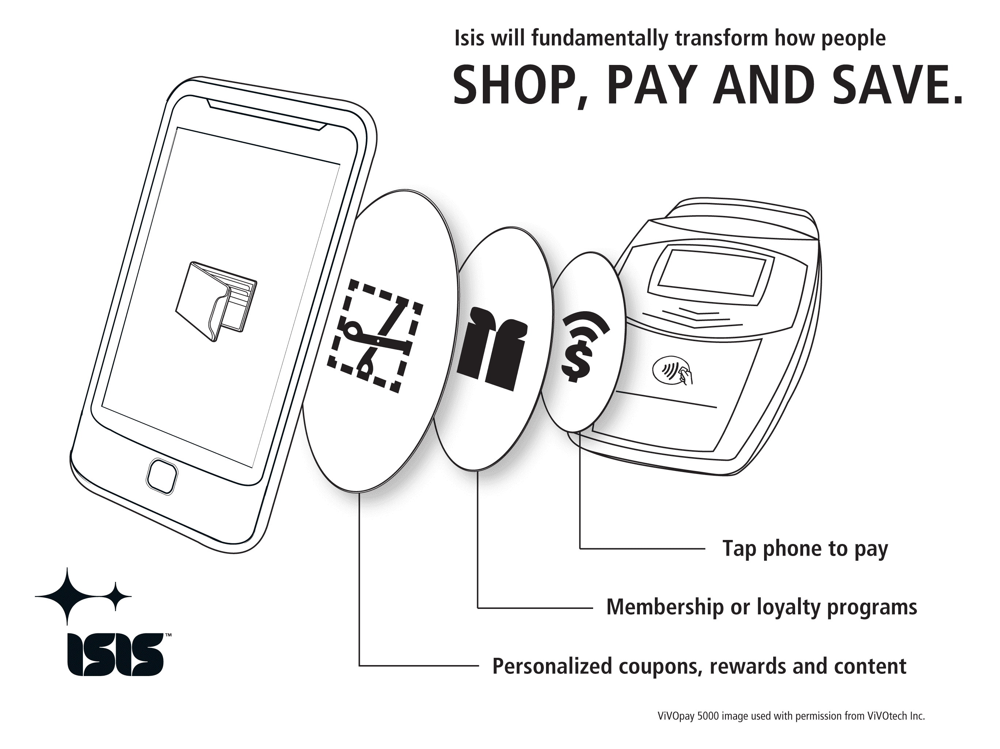

# 领先的移动设备制造商承诺支持运营商主导的 NFC 项目 Isis 

> 原文：<https://web.archive.org/web/https://techcrunch.com/2011/09/27/leading-mobile-device-makers-pledge-support-for-carrier-led-nfc-venture-isis/>

AT & T、T-Mobile 和威瑞森之间的运营商主导的合资企业 Isis 今天宣布，包括 HTC、LG、摩托罗拉、RIM、三星和索尼爱立信在内的大多数领先设备制造商以及 NFC 硬件提供商 Device Fidelity 都支持其移动钱包系统。

所有手机制造商现在都致力于推出将包含 Isis 的 NFC 和相关技术标准的手机。

[Isis](https://web.archive.org/web/20230203173644/http://www.paywithisis.com/) 代表着运营商试图将自己插入移动钱包和移动支付领域，以便与其他移动钱包提供商正面竞争，包括信用卡公司、银行和平台提供商，如谷歌为 Android 手机推出的[谷歌钱包](https://web.archive.org/web/20230203173644/http://www.google.com/wallet)计划。

Isis 移动钱包中的技术使用 NFC，即“近场通信”，可以在销售点实现短程无线交易。消费者不用刷信用卡，只需在收银台的支付终端上点击或挥动手机就能完成交易，在某些情况下，甚至可以收到商家的优惠券或优惠。

NFC 的预测各不相同，ABI 研究公司估计今年手机出货量为 3500 万部，明年将翻一番。IHS iSuppli 预测，到 2015 年，手机销量将接近 5.5 亿部。与此同时，Berg Insight AB 预计，到 2015 年，这个数字将达到 4 亿。不管真实数字是多少，人们一致认为这项技术还需要几年才能被消费者接受。

然而，苹果 iPhone 5 的发布指日可待，这将是 NFC 未来的一个关键转折点，可能会动摇这些分析师的估计。如果 iPhone 5 不支持 NFC，那么 NFC 的采用将会滞后。如果它真的提供 NFC，该运动将继续其目前的前进势头，并可能以更快的速度发展。

今天来自 Isis 的消息支持后一种理论，因为它看似反动。如果苹果正在推进 NFC，竞争的手机制造商将别无选择，只能通过在手机中提供 NFC 支持来参与进来。当然，这种支持不一定包括与 Isis 的合作，但 Isis 是该领域的领先运动之一。

至于 DeviceFidelty，鉴于其在包括 NFC 在内的非接触式技术领域的领先地位，它也被官方指定为支持 Isis 移动钱包的公司之一也就不足为奇了。

现在听到这个消息也很有趣，就在昨天，颠覆性移动支付公司 Square 的首席运营官·基思·拉布瓦[大胆地宣布](https://web.archive.org/web/20230203173644/http://gigaom.com/2011/09/26/square-mobilize-2011/) NFC 没有价值，理由是商家对这项技术缺乏兴趣。“商家采用”的障碍当然是有效的，但非接触式基础设施已经在比消费者可能意识到的更多的地方出现，即使它有些未被充分利用。例如，截至今年春天，[万事达卡声称](https://web.archive.org/web/20230203173644/http://www.readwriteweb.com/mobile/2011/04/nfc-in-2011-mastercard-explores-mobile-payments.php)它有大约 8800 万张 PayPass 卡(非接触式信用卡)和设备在 276000 个商户使用，加上正在 36 个国家进行的试验和推广，包括麦当劳、肯德基和塔可钟等快餐店，以及 Sports Authority、Best Buy 等零售商和 BP 和 Hess 等加油站。Visa 通过 payWave 提供类似的非接触式支持，在美国有超过 150，000 家商户，在全球有超过 300，000 家商户。

非接触式基础设施是 NFC 采用的重要组成部分，因为 NFC 基于全球现有的非接触式基础设施。换句话说，哪里有非接触式支持，哪里就有 NFC 支持。当然，这是假设所讨论的设备提供“卡仿真”模式，这使得 NFC 设备的行为像现有的非接触式卡一样。但这是非接触式向 NFC 过渡中最合乎逻辑的一步，因此大多数移动钱包计划可能都是如此。

*更正:文章最初称 Visa 的服务为“In2Pay”，但这是其智能手机外壳将 NFC 引入 iPhone。Visa 的 NFC 支付技术是“Visa payWave”。Visa 还提供了一些关于这项服务的数字，这些数字是补充的。*