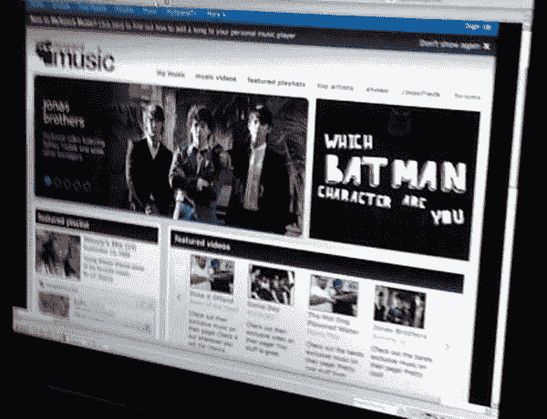
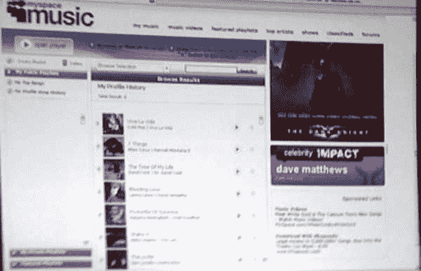
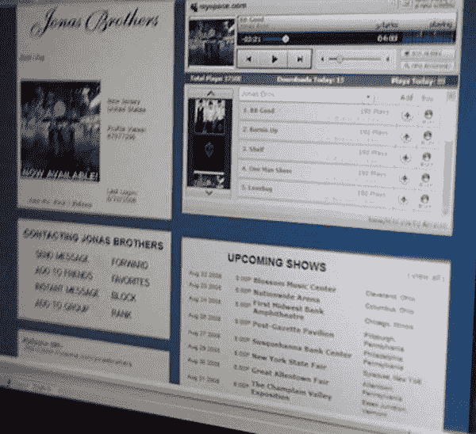

# 泄露的 MySpace 音乐截图 

> 原文：<https://web.archive.org/web/https://techcrunch.com/2008/09/22/leaked-myspace-music-screenshots/>

# 泄露的 MySpace 音乐截图

MySpace 和大唱片公司的合资企业 MySpace Music 将于本月推出[，几乎可以肯定是在本周的某个时候。MySpace 花了几周时间向广告商和唱片公司做简报，为发布做准备。](https://web.archive.org/web/20230213024814/https://techcrunch.com/2008/09/08/tc50-myspace-ceo-chris-dewolfe-says-95-percent-of-ad-revenues-comes-from-9-countries-announces-new-google-gears-project/)

新服务将在 music.myspace.com 推出，但看起来将与现有网站完全不同。用户将能够免费播放音乐，创建播放列表，从亚马逊下载音乐，购买商品和活动门票，以及购买铃声。

几周来，我们一直在寻找新服务的截图，但毫无进展。但是今天我们设法从一个匿名来源获得了这三张截图。这些可能是旧模型，也可能是 ps 过的赝品，但它们在这里。我们很快就会知道了。

第一个镜头可能是新的 MySpace 音乐主页，显示特色播放列表和视频。第二个截图看起来像一个音乐用户管理面板，第三个是乔纳斯兄弟的艺术家页面，显示了新的播放器。

屏幕截图如下:

