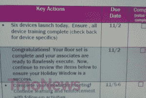

# 泄露的 T-Mobile 路线图承诺 11 月 2 日推出六款新设备 

> 原文：<https://web.archive.org/web/https://techcrunch.com/2011/10/05/leaked-t-mobile-roadmap-promises-six-new-devices-on-november-2/>

# 泄露的 T-Mobile 路线图承诺 11 月 2 日推出六款新设备

对于 T-Mobile 的客户来说，圣诞节可能会提前到来。内部文件显示，本月有四款设备发布，11 月份有两倍多，包括三星 Galaxy 7.0 Plus 平板电脑。奇怪的是，这个路线图的一些部分看起来完全正确，而其他部分则没有太多意义。所以我们要谨慎行事，一起想办法，好吗？

首先是三款“10 月 19 日”发布的产品:HTC“Ruby”(官方名称为 [HTC Amaze 4G](https://web.archive.org/web/20230203194454/https://techcrunch.com/2011/09/26/t-mobile-galaxy-s2-amaze-4g-specs/) )、三星“Hercules”(T2 Galaxy S II)和华为“Wayne”，你可能会认为这是华为 Sonic 4G 移动热点。热点是不言自明的，所以我将把我的话用在两款据说将于 19 日上架的糟糕的智能手机*上。*

首先，这是路线图中最有缺陷的部分，正如其原始海报 [TmoNews](https://web.archive.org/web/20230203194454/http://www.tmonews.com/2011/10/t-mobile-preparing-for-super-november-with-multiple-smartphone-and-tablet-launches/) 所指出的。Amaze 4G 和 Galaxy S II 都将于 10 月 10 日进行预购，10 月 12 日在店内发售。虽然很奇怪，但不正确的日期可能与这个路线图有点旧有关，可能不是 T-Mobile 系统中最新的版本。

继续往前走，你会发现三星“阿诺德”，这远远不是将于 10 月 26 日发布的 Galaxy Tab 10.1 的热门代号。苹果[最不喜欢的“山寨版”](https://web.archive.org/web/20230203194454/https://techcrunch.com/2011/09/09/apple-ftw-german-court-upholds-galaxy-tab-10-1-sales-ban/)的规格包括双核 1GHz 处理器，10.1 英寸 1280×800 WXGA 显示屏，腰围仅为 8.6 毫米。

11 月 2 日的大规模发布日似乎很合理，因为 TmoNews 发现了另一份[内部 T-Mo 文件](https://web.archive.org/web/20230203194454/http://www.tmonews.com/2011/10/t-mobile-launching-six-devices-on-november-2nd/)(右图)承诺在 11 月 2 日发布 6 次。瞧，在路线图中有六种设备被安排在那个日期。

计划于 2 日发布的设备包括 LG 的两款新的 [myTouch 手机](https://web.archive.org/web/20230203194454/https://techcrunch.com/2011/09/15/youtube-video-hints-at-new-t-mobile-mytouch-phones-by-lg/)(Maxx 和 Maxx Touch)、LG Flip II(令人困惑的双屏 Android 滑盖)、HTC Omega(官方名称为 [Radar 4G](https://web.archive.org/web/20230203194454/https://techcrunch.com/2011/09/27/t-mobile-spots-htc-radar-on-horizon-set-for-holiday-launch/) )、华为“Tallsome”(看起来很像一个 7 或 8 英寸的小平板电脑)，以及三星“Ancora”(可能是一款中低端 Galaxy 设备)。

最后但同样重要的是，11 月 9 日应该会让我们与 [Galaxy Tab 7.0 Plus](https://web.archive.org/web/20230203194454/https://techcrunch.com/2011/09/30/samsung-announces-the-dual-core-galaxy-tab-7-0-plus/) 和黑莓 Torch(代号“Dumoine”)面对面。

由于路线图在 11 月 9 日截止，我们不会惊讶于在 11 月下半月和 12 月初看到更多的 T-Mo。尤其是自从这家运营商在与苹果的恶名远扬的战斗中站在三星一边，对假日销售大惊小怪之后。