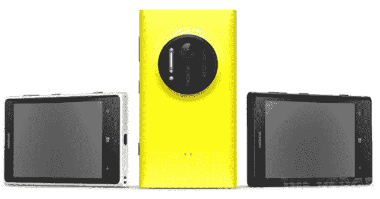
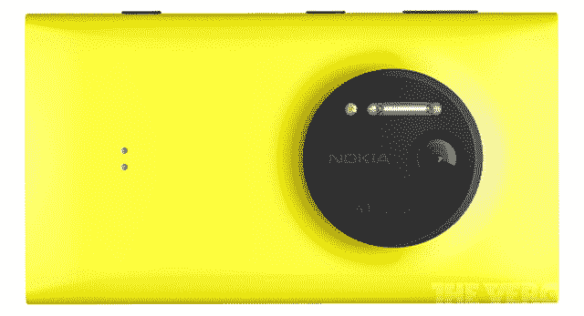
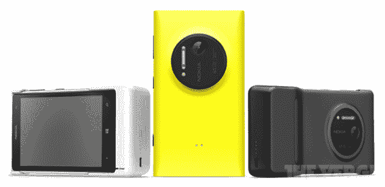
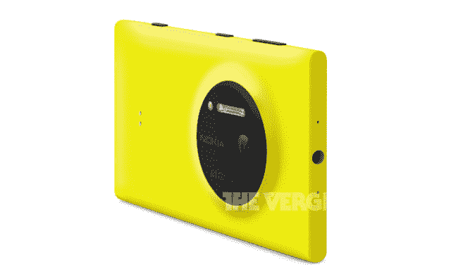

# 几乎即将发布的配备 41MP 摄像头的诺基亚 Lumia 1020 漏洞百出 TechCrunch

> 原文：<https://web.archive.org/web/https://techcrunch.com/2013/07/11/leaks-abound-for-the-almost-announced-nokia-lumia-1020-with-41mp-camera/>

就在我们期待诺基亚展示 Lumia 1020 的几个小时前，这款手机已经在互联网上展示给所有人看。

除了一些泄露的新闻照片，美国电话电报公司似乎还意外地在 YouTube 上发布了一段新的 4100 万像素摄像头智能手机的视频，这是 Engadget 的好心人为我们提供的。哦，如果这还不足以破坏惊喜的话，WP Central 似乎已经拿到了一份完整的规格清单。

让我们从细节开始:

你可以在 [WP Central](https://web.archive.org/web/20221207091846/http://www.wpcentral.com/full-specs-nokia-lumia-1020-6-lenses-2gb-ram-and-more) 获得诺基亚 Lumia 1020 的详细信息，但亮点包括 LTE 支持、Windows Phone 8、2GB 内存、32GB 内部存储和 1.5GHz 双核骁龙处理器。

你还会注意到前方有一个 4.5 英寸的 AMOLED 1280×720 显示屏，配有诺基亚的 ClearBlack 技术，使手机在明亮的阳光下保持可见。

但最重要的是，Lumia 1020 配备了诺基亚的 4100 万像素 PureView 相机技术，包括卡尔·蔡司镜头。这提供了光学图像稳定，背照式图像传感器，6 个镜头光学元件，3 倍高分辨率变焦，自动对焦，氙气闪光灯，以及以 30fps 拍摄 1080p 视频的能力。

虽然相机技术肯定会让我们这些主要在手机上长大的人感到兴奋，但[并不是每个人都印象深刻](https://web.archive.org/web/20221207091846/https://beta.techcrunch.com/2013/07/11/nokia-please-stop/)。

从这些由 [TheVerge](https://web.archive.org/web/20221207091846/http://www.theverge.com/2013/7/11/4513484/nokia-lumia-1020-photos-features) 首次发布的泄露的新闻照片中可以看出，甚至手机的设计语言都提到了“摄像头”，从正面几乎无边框的巨大显示屏到 Lumia 1020 背面中间夸大的摄像头传感器。

如果这些图片在今天宣布之前还不足以满足你的胃口，那么看看 Engadget 从美国电话电报公司的 YouTube 频道找到的这些视频:

[viddler id=d823baa4 w=545 h=307]

[viddler id=104bca3c w=545 h=307]

[viddler id=d661a8b8 w=545 h=307]

请务必在美国东部时间上午 11 点开始收听我们的直播博客。