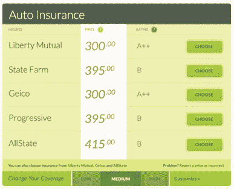

# 汽车保险比较初创公司 Leaky 在全国推出，融资 67 万美元 TechCrunch

> 原文：<https://web.archive.org/web/https://techcrunch.com/2012/12/05/leaky-national-launch-seed-funding/>

# 汽车保险比较初创公司 Leaky 在全国推出，募集 67 万美元

Y Combinator 孵化的初创公司 Leaky 帮助客户比较他们愿意向汽车保险公司支付的价格，如今该公司正扩展到全国范围。

创业公司 first [在一年多前](https://web.archive.org/web/20230125034002/https://techcrunch.com/2011/08/08/yc-backed-leaky-is-hipmunk-for-car-insurance/)成立，但该网站很快吸引了保险公司的注意(以及停止通知)，所以它被关闭了，[在 3 月](https://web.archive.org/web/20230125034002/https://techcrunch.com/2012/03/26/leaky-relaunch/)以新的方式重新出现。

Leaky 不是直接从保险公司的网站上获取价格，而是查看他们的州监管文件，然后根据他们的个人信息预测每个用户将被收取的费用。Leaky 还可以预测你生活中的变化，比如搬到另一个国家或者买一辆新车，会如何影响你的保险费用。

联合创始人兼首席执行官杰森·特拉夫(Jason Traff)表示，到目前为止，Leaky 仅在加州可用，因此这是一次大规模扩张。该网站也从支持 7 家保险公司发展到 100 多家。Traff 补充说，在 3 月份重新推出后发布的监控功能非常受欢迎。

“通过创建一个档案，Leaky 将监控你的保险，并让你知道你何时有资格根据一些因素享受折扣，包括你的司机档案和你的事故历史，”他通过电子邮件告诉我。“监控已经真正成为一个受欢迎的功能，因为它让人们安心地知道有人在关注他们的保险需求。”

该公司还宣布，它已经从 YC、500 Startups、Start Fund、Box Group 和一些天使投资者那里筹集了 67.5 万美元的种子资金。未来的计划包括为其他类型的保险提供这些功能。