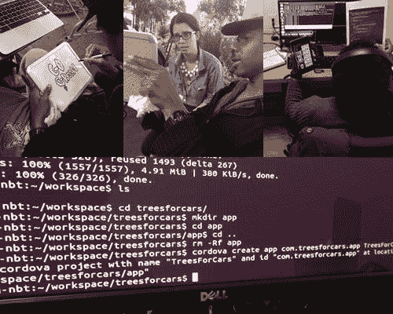

# 在街上学习编程 TechCrunch

> 原文：<https://web.archive.org/web/https://techcrunch.com/2013/11/24/learning-to-code-on-the-street/>

现在是早上 7 点 33 分。当我坐在附近桑迪飓风留下的沙袋上时，利奥正趴在他的笔记本电脑上写一些代码练习行。天气很冷，但这是一个美好的早晨。

不到三个月前，Leo [成为了网络偶像](https://web.archive.org/web/20221207063612/https://medium.com/architecting-a-life/fee8f3ee97a0)，他拒绝了我 100 美元现金的提议，转而选择学习编程。你可以通过[这个视频采访来了解他的故事。每天早上上班前一个小时，我都会和 Leo 见面，帮助他学习一种叫做 JavaScript 的软件工程语言。作为他同意编码的一部分，他有一个翻新的三星 Chromebook 要做，还有](https://web.archive.org/web/20221207063612/http://www.businessinsider.com/homeless-coder-2013-9)[三本 JavaScript 书](https://web.archive.org/web/20221207063612/http://www.amazon.com/Javascript-Beginners-Mr-Mark-Lassoff/dp/0988842955/ref=sr_1_2_title_0_main?ie=UTF8&qid=1385356839&sr=8-2&keywords=beginning+javascript)要学。

虽然一开始这个提议受到了很多批评，但成千上万的人聚集在他的脸书故事周围，这个社区已经成为我在网上见过的最有爱心和支持的社区之一。一天早上，一个慢跑者边跑边喊，“看到你的故事了，加油，利奥，加油！”现在已经变成了每天的鼓励，欢呼，甚至陌生人走上前来分享他们对利奥所做的事情的兴奋。

“学习编码”不是重点。学习编码不是目的地，也不是最终结果；学习编码是一个方向。对狮子座来说，方向很简单。“我们需要关心我们的星球，”他说，这是他在第四课的目标。Leo 的想法是开发一个拼车手机应用程序，计算你节省了多少二氧化碳排放量，称之为[“汽车的树木”](https://web.archive.org/web/20221207063612/http://www.treesforcars.com/)

一旦时机成熟，他会宣布其余的细节(他会想出办法)。我将此作为我们课程的最终目标，涵盖了从数据库架构到定位服务的所有内容。

Leo 的方向不仅仅是构建编程一个 app。狮子座有改变的动力。在这里，我认为我是一个帮助，但利奥的目标是帮助每个人很多次，通过传播意识，使地球成为一个更美好的地方。从珊瑚礁到衰退的森林，利奥告诉我他的一个目标是让公众重新关注我们的星球。虽然我希望他的应用程序非常成功，但他对大局的关注确实令人鼓舞。

站在利奥的角度想想。他走了四个街区去给他的笔记本电脑充电，又走了六个街区去洗手间(在相反的方向)。他坐着睡觉，有时，如果是一个糟糕的夜晚，当我到那里时，他仍然在睡觉，我发现他盖在他的笔记本电脑上以保护它的安全。他必须得到食物，保持温暖，保管好自己的东西，而且不知何故，他能以一种愉快的心情连续几个小时研究一个非常困难的课题。

很多时候在这个项目中，尤其是在第二周，如果我是他，我会收拾行李离开。在第一周，我们不得不包括复制粘贴，安装程序，甚至基本的电子邮件。尽管有一座大山要爬，但他日复一日地坚持着。每天早上我出现的时候，他都会微笑着说，“早上好，我的孩子！“他知道我是爱尔兰人，经常这么说。除了成为我的朋友，这些会议已经成为我一天中最美好的部分。

创业大师塞思戈丁(Seth Godin)表示，在你做大事情之前，总会有一个“空档”或“低谷”。低谷是最低点，是很多人放弃的时候。

> “给一个人一条鱼，喂他一天。教一个人钓鱼，看他改变世界。”

在他接受《今日秀》采访的前两天，我们遇到了第一次大滑坡。当我周一早上去上我们的日常课时，我发现他的帽子在长凳上，他的杯子被打翻了，咖啡洒在了人行道上。立刻，我就觉得不对劲。在与他的朋友、一名交通警卫和两名警察交谈后，我发现利奥[因擅自闯入公共长椅而被逮捕](https://web.archive.org/web/20221207063612/http://www.activistpost.com/2013/10/update-homeless-journeyman-hacker.html),正被送往中央登记处。尽管在分局向逮捕他的警官出示了收据，利奥的电子产品(手机、笔记本电脑)还是被没收了。通过令人难以置信的支持，脸书社区和许多新闻媒体将他的故事公之于众，敦促 NYPD 加快释放他，并在推特上开始发布“#FreeLeo”。

周二早上，在他接受《今日秀》采访的 24 小时前，利奥被释放了，我被告知这是一个令人难以置信的快速处理时间——法官也接受了一个特殊的案件。尽管得到了赔偿，但由于一个“文书”错误，Leo 的笔记本电脑和手机被作为调查文件归档，这意味着可能需要长达六个月的时间才能归还。

我们很沮丧，但不知何故逮捕是激励，利奥没有笔记本电脑，没有手机来测试应用程序。他也生病了，但没有被吓倒。我们继续学习 JavaScript 书籍，当我们需要一台机器时，他用我的电脑继续学习。负责逮捕的警官告诉我，给地方检察官写封信可以加快归还他的笔记本电脑和手机。与此同时，脸书社区的一位好心人向她提供了 Chromebook。

在利奥给脸书社区的信中，他写道，“‘狮子利奥’爱你们所有人，一切都会好的。”我们两个中，他绝对是比较平和的一个。

这些课程正是你可能假设的两个关键部分:第一部分是专注于头脑。由于我们的时间限制，利奥必须记住大量的新词汇，并使用古希腊演说家的一种叫做“记忆宫殿”的技巧来记忆希腊人用这种方法来记忆长达数小时的整篇演讲，方法是在演讲的每一部分想象一个不同的房间或房间里的物体。对于 Leo 来说，进入 JavaScript 的房间让他学得更快，记住的更多。

第二种根本不是过程或者工具。是学习编码过程的人性化。想象一下，如果你有一个私人导师带你走过每一行代码，一个相信你并让你负责的人，我相信这是在线教育以及随后的在线免费软件工程课程所严重缺乏的东西。

在我看来，我看到了导师和学员的社交网络。这是你只能有一个朋友(你的导师)的地方，在这里你可以一起布局你的想法，做视频会议，并设定见面的时间。我认为这是一个安全的地方，在这里，程序员会被审查承诺，学生们会真正渴望学习。这个地方对我来说只是一个梦，但梦是独自做的；这是我们必须共同建设的现实。

我正在寻找 10 名软件工程师，他们愿意从成千上万发邮件询问 Leo 的人中选择，要求学习自己编码。这些软件工程师会花两个月的时间，每天一个小时，来教一个学生如何用工程师熟悉的语言来构建一个应用程序或网站。课程将通过 Google Helpouts、Hangouts 或 Skype 进行，每堂课都有录音。最终，在两个月结束时，我们将所有 10 个工程师会议(400 小时的材料)合并并组织成一个大规模的视频数据库，任何人都可以免费探索和学习。读到这里，如果你觉得有责任通过真正帮助一个人来帮助数百人，请[报名](https://web.archive.org/web/20221207063612/http://www.journeymancourse.com/iamtheothercoder)。

看看你的钟。Leo 现在在纽约的一个小 Chromebook 上打字。冬天来了，我们现在正和寒冷赛跑。一位社区成员说得好，“给一个人一条鱼，喂他一天。教一个人钓鱼，看他改变世界。”

PS:记住你到这一步的确切时间，日，时，秒。如果你是一名工程师并想教书，我们将把它作为你的“监护人 ID”(2013 年 10 月 21 日星期一上午 11:53:21 = 10212013115321)。这是一个非常重要的时刻，是你决定伸出援手的时刻。谢谢你。

*要了解 Leo 的故事和他即将发布的应用，请访问他的脸书页面[。要加入帮助教授编码的邮件列表，请访问 www.journeymancourse.com/iamtheothercoder](https://web.archive.org/web/20221207063612/https://www.facebook.com/journeymanchallenge)。]*