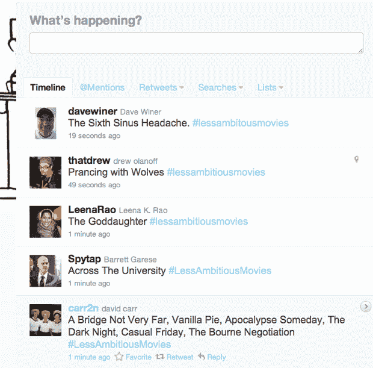
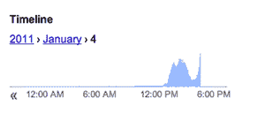

# # LessAmbitiousMovies 旨在接管你的部分 Twitter 信息流 

> 原文：<https://web.archive.org/web/http://techcrunch.com/2011/01/04/lessambitiousmovies/>

嘿，你知道现在发生了什么吗？[# lesambitious movies](https://web.archive.org/web/20230202230407/http://search.twitter.com/search?q=%23lessambitiousmovies)，我见过的最疯狂的 Twitter 标签 meme，每分钟大约 200 条推文。基本前提是把热门电影的片名推出来但是淡化了，没那么大野心了，懂吗？

关于这个迷因，值得注意的是:a)由于一些令人费解的原因，它并没有成为趋势；b)自从几个小时前开始，这个标签突然充斥了我(和[可能是你的](https://web.archive.org/web/20230202230407/http://twitter.com/#!/xenijardin/status/22510006712664064))的整个推特流，带有滑稽的仿电影标题，如《成为约翰·斯塔莫斯》、《哈利·波特与密室》和《穿 Zara 的恶魔》。"

也许是因为这是假期后的第一个工作周，我们都需要释放一点压力，但想到这些还是有一些深深的满足感。来吧，试一个。

是的，真的应该有人为所有电影制作海报。

**更新:**它现在正在流行——我已经联系了 Twitter，以了解更多关于它发展速度的信息，因为它似乎是最近增长最快的标签。

**更新#2** : Twitter 在太平洋标准时间 9:14 的回应，*“我们不容易获得这些信息。”*我不怪他们。同时，这是谷歌趋势图，显示了包括标签在内的实时更新的频率。

下面是我最喜欢的一些:

https://twitter.com/#!/granulac/status/22520192374411264

http://twitter.com/#!/gabrielsnyder/status/22509055503241216

http://twitter.com/#!/frome home/status/22493359511707648

http://twitter.com/#!/peretti/status/22509954883649536

http://twitter.com/#!/Brad Nelson/status/22500680912609280

http://twitter.com/#!/rachelsklar/status/22491275823423488

http://twitter.com/#!/sacca/status/22507002223656960

http://twitter.com/#!/cpen/status/22500256579059712

http://twitter.com/#!/布鲁克/地位/22502869248774144

http://twitter.com/#!/Paris lemon/status/22501128826527744

http://twitter.com/#!/leena Rao/status/22499834715971584

http://twitter.com/#!/that drew/status/22498350678941675

http://twitter.com/#!/停止/状态/22498260279099392

http://twitter.com/#!/frome home/status/22495436023533569

http://twitter.com/#!/caro/status/22494991045632001

http://twitter.com/#!/Andy levy/status/22508840322859010

http://twitter.com/#!/candiRSX/status/22504233844604928