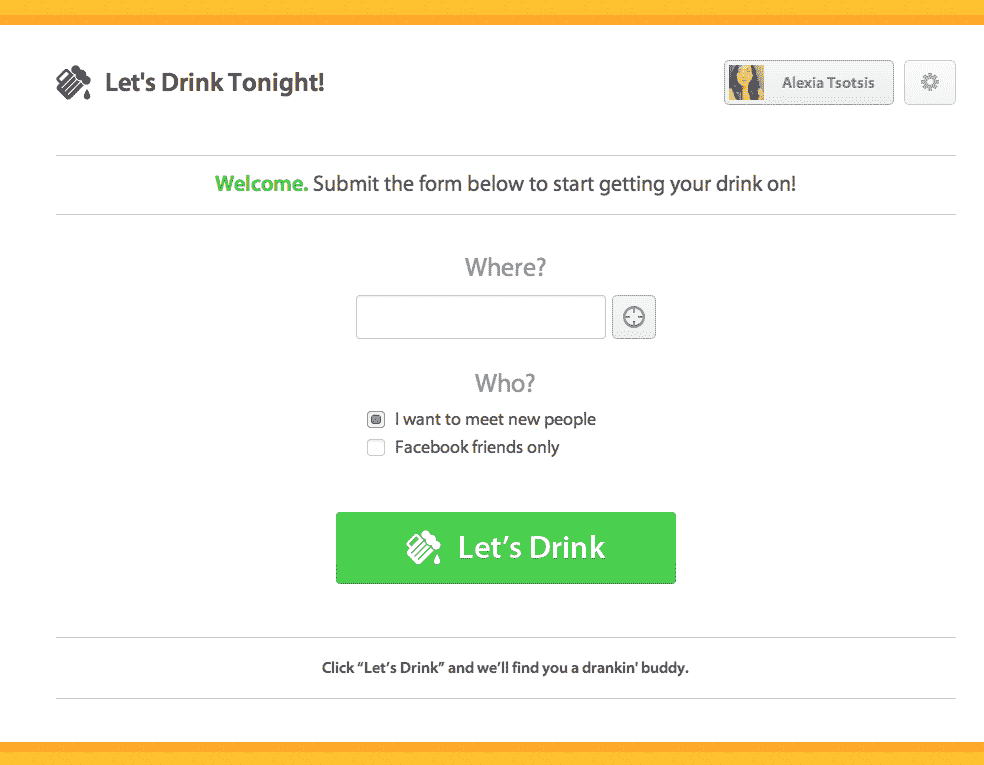

# 今晚一起喝酒帮助你找到和 TechCrunch 一起喝酒的人

> 原文：<https://web.archive.org/web/http://techcrunch.com/2011/09/11/lets-drink-tonight-helps-you-find-people-to-drink-with/>

# 今晚一起喝酒可以帮你找到一起喝酒的人

由开发人员泽法·佩尔兰、艾伦·罗梅罗、杰瑞米亚·基梅尔曼和亨特·黑斯廷斯组成的团队[今晚一起喝酒](https://web.archive.org/web/20230205045119/http://letsdrinktonight.com/)，利用在 [TechCrunch Disrupt 黑客马拉松](https://web.archive.org/web/20230205045119/https://techcrunch.com/2011/09/11/and-the-2011-techcrunch-disrupt-sf-hackathon-winners-are/)上的机会，试图解决没有人一起喝酒的古老难题。

希望喝酒时有人陪伴的用户可以登录[的【今晚喝酒吧】网站](https://web.archive.org/web/20230205045119/http://letsdrinktonight.com/)，回答四个尖锐的个人资料问题，比如“和我一起喝过酒的最酷的人是谁？”和“最喜欢的饮料？…”然后，他们可以选择自己的位置，以及是想和脸书朋友一起喝酒，还是想结识新朋友。

如果你身边有人准备喝酒，这款应用会发短信给你。一点也不会导致灾难。没有。

到目前为止，我已经输入了我的信息，让世界知道我可以去喝酒，但是应用程序的建议——一位 Vinodh Kumar 先生——似乎不可用(因为他的个人资料链接不起作用)。我想我得回家去写一些在 TechCrunch Disrupt 上发布的创业公司。

上面是今晚的后台采访，下面是 Hackathon 演示，大家一起喝一杯吧。

