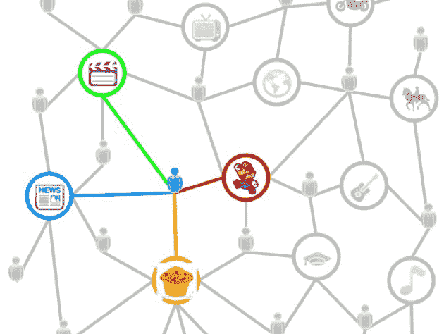

# Levchin 和 Gurley 说下一个大公司将会抓住有趣的图表 

> 原文：<https://web.archive.org/web/https://techcrunch.com/2011/02/17/levchin-and-gurley-say-that-next-big-company-will-capture-the-interest-graph/>

 昨天，在旧金山的高盛技术和互联网大会上，谷歌和贝宝创始人[麦克斯·拉夫琴](https://web.archive.org/web/20230108181751/http://www.crunchbase.com/person/max-levchin)和基准 GP [比尔·格利](https://web.archive.org/web/20230108181751/http://www.crunchbase.com/person/bill-gurley)讨论了“改变游戏规则的技术”和网络的未来。作为当今心态的象征，他们通过比较谷歌和脸书的优势和目标来攻击这个相当大的话题，使用后者令人瞠目结舌的统计数据(5 亿多用户，每天地球上每 13 个人*中就有一个*登录脸书】及其对社交图的推广作为未来的衡量标准。

Levchin 说，脸书正在迅速成为新的社交白页，也就是说，当你不知道某人在网上的什么位置时，你可以去脸书找到并联系他们。但是，除此之外，他说，社交网络巨头实际上是“丰富的白页”，在那里你不仅可以找到某人，还可以发现他们喜欢什么，他们读什么，他们最喜欢的电影等等。

脸书希望利用这一点，通过脸书连接向网站“出租”他们的图表，他说，这“非常强大”，反过来可能导致他们成功“取代核心信息服务”如果脸书真的成为网络的下一个交流平台，那么它将“毫无疑问地成为世界上最有价值的公司”考虑到沟通在我们的数字世界中的重要性，我想很少有人会不同意他的猜想。

(不过，作为一个有趣的旁注， [Business Insider 昨晚在这个论坛上发表了一篇文章，并引用了莱佛青关于他的脸书假说的观点。谷歌直接回复了毕的帖子，称莱佛青的话被错误引用，并暗示他不会去给脸书那种道具。嗯，我在座谈会上，让](https://web.archive.org/web/20230108181751/http://www.businessinsider.com/max-levchin-facebook-2011-2)[看了几遍](https://web.archive.org/web/20230108181751/http://www.danielodio.com/2011/02/15/max-levchin-google-and-bill-gurley-benchmark-at-goldman-sachs-2011-technology-and-internet-conference/)的视频，上面引用的是*所说的话*。你呢，莱佛青？)

撇开戏剧性不谈，让我们说一秒钟，脸书不会成为下一个贝尔大西洋。那么，脸书将如何成长为这个超级有价值的怪物呢？扎克伯格一再表示，社交网络是他们业务的核心，是脸书成功的关键，也是网络未来的关键。

公平地说，Levchin 并没有盲目地喝脸书的 Kool-Aid，引用了需求生成和需求发现(搜索)广告作为社交图局限性的主要例子。“社交图谱信号对优化与搜索相关的广告没有帮助，”他说，这表明草率地提出脸书将在各方面与谷歌一样大是错误的。考虑到数十亿美元的收入差异，脸书在大规模货币化方面继续面临不同的挑战。他说，最终，脸书作为一项网络资产“根本不会与谷歌竞争——至少在短期内不会。”

为了支持 Levchin 的观点，Gurley 列举了一个类似的例子，网飞最初在他们的电影推荐系统中实现了一个社交图模型，但很快发现它远不如其他类型的推荐算法有效。对许多人来说，社会产生的 rec 似乎是我们想要的很好的指标，但事实也是如此，我们大多数人都和至少有几个特殊爱好或热情与我们自己非常不同的朋友在一起。

因此，硅谷和“风险之地”的每个人都认为真正改变游戏规则的模式包括捕捉和利用“兴趣图”，他说。成功做到这一点的公司将“接近谷歌搜索范式，因为它将与需求挖掘和与产品目的相关的发现保持一致。”因此，正是兴趣图定义了谷歌和脸书之间的中间地带——搜索、广告和社交图之间的中间地带。

我认为我们可以肯定的是，谁能收集你当前兴趣的记录，并为广告商包装它们，谁就能赚很多钱。Levchin 表示，Twitter 最终可能会成为一个对广告商更有利的平台，因为它允许你关注一个品牌，并通过品牌发现和名人发现获得实时信息和更新，这比你从朋友那里获得的信息更有可能丰富，你的朋友可能不是专家。Twitter [已经表示，它相信它已经控制了兴趣图，但是状态更新并没有真正提供真正需要的深度和语境。当然，兴趣图不是唯一的。脸书、Twitter 和像](https://web.archive.org/web/20230108181751/https://techcrunch.com/2010/04/19/facebook-twitter-interests/) [Gravity](https://web.archive.org/web/20230108181751/http://www.gravity.com/) 这样的初创公司都希望利用它——尽管我有预感 Levchin 也想给谷歌带来一份利益。

[维梅奥·http://vimeo.com/19985085 w = 640 & h = 360]