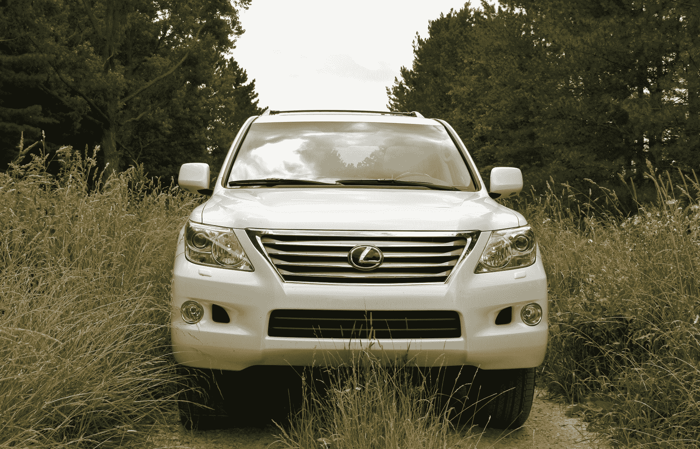
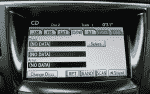
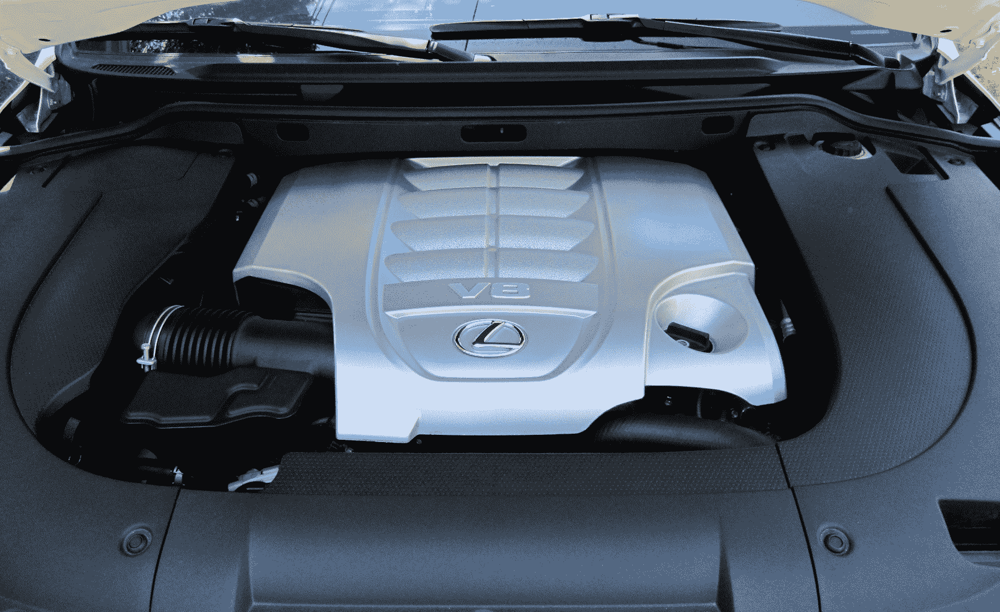

# 点评:雷克萨斯 LX 570 是一款全地形电子游乐园 

> 原文：<https://web.archive.org/web/http://techcrunch.com/2011/07/27/lexus-lx-570-review/>

一想到我就在这里，以将近 60 英里的时速在这条熟悉的双轨上行驶，我就感到震惊。这是去我的一个树摊的路线，通常是在我岳父的福特 F150 里完成的。但我的牙齿仍然完好无损，我不觉得我的脊椎受到了挤压。我在这辆价值 89k 美元的雷克萨斯旗舰车中漂浮，由空调座椅冷却，通过蓝牙连接到我的 Droid X，在 Rdio 上拥堵到极致。车窗降下，天窗打开，我右肘正下方的[空调冷却箱](https://web.archive.org/web/20230203045603/https://techcrunch.com/2011/07/27/lexus-lx-570-review/img_3327/)中有两瓶水。生活很美好。

2011 款雷克萨斯 LX 570 在过去的一周里给了我很好的服务。它作为一款野营多用途车，在密歇根的偏远地区和城镇周围都表现出色。我想我从来没有对一辆有潜在交易破坏者的车更满意过。

 
把 LX 系列想象成西装革履的莱斯·斯特劳德。他仍然拥有使他成为幸存者的所有知识和才能；他不会穿成这样去雨林。当然，如果他想的话，他可以穿过岩石场地，但这是不对的。他会毁了他的裤子。

这就是我在雷克萨斯 LX 570 期间的感受。这辆车实在太好了，不会脏的。事实上，这不是我的，这有助于抵消这种感觉，因为我不必担心 20，000 英里后的悬挂。我想驾驶 LX 570，它有 9 英寸的离地间隙和自动爬行控制，但感觉不太好(我找不到任何合适的位置)。此外，这种愚蠢的行为最好留给它不那么花哨，但同样能干的堂兄，丰田陆地巡洋舰。

 看，LX 570 大概是 SUV 能得到的最好的了；我的测试机标价 89k 美元。暂时忘掉这款车的越野性能吧——LX 570 一点都不缺少生物舒适性。它的装备和英菲尼迪 QX56 甚至奔驰 G 或 GL 级一样好。LX 570 比满载的凯迪拉克凯雷德拥有更多的技术和设施。只有配有数字仪表盘的路虎揽胜有一些明显不同的东西，尽管[我们发现](https://web.archive.org/web/20230203045603/https://techcrunch.com/2010/09/22/the-gadgetry-inside-the-2010-range-rover-supercharged-sadly-disappointing-video/)的这个功能很傻。

它拥有一切:19 扬声器马克·列文森音频系统，后座娱乐与远程，蓝牙和 USB 连接。有四个加热和冷却座椅，以配合四个区域的气候控制。车辆周围的摄像头系统是可选的，对于这种大小的车辆，在停车场和越野时同样重要。电动分离式后举升门打开，露出电源控制装置，可折叠后排座椅。LX 570 拥有自适应巡航控制，雷克萨斯称之为动态雷达巡航控制。有一个强大的 383 马力发动机搭配一个柔滑的六速顺序换档自动变速器。整备重量为 5995 磅，这是三吨的乐趣。

 坐在驾驶座上就像指挥一艘豪华游艇。你有很多功能可以支配，但是当你开动的时候，汽车为你做了大部分的工作。甚至爬行控制模式下的车速也是自动的。有一个安装在中央的摇杆开关，可以让车辆以预定的速度前进或后退。除了转向之外，你唯一的任务就是决定车辆的高度，然后使用邻近的翘板开关来升高或降低卡车。

这本身并不是一件坏事。它让司机享受内部的富裕。座位太棒了，我是说在开了 400 英里后，我四岁的孩子不停地踢着头枕。他们就是那么好。四区气候控制有可能是地球上最冷的空调，甚至有一个空气过滤系统，有助于去除过敏原，空气颗粒和露营的一般臭味。

 不幸的是，虽然汽车的驱动系统是一个技术奇迹，但信息娱乐系统却不能这么说。这是过去的遗迹。由于过时的用户界面，即使是收音机功能也很难使用。该系统使用标签、文件夹和冗余的物理按钮来控制一切，这实际上使浏览电台的简单任务变得过于复杂。这一系统用于目前大多数雷克萨斯车型，需要认真改进。这不全是坏消息:该系统至少支持蓝牙和 USB 流媒体音频。

当你终于找到一个电台，播放一首好歌时，马克·列文森的音频系统会让你忘记过去所有的过失。不管我演奏的是什么类型的音乐，它都在这个系统上闪耀。高点清脆而紧实。低点足够强大，使许多售后解决方案尴尬。不过，这并不奇怪。马克·列文森以其强大的音频系统而闻名，LX 570 使用的系统在 19 个扬声器上传播 450 瓦的功率，总谐波失真小于 0.1%。这令人印象深刻，但仍然不能弥补遗憾的信息娱乐系统。

如今，功能不足以弥补糟糕的用户体验。汽车制造商似乎很难从按钮过渡到触摸，雷克萨斯并不是唯一一个用户界面不好的公司。通用汽车目前的系统感觉像是 90 年代中期制造的，下一代版本也好不到哪里去。福特的 MyFord Touch 令人印象深刻，但对新手来说也很有气势。我不是本田或克莱斯勒的粉丝。奥迪和宝马做得很好，但没有使用触摸屏。相反，他们采用了一种多功能圆盘，这在某种程度上意味着触摸还不适合汽车。

LX 570 的其余部分弥补了信息娱乐系统的不足。车辆的主界面将是其他车辆的交易破坏者，但乘坐，操纵和感觉完全对抗相对重要的系统。383 马力和 403 磅-英尺的扭矩超过处理 5995 磅卡车。雷克萨斯吹嘘说，它甚至能在 7.4 秒内加速到 60 英里/小时。环境保护署评定它在城市里为 12 英里/加仑，在高速公路上为 18 英里/加仑。令我领先的那只脚惊讶的是，我在 535 英里的路程中平均跑了 18.7 英里。它的正式座位是七个，但后排座位只适合那些身高不足以乘坐过山车的人。

我一直很喜欢看像 LX 570 这样的 OEM 顶级 SUV。对于汽车制造商来说，这是一个坚实的晴雨表，因为它的设计师、工程师和财务人员摆脱了传统的界限。没有理由减轻重量或过于担心燃油经济性。有足够的空间扔进所有可用的玩具，谁会在乎最终的标价。从这个意义上说，LX 570 很好地服务了雷克萨斯品牌。它比同级别中的大多数其他车辆有更多的原始性能，并且看起来很棒。有人可能会说，它的功能比需要的多，一辆类似装备的 SUV 可以便宜几万美元。这不是重点。LX 570 处于豪华 SUV 山的顶端。