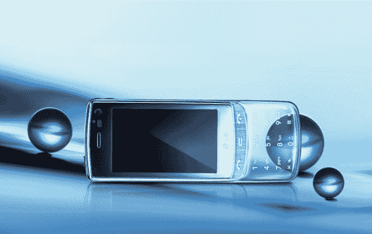

# LG 宣布推出全球首款透明设计手机| TechCrunch

> 原文：<https://web.archive.org/web/https://techcrunch.com/2009/02/20/lg-announces-the-worlds-first-transparent-design-phone/>

# LG 宣布推出全球首款透明设计手机

LG [今天](https://web.archive.org/web/20230309012616/http://www.cellular-news.com/story/36164.php?source=rss)发布了 LG-GD900 手机，它有一个非常与众不同的特点——一个半透明的滑动键盘。这款手机被设计成一种新的时尚宣言，并计划在 2009 年第二季度发布。还没有关于特性的消息，但是谁关心*的特性*？太美了！