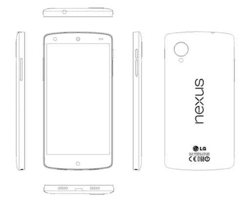

# LG 新 Nexus 手机在泄露的维修手册 TechCrunch 中获得详细信息

> 原文：<https://web.archive.org/web/https://techcrunch.com/2013/10/06/lgs-new-nexus-phone-gets-detailed-in-leaked-service-manual/>

# LG 的新 Nexus 手机在泄露的维修手册中得到详细说明

在过去的几周和几个月里，声称要展示谷歌下一代 Nexus 智能手机的泄露消息并不少见(包括谷歌自己的这款[毫不隐晦的点头](https://web.archive.org/web/20221022112228/http://www.theverge.com/2013/9/3/4691652/did-google-just-leak-the-nexus-5-kitkat-video)),但我们可能刚刚在这个周末找到了主矿脉。 [Android Police](https://web.archive.org/web/20221022112228/http://www.androidpolice.com/2013/10/05/purported-service-manual-gives-a-look-at-the-next-nexus-phone-reveals-32gb-storage-8mp-ois-camera-photos-and-more/) 的人已经拿到了一份即将发布的 281 页服务手册的重要定稿，从技术上来说，这款设备的型号仍然是 LG D821。

说真的，LG 并没有愚弄任何人。该文件充满了图表和图像(一些设备处于各种拆卸状态)，描述了一款非常熟悉的手机，在其后端带有一些类似 Nexus 7 的品牌。早先的 FCC 文件[已经披露了一些有趣的细节——包括 4.95 英寸 1080p IPS 屏幕和 2.3 GHz 2GB 内存的高通骁龙 800——但这份新泄露的手册设法为那些早期报告增添了一点额外的光芒(更不用说额外的可信度了)。](https://web.archive.org/web/20221022112228/https://beta.techcrunch.com/2013/09/06/nexus-5-could-get-lte-5-inch-display-and-snapdragon-800-processor-per-fcc-filing-for-new-lg-device/)

新的 Nexus 可能会有 16 或 32GB 的版本，并将配备 LTE 无线电和带有光学图像稳定功能的 800 万像素后置摄像头(不过没有提到那个疯狂的尼康技术)。NFC、无线充电和可爱的小通知灯也回来了，但不要指望寿命会有很大的提高——它将配备一个密封的 2300 毫安时电池，比去年 Nexus 4 的 2100 毫安时电池略高。关注 Nexus 4 的人应该对这份规格表很熟悉。正如这款设备是在 LG Optimus G 的基础上构建的一样，Nexus 5(或无论它将被称为什么)似乎是 LG G2 的轻度改进版本。

在这一点上，我通常会敦促你小心处理这样的泄漏，但现在似乎没有必要了。尽管我很喜欢自己脑海中的形象，一个孤独的恶作剧者在凌晨辛苦制作一份精心制作的赝品，但这份文件中包含的信息的复杂性和粒度使得这种情况不太可能发生。还有锦上添花？今天早些时候，LG 要求 Android Police 撤回违规的文件和图像——AP 遵从了这一要求，但现在没有办法让这只猫回到它的包里。

也很难对时机提出异议。Nexus 4 发布一周年即将到来，尽管这款设备很坚固，但在几个月内，它发现自己被一种更强大的智能手机远远超过。Galaxy Nexus 和 Nexus 4 分别于 2011 年 10 月和 2012 年正式亮相，现在我们已经有了谷歌定于 10 月 14 日举行活动的持续传言，我敢打赌所有这些秘密交易应该很快就会被取消。在此之前，请随意阅读下面的完整文档，获取更多的技术信息——祝您狩猎愉快！

[LG D821](https://web.archive.org/web/20221022112228/http://www.scribd.com/doc/173744848 "View LG D821 on Scribd")