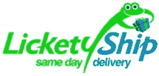

# lick etylation:创始人 CEO 出局，放弃商业模式，专注于快递服务 TechCrunch

> 原文：<https://web.archive.org/web/http://techcrunch.com/2008/06/11/licketyship-ceo-out-ditches-business-model-to-focus-on-couriers-as-a-web-service/>

2006 年末，当[lit ecy Ship](https://web.archive.org/web/20230126093722/http://www.licketyship.com/)开始向顾客提供结账后四小时内的电子商务商品时，我问它[的结局是否会与命运多舛的 Kozmo 有所不同](https://web.archive.org/web/20230126093722/http://techcrunch.com/2006/12/22/will-lickety-ship-end-differently-than-kozmo/)，koz mo 在 2001 年大放异彩之前，烧完了 2 . 8 亿美元的资本。

Kozmo 不收送货费，人们会开玩笑地买一包 M & Ms 巧克力豆或其他小商品，然后亲自免费送货上门。一项 1.5 亿美元的营销协议让 Kozmo 在星巴克咖啡馆得到推广，但也没有起到多大作用。

罗伯特·帕佐尼克创立的 LicketyShip 公司采取了一种不同的方式。他们会向用户收取高额的快速递送费用，利用未充分利用的快递员来递送货物。人们希望，对超快速送货的需求足够大，他们可以从中获利。

事实证明，这个想法可能没有那么糟糕，但执行起来却是不可能的。lick etylation 需要与商品实际位于所服务市场附近的零售商进行交易，他们必须离得足够近，以便快递员可以前往该位置，取走商品，然后交给客户。由于 LicketyShip 在自己的网站上销售商品，它必须与这些零售商的库存系统进行深度整合。如果成功的话，这种整合将是一个巨大的竞争优势。但实际上，这是不可能的。

2007 年 7 月，该公司放弃了与零售商的直接整合，开始专注于整合本地快递服务。现在，您可以使用该服务(在受支持的地区)来提货您通过电话向当地零售商购买的商品。

好消息是，该公司没有在第一个模型上浪费太多钱——他们只从天使投资者那里筹集了 150 万美元。

但是坏消息是投资者厌倦了等待 Pazornik 让这个东西运转，大约一个月前他们做出了改变。帕佐尼克离开了他创立的公司。约翰·麦格罗里接替他成为首席执行官。

现在，该公司正在准备重新推出，并将专注于聚合快递服务，而不仅仅是零售商品的交付。实际上，他们将占据巨大但高度分散的快递市场，并将其转变为网络服务。

麦格罗里说，美国每月有 2500 万个快递包裹被投递，每次投递的平均成本为 100 美元(这意味着每年有 300 亿美元的市场)。没有太多的价格敏感性——人们最想要的是可靠性，并倾向于随着时间的推移与个体快递服务建立关系(例如，律师事务所广泛使用它们，并将成本转嫁给客户)。麦格罗里说，打开市场的关键是通过网络服务或电话提供预订，并提供服务保证。想想 1-800-给快递员送花。

LicketyShip 也在构建一个 API，将快递服务转变为网络服务。例如，任何电子商务网站或零售商都可以提供即时快递服务。所需要的只是他们在客户附近有一个仓库。百思买和 Barnes & Noble 将是理想的客户。这也将有助于实体竞争对手更好地利用这些实物资产，允许在购买当天立即履行。

该公司现在正在向投资者推销这一新战略，并希望在今年夏天完成一轮新的风险投资。