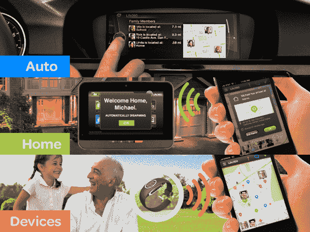

# 比 Foursquare 拥有更多用户的家庭网络应用 Life360 现在正走向汽车、智能家居系统 TechCrunch

> 原文：<https://web.archive.org/web/https://techcrunch.com/2013/04/26/life360-a-family-networking-app-with-more-users-than-foursquare-is-now-headed-for-cars-smart-home-systems/>

Foursquare 最近宣布，它的用户已经增长到 3300 万，但是另一个更老的基于位置的应用 Life360 刚刚突破了自己的里程碑:3400 万用户。是的，这个家庭定位器工具现在比 Foursquare 更大——至少在注册用户方面。公平地说，这些公司不公开他们的活动。

Life360 不是你所说的一夜成功的故事。它早在 2008 年就推出了，Android first，那时人们可能还不像今天这样乐于分享自己的位置。它的核心用例涉及家庭位置跟踪，这些年来慢慢变得更加相关，特别是随着越来越多的儿童和青少年采用智能手机。事实上，根据最近来自[皮尤互联网](https://web.archive.org/web/20221208085026/http://www.pewinternet.org/Reports/2013/Teens-and-Tech.aspx)的一份报告，37%的美国青少年现在拥有智能手机。

当然，在 Foursquare 之外的家庭定位器或签到空间中，有许多应用程序在忙碌着。具体来说，苹果和谷歌都对 Find My Friends 和 Latitude 这样的应用程序三心二意。其他人主要关注家庭信息的一个方面——如“[紧急按钮”应用程序](https://web.archive.org/web/20221208085026/https://beta.techcrunch.com/2013/04/19/family-safety-app-alert-us-goes-beyond-kid-tracking-with-message-boards-battery-alerts-more/),当家庭成员遇到麻烦时，它会提醒网络。像 Hubble 这样的新加入者相信，主要专注于私人家庭网络的应用有发展空间。

但是 Life360 的首席执行官克里斯·赫尔斯认为，脸书以外的家庭互联的真正潜力不在于建立更小、更私人的社交网络，而在于实用性。

“有一种有趣的偏见，即无论谁赢得家庭奖，都会看起来像脸书，但拥有一个更小的群体，”他说。“但也许无论谁赢得家庭，都会做一些与今天截然不同的事情，这将使他们腾飞。”

对于 Life360 来说，其用于 iOS、Android 和黑莓的智能手机应用程序提供了一套服务，为家庭定位器实用程序应该提供的服务设定了标准:位置跟踪、签到(例如，“妈妈，我没事”按钮)、地理围栏警报、消息传递(一对一和群聊)以及紧急/恐慌按钮警报功能。

但现在的计划是将 Life360 扩展到不仅仅是一个应用程序。“很多时候，当人们想到家庭位置时，他们会立即想到跟踪，我们正在努力摆脱这些内涵，”赫尔斯说。“当用户使用我们时，它更像是用户用来协调日常生活的家庭网络。”

在这方面，该公司已经从宝马筹集了 300 万美元的战略轮融资，该融资于 12 月完成，将允许其服务集成到汽车制造商的车辆中。完成后，司机不必在导航系统中输入地址，而是可以导航到一个人——他们要去接的家庭成员。

此外，该公司还在研究一项协议，允许该服务控制家庭安全系统，当它检测到没有家庭成员在房子里时，会自动启动警报。这也将包括恒温器和暖气的控制。“我们希望成为一个大得多的家庭数据平台，”赫尔斯解释说，Life360 在这方面有一些报警系统合作伙伴，他补充说，但他还不能透露名字。

为了从应用转向平台，Life360 还聘请了 Twitpic 的前首席技术官史蒂夫·科罗纳(Steve Corona)，他现在正在帮助该公司建立基础设施和 API。Hulls 说这是一次关键的雇佣，因为 Life360 的基础设施是巨大的——它是世界上第三大 PHP 用户，因为用户的手机一直是连接的。他甚至指出，他们比 WordPress 和维基百科获得了更多的请求量。

虽然可能花了一些时间，但就在两个月前，Life360 开始盈利。尽管它过去曾尝试过创收，但该公司主要专注于扩大业务范围。现在，该公司提供每月 5 美元的高级服务套件(介绍定价-以后将为每月 7 美元)。这个包包括一个类似 OnStar 的功能，可以将用户连接到一个实时运营商以获得帮助，如道路救援或锁匠，以及被盗电话保险(替换成本为 100 美元)，添加更多地理围栏的能力，以及查看家庭成员位置历史的能力。

尽管 Life360 除了在应用程序中提供这项服务之外，还没有推广这项服务，但到目前为止，该公司已经看到了数千例免费到付费的转换。未来，该公司计划增加更多功能，包括“圈子”功能，以便在需要时联系护理人员或保姆，改进消息传递，以及(高级)礼宾服务。

Life360 得到了 1000 万美元的外部资金支持，包括最近来自宝马的 300 万美元战略轮投资。该公司计划在不久的将来进行 B 轮融资。