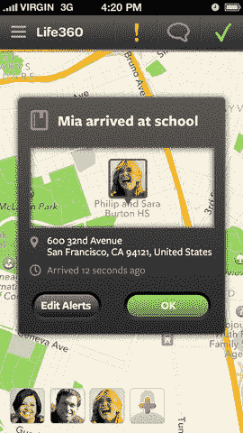

# 拥有比 Foursquare 更多用户的家庭定位器 Life360 筹集了 1000 万美元的 B 轮融资 

> 原文：<https://web.archive.org/web/https://techcrunch.com/2013/07/10/life360-the-family-locator-with-more-users-than-foursquare-raises-10-million-series-b/>

移动家庭定位工具 Life360 ，最近因其用户群[超过 Foursquare](https://web.archive.org/web/20221207215248/https://beta.techcrunch.com/2013/04/26/life360-a-family-networking-app-with-more-users-than-foursquare-is-now-headed-for-cars-smart-home-systems/) (该服务目前拥有超过 4000 万用户，而 Foursquare 的用户群[为 3000 万+](https://web.archive.org/web/20221207215248/https://foursquare.com/about/) )而声名鹊起，今天宣布获得 1000 万美元的 B 轮融资。这轮融资由 DCM 牵头，参与方包括 Life360 的现有投资者，包括 Bessemer、宝马、Seraph Group、Fontinalis Partners(比尔·福特的基金)和 500 家初创公司。新一轮融资使 Life360 迄今为止的融资总额达到 2000 万美元。

该公司计划将这笔资金用于各种产品增强、国际化努力以及与家庭安全和汽车合作伙伴的集成。

我们[最近与 Life360 首席执行官克里斯·赫尔斯谈论了 Life360 的发展方向](https://web.archive.org/web/20221207215248/https://beta.techcrunch.com/2013/04/26/life360-a-family-networking-app-with-more-users-than-foursquare-is-now-headed-for-cars-smart-home-systems/)。他解释说，这项服务在 2008 年推出，并不是一夜之间就成功的——首先是在安卓系统上。稍微超前一点的是，当时的用户并不像今天这样乐于通过手机分享自己的位置。

该公司通常避开科技媒体，后者通常更关注更热门的消费者网络公司，如上文提到的 Foursquare。此外，在一个工作者倾向于比该国其他人年轻得多的生态系统中，一个帮助父母和孩子更好地联系的应用程序有时会感觉像妈妈牛仔裤应用程序，相当于 far 的紧身牛仔裤， *far* 更酷的服务，如价值十亿美元的婴儿 Instagram。

尽管 Life360 积累用户的速度较慢，但它今年仍致力于创收计划，这在以前只是试验。它现在提供每月 4.99 美元的高级产品，包括 24/7“实时顾问”(类似于 OnStar 的)，道路救援，无限地点(你可以地理围栏的地点，如家庭，工作或学校)，扩展的位置历史，100 美元的被盗手机保护，非智能手机的位置查找等等。

 由于付费层级太新，该公司目前拒绝讨论其转换率。

然而，考虑到优质的功能集，Life360 现在正努力将其服务集成到一些车载导航系统中也就不足为奇了。通过去年 12 月完成的宝马(BMW)300 万美元的战略融资，该服务计划让司机只需通过语音指引系统导航到特定的家庭成员，而不是必须输入地址。

此外，Life360 一直在与家庭安全系统提供商进行交易，这些提供商将能够在没有家庭成员在家时自动启动系统。赫尔斯提到这些合作关系时说，Life360 希望成为“一个大得多的家庭数据平台。”

该公司对额外资金的直接计划将是招聘和基础设施——今天，这家初创公司每天处理超过 2.5 亿个 API 请求，每月的基础设施成本为几十万。在近期路线图中，Life360 将推出一项名为“圈子”的产品功能，该功能将扩展正在进行的私人社交网络趋势，允许用户邀请保姆或大家庭成员等其他人加入应用程序中的指定群组。

此外，赫尔斯表示，Life360 今年的国际增长呈爆炸式增长。“现在，Life360 超过一半的用户来自海外，”他告诉我们。Life360 没有在国际营销上投入任何资金，该应用程序的许多功能甚至无法在美国以外的地区使用。随着海外需求的持续增长，Life360 正专注于为该应用程序增加全球支持，今年秋天从亚洲开始，然后扩展到欧洲和其他地区。"

在 B 轮融资中的领先地位， [DCM](https://web.archive.org/web/20221207215248/http://www.dcm.com/) ，体现了 Life360 的国际战略。DCM 投资了一只专门针对专注于亚洲的移动优先公司的基金，亚洲是这家初创公司用户总数第二大、增长最快的地区，尽管这款应用尚未本地化。这种情况将在今年秋季晚些时候改变，届时该应用将推向欧洲和其他地区。

“DCM 将非常有帮助，因为我们将更积极地推进该地区的国际化进程，”Hulls 说。此外，主导这笔交易的合伙人是 Jason Krikorian，但他指出，亚洲合伙人 Osuke Honda 也积极参与了这笔交易，在该地区拥有丰富的经验。例如，本田是 KakaoTalk 的早期投资者。

总部位于旧金山的 Life360 现在有 32 名员工。