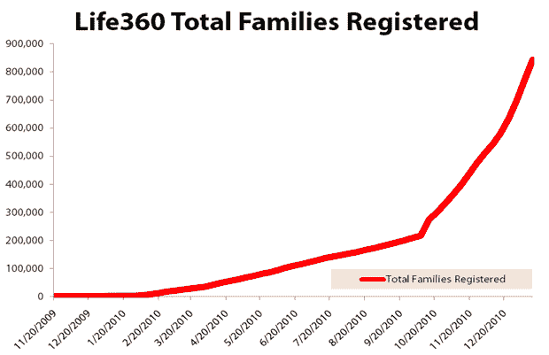

# Life360 的家庭安全应用程序支持签到，然后激增 TechCrunch

> 原文：<https://web.archive.org/web/http://techcrunch.com/2011/01/20/life360s-family-safety-app-embraces-the-check-in-then-surges/>

在过去的两年半时间里，我们一直在跟踪 [Life360](https://web.archive.org/web/20230202233502/http://www.life360.com/) 的进展，这是一家初创公司，旨在通过提供各种工具来帮助你保持家人的安全，比如防止身份盗窃和监控你邻居中性犯罪者的警报系统。这不是你所期望的那种会被广泛传播的事情。只不过这是刚刚发生的事。

最近，Life360 每天都在增加超过 10，000 个家庭——上周刚刚创造了新的纪录，有 72，000 个家庭注册。总的来说，它接近 100 万个注册家庭，其中 363 000 个是上个月活跃的。我们谈论的是*家庭*——下载的绝对数量更高。

那么是什么推动了增长呢？

媒体关注度的突然提升起到了作用。Life360 最近在多家报纸和美国有线电视新闻网上进行了报道。信息并没有集中在让它听起来对技术爱好者有吸引力上——赫尔斯说，真正锁定这项服务的是美国中产阶级家庭。父母似乎喜欢把孩子的新智能手机变成能让他们更安全的东西。

另一个催化剂是应用程序 UI 中相对较小的调整。Life360 在 Android 和 iPhone 上的移动应用程序提供了一个“恐慌”按钮已经有一段时间了——如果孩子点击了它，他们的父母会立即通过推送通知、短信或电子邮件收到消息。Life360 保留了这一功能，但最近它将按钮的名称改为一个不那么令人担忧的“签到”，事情从那里开始了。

赫尔斯说，正如你所料，父母喜欢知道他们的孩子是安全的。但是孩子们不太喜欢老大哥式的持续位置追踪，而签到系统是一种妥协。父母只需告诉他们的孩子经常通过 Life360 应用程序“签到”——只需点击一次，因此比发送短信更省事。当孩子登记时，家长会收到一个通知，告知他们的 GPS 坐标。家长们显然在告诉对方，他们对这个体系感到满意，这推动了进一步的增长。

签到功能仍有一些改进的空间:它实际上没有将坐标与附近的场地相关联，也没有让孩子解释他们在哪里的文本字段(Hulls 说这增加了摩擦，所以孩子不太可能签到)。但他说，即使没有这种背景，许多父母也很高兴他们从孩子那里得到了相当于竖起大拇指的数字信号。下周将发布一个新版本，增加更多功能。

最后，增长突然激增的最后一个关键是:Life360 的移动应用是免费的。以前，这家初创公司更关注其优质服务(包括提供配备 GPS 的硬件来跟踪你的孩子，一个可以监控性侵犯者是否正在转移到你所在地区的警报系统，等等)。现在的重点是获得免费移动应用的分销，并计划向上销售这些优质服务和其他新服务。

Life360 已经筹集了 150 万美元，正在筹集新一轮资金。其他也希望帮助父母监视孩子的服务包括美国电话电报公司的 FamilyMap(由[位置实验室](https://web.archive.org/web/20230202233502/http://www.locationlabs.com/)和 [Whereoscope](https://web.archive.org/web/20230202233502/http://www.whereoscope.com/) 提供支持)。

