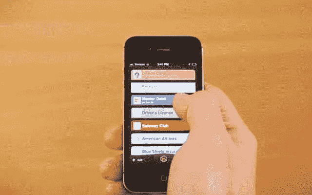

# LifeLock 以 4260 万美元收购移动钱包平台 Lemon，推出 LifeLock 钱包

> 原文：<https://web.archive.org/web/https://techcrunch.com/2013/12/12/lifelock-acquires-mobile-wallet-platform-lemon-for-42-6-million/>

Lemon 是一个数字钱包平台，允许用户在智能手机上存储他们的 ID、支付、积分卡和更多信息，该平台已被身份盗窃保护服务 [LifeLock](https://web.archive.org/web/20230401211914/http://www.lifelock.com/) 以大约 4260 万美元的价格收购，两家公司今天宣布。LifeLock 现在还推出了一款名为“LifeLock Wallet”的新应用，该应用基于 Lemon Wallet Plus 技术。

Lemon 于 2011 年首次推出，此前曾在第二年从 Maveron、Lightspeed Venture Partners、CampVentures、Draper Fisher Jurvetson、Chamath Palihapitiya 的 Social+Capital Partnership 和其他天使投资者那里筹集了 800 万美元的首轮融资。

对于 LifeLock 来说，这笔交易让该公司能够更深入地扩展到移动领域。直到今天，它只有一个针对其订阅服务用户的 iOS 应用程序,帮助他们管理警报——但没有像 Lemon 一样现代和移动优先。

“我们看到了将创新的移动平台(数字钱包)与领先的身份盗窃保护功能相结合的机会。LifeLock 总裁 Hilary Schneider 说:“像 Lemon 这样的移动优先公司的创新和专业知识为我们提供了与当前和未来会员互动的新方法。“此次收购使我们能够加快我们的产品路线图，为我们的平台添加额外的功能和数据，扩大我们的市场机会，更好地为我们的成员服务，并与广大消费者建立更有意义的关系，”她补充道。

从 Lemon 的角度来看，当你考虑移动钱包的“ID”方面时，LifeLock 和 Lemon 的结合也是有意义的。身份和欺诈保护符合 Lemon 已经在其高级层中构建的内容。

据我们所知，Lemon 的团队几周前就已经知道了这笔交易，在此次收购后，所有人都将加入 LifeLock。Lemon 首席执行官[文塞斯·卡萨雷斯](https://web.archive.org/web/20230401211914/http://www.crunchbase.com/person/wenceslao-casares)将加入 LifeLock，担任移动部门总经理，他和他的团队将在 LifeLock 内部运营，领导其移动部门。Lemon Palo Alto 团队将加入 LifeLock 的湾区办公室，而布宜诺斯艾利斯团队将留在那里。

## 柠檬钱包成为 LifeLock 钱包

柠檬钱包(Plus)现在正在形成新的 [LifeLock 钱包](https://web.archive.org/web/20230401211914/http://lifelock.com/mobile)产品的基础，它将取代以前的柠檬版本。当前用户将通过应用程序得到通知，他们需要升级到 LifeLock 的钱包。

对于那些不熟悉的人来说，Lemon Wallet Plus 服务是 Lemon 移动钱包应用程序的高级版本，提供帐户监控、余额更新、丢失钱包服务以及增强的安全性和卡过期提醒。以前，这些服务的费用为每月 4.99 美元或每年 39.99 美元。现在它们将被免费收录。

从今天开始，如果用户想从钱包应用程序升级，LifeLock 钱包将转而引导用户使用 LifeLock 的付费身份保护服务。额外的订阅将添加身份欺诈警报，并让消费者使用 LifeLock 的“非我”技术来应对欺诈活动。

升级后的钱包还将包括 LifeLock 的总服务保证，在身份被盗的情况下提供高达 100 万美元的专业恢复援助，24/7 访问 LifeLock 支持团队，并允许用户访问他们的每月信用评分。

柠檬网可能不再有

卡萨雷斯对手机的变革性很感兴趣已经有一段时间了。在莱蒙之前，他创立了 [Bling Nation](https://web.archive.org/web/20230401211914/https://techcrunch.com/2009/10/30/bling-nation-raises-20-million-for-cell-phone-payment-system/) ，这是一家创新的，但可能太早的公司，最初专注于非接触式移动支付。然而，Lemon 最初的想法是[移动收据组织者](https://web.archive.org/web/20230401211914/https://techcrunch.com/2011/10/13/backed-by-10m-in-funding-lemon-com-lets-you-store-organize-your-receipts-in-the-cloud/)，后来[发展成了更加成熟的移动钱包。](https://web.archive.org/web/20230401211914/https://techcrunch.com/2012/06/12/mobile-money-management-app-lemon-launches-digital-wallet-closes-8-million-series-a/)

虽然用户实际上不能在销售点用 Lemon 支付，但他们可以在应用程序中保留所有信用卡的副本——支付和其他。他们可以管理他们的开支、收据、跟踪余额、注销卡(如果你的钱包丢失或被盗)，等等。最近，该公司推出了 [Lemon Network](https://web.archive.org/web/20230401211914/https://techcrunch.com/2013/07/23/with-launch-of-lemon-network-wallet-app-maker-lemon-prepares-to-take-on-paypal-google-venmo-others/) ，试图建立一个商户网络，这些商户可以在他们的移动应用程序中通过 Lemon 接受支付，类似于 Venmo Touch。

尽管 Lemon 应用程序本质上被重新命名为 LifeLock 应用程序，但 Lemon Network 可能没有这么幸运。LifeLock 表示，它将评估这项技术的发展…这可能是被解雇的委婉说法。

Lemon 和之前的 Bling Nation 一样，可能还为时过早，还不能一炮而红，尤其是在美国，由于苹果的 Passbook 应用程序和 PayPal 等产品，用户才刚刚开始接受将钱包转移到手机上的想法，这些产品现在正在将消费者推向这个方向。

但该公司过去曾表示，Lemon 的产品覆盖了数百万消费者。然而，它从未讨论过牵引力或收入的细节，这很能说明问题。据我们所知，这笔交易的达成是因为这是为 Lemon 寻找出路的正确时机，这次收购为 Lemon 员工提供了有利的条件，这对 Casares 很重要。LifeLock 成立于 2005 年，是一家拥有 700 名员工的大型公司，总部位于亚利桑那州的坦佩，在加州的尔湾和桑尼维尔设有中心。

新的 LifeLock 应用程序是[这里是](https://web.archive.org/web/20230401211914/http://lifelock.com/mobile)。