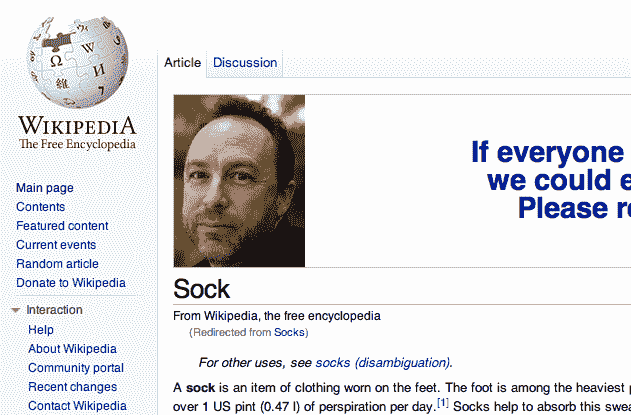

# 对维基百科创始人吉米·多纳尔·威尔士的个人呼吁

> 原文：<https://web.archive.org/web/https://techcrunch.com/2011/11/20/ligers-and-tigons-and-wales-oh-my/>

# 对维基百科创始人吉米·多纳尔·威尔士的个人呼吁

最亲爱的吉米·多纳尔·威尔士，

所以我们又见面了……是的，我知道，又是一个假期，[又是一个取笑你愚蠢的、引起恐镜症的横幅广告的理由，这些广告掩盖了筹集 2950 万美元用于不断更新的知识的无限供应的崇高事业——为此我们都非常感谢吉米，我保证。](https://web.archive.org/web/20230223133836/https://techcrunch.com/2010/11/22/just-add-wales/)

但是，不管出于什么原因，吉米，今年你选择了左对齐你的传统横幅广告肖像，要求[维基媒体基金会捐款](https://web.archive.org/web/20230223133836/http://meta.wikimedia.org/wiki/Fundraising_2010/What_we've_learned_so_far)，这意味着你的杯子最终会成为我在维基百科上查找的任何东西的伴随图像。

因此欢乐随之而来(见上、下、下、下，你会明白的)。

我不请自来的建议是，明年你拿一些捐款，尤其是我出于写这篇文章的内疚而准备扔给你的 20 美元，并聘请一名专业的平面设计师，这样你就不会吓到别人或(更糟糕的是)让他们无意中发笑。

最好(节日快乐！),

亚历克西亚·措特西斯

https://twitter.com/#!/gaberivera/status/135152567469621248

https://twitter.com/#!/gretchen Rubin/status/137497528781381632

https://twitter.com/#!/geneweingarten/status/138235086767259650

https://twitter.com/#!/aj keen/status/138409018375946242

https://twitter.com/#!/kash hill/status/137292038705123329