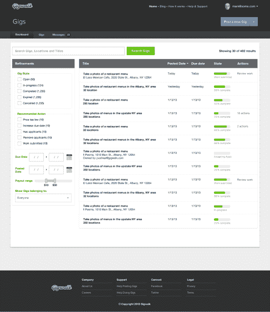

# Gigwalk，一个亚马逊土耳其人在现实世界中的工作，获得了一个升级的商业后端技术

> 原文：<https://web.archive.org/web/https://techcrunch.com/2013/02/20/like-an-amazon-turk-for-the-real-world-gigwalks-mobile-workforce-platform-gets-an-upgrade-as-business-adoption-grows/>

移动临时工中介公司 Gigwalk 允许用户从需要真实世界数据或市场研究的公司获得分配的工作(或“工作”)，随着该服务的发展，该公司今天升级了其面向企业的平台，以适应来自微软、梅赛德斯-奔驰、TomTom、易贝等客户的更大规模的工作分配。它还增加了另一个大牌品牌——利洁时(Reckitt Benckiser ),这是数百种[家用产品](https://web.archive.org/web/20221108223522/http://www.rb.com/our-brands/powerbrands-on-the-shelf)的所在地，包括来苏儿、Finish、Easy Off、Jet Dry、Woolite、Vanish、Vicks 等等。

这家公司有点像现实世界中的机械土耳其人，最近从八月资本、Greylock、Harrison Metal、SoftTech VC、Founder Collective 和其他公司筹集了 600 万美元的 A 轮。它现在拥有 220，000 名员工，比 10 月份的 200，000 人有所增加，并在美国和加拿大的 6，500 个城市提供服务。它也刚刚在波多黎各推出，并准备在英国扩张。

在获得资金时，Gigwalk 还扩展了与微软的关系，后者利用这项服务为 Bing 本地搜索收集数据——例如，该公司会让员工拍摄餐馆的 360 度照片。由于这些公司客户给 Gigwalk 带来的一些工作的规模，该公司最初的仪表板不再足够。它显示了一个活动演出的列表，但是企业必须点击每个演出才能查看详细信息。

在 Gigwalk 早期，这不是问题，因为客户通常一次只发布 20 或 30 个 gig。但是随着演出数量的增加，这很快成为一个棘手的问题。

今天的升级代表了对仪表盘的一次大检修。公司现在可以看到现场员工的实时地图，他们可以放大和缩小地图，等等。

Gigwalk 创始人兼首席技术官 Matt Crampton 解释说:“人们一次发布数千份演出，这种(旧仪表板)模式已经不再适用了。“他们需要能够一次看到所有这些东西，”他谈到 Gigwalk 客户的需求时说。在升级后的界面中，企业可以实时看到员工的详细信息、他们发送的消息、人们的位置、照片和调查答案以及其他数据。

还包括一套管理演出的搜索和过滤工具，由 [Elasticsearch](https://web.archive.org/web/20221108223522/http://www.elasticsearch.com/) 提供支持，该公司本周刚刚宣布[从 Index、Benchmark 和 SV Angel 获得 2400 万美元的 A 轮投资](https://web.archive.org/web/20221108223522/https://beta.techcrunch.com/2013/02/19/enterprise-and-open-source-data-search-and-analytics-startup-elasticsearch-raises-24m-from-index-ventures-benchmark-and-sv-angel/)。

然而，另一个旨在支持 Gigwalk 大客户的特性仍在开发中:开发者 API。Crampton 说，现在，该系统允许上传电子表格，它可以指派“管理员”一对一地与大客户合作，但这些 API 将在 beta 测试完成后的一两个月内可用。

对于 Gigwalk 来说，最大的优势不仅仅是利用传统的市场研究能力，为了方便起见把它们放到网上和手机上。这是关于初创公司使用算法方法描绘其员工用户群的能力。例如，该公司跟踪数据点，如工人是否按时上班、最终产品的质量以及工作需要多长时间。

“我们正在收集所有这些数据点——我们正在为我们系统内发生的每一项工作收集数百个数据点——我们正在利用这些数据来更好地模拟谁是优秀的跑腿者，”Crampton 说。“这让我们能够做到的是，当我们进入更复杂的工作时，我们能够将真正优秀的跑腿者与那些更复杂、薪酬更高的工作匹配起来。”

最终的结果是，Gigwalk 可以承担更大的工作量，并且比任何人都要快得多。“我们更便宜，而且完成速度快 10 倍，”Crampton 补充道。

该公司目前在演出价格的基础上收取 30%的标准利润，但拒绝透露其目前的收入或盈利状况。然而，演出往往从 4 美元到 100 多美元不等，对于那些在城市地区的人来说，你可以在几个街区内找到几个，一些更活跃的工人每月可以赚到 1000 美元或 2000 美元。

但是，尽管上面提到的工人特征分析有助于 Gigwalk 将好的从坏的中挑选出来，但它也可能会减缓终端用户在更随意参与的细分市场中的采用。也就是说，比如说，有人在外面到处演出，但并不经常演出。该公司目前使用推送通知来吸引这些更被动的参与者。但因为用户在获得高薪工作之前首先必须证明自己，这意味着他们必须找到动力，在他们的努力真正得到回报之前，到处为几美元工作。