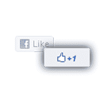

# Like+1 将脸书赞变成 Google+1s 

> 原文：<https://web.archive.org/web/https://techcrunch.com/2011/06/20/like1-extension-turns-facebook-likes-into-google-1s/>

# 喜欢+1 把脸书喜欢变成谷歌+1

由于 Google +1 按钮到底是做什么的[继续让一些用户](https://web.archive.org/web/20230209125207/https://techcrunch.com/2011/06/10/see-you-in-another-life-brother/)迷惑不解，安全研究员[阿什坎·索尔塔尼](https://web.archive.org/web/20230209125207/http://ashkansoltani.org/)和[布莱恩·肯尼什](https://web.archive.org/web/20230209125207/http://twitter.com/#!/byoogle)前谷歌员工和[脸书断开](https://web.archive.org/web/20230209125207/http://disconnect.me/)的幕后策划者，已经决定用一个浏览器扩展杀死两个按钮，创造[像+1](https://web.archive.org/web/20230209125207/http://www.likeplusone.org/) 。

不像 [+like 扩展](https://web.archive.org/web/20230209125207/https://techcrunch.com/2011/03/31/google-like-pretty-much-eliminates-the-need-for-1/)，它允许你像谷歌搜索结果一样脸书，Like +1 将所有异地 Like 按钮变成混合 Like+1 按钮，允许你将一些社交按钮点击行为合并到一次点击中，所以你可以同时+1 一些你喜欢的东西。

除了节省你点击两个不同按钮的努力，并让你在你的谷歌个人资料上查看你的脸书喜欢行为，该扩展将你所有的喜欢+1 活动保存在本地。所以，如果你想输出你喜欢的脸书独立唱片，或者+1 你很好。

Like +1，兼容 Chrome、Firefox、IE 和 Safari，由 [WebMynd](https://web.archive.org/web/20230209125207/http://www.webmynd.com/) 提供，对于饱受按键疲劳之苦的人来说是个好消息。现在你只需要做 50%的工作，就能在你的脸书饲料中看到你的劳动成果。

“网络有太多的按钮，”肯尼什说。是啊，看看这个帖子的顶部。