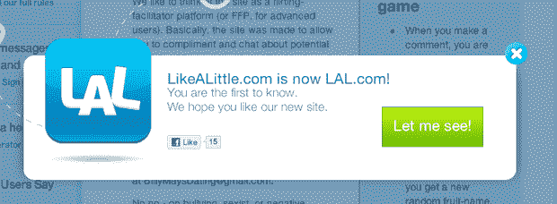

# 投资者不只是有点喜欢，而是非常喜欢 

> 原文：<https://web.archive.org/web/https://techcrunch.com/2011/04/28/likealittle-funding/>

# 投资者不只是有点喜欢，而是非常喜欢

任何时候，只要有一家初创公司悄悄火了起来，你总能找到一串投资者在火边取暖。以 [LikeALittle](https://web.archive.org/web/20221005153752/http://likealittle.com/) 为例。虽然他们一直保持沉默，但我们现在从多个来源证实，他们在今年早些时候从安德森·霍洛维茨和其他人那里筹集了 100 万美元。

这是有道理的。就像第一次[出现在我们的雷达上](https://web.archive.org/web/20221005153752/https://beta.techcrunch.com/2010/12/19/likealittle/)是在去年 12 月，当时我们正在调查一条[黑客新闻线索](https://web.archive.org/web/20221005153752/http://news.ycombinator.com/item?id=2020416)声称 Y Combinator Winter 的一家初创公司在六周内完成了 2000 万次页面浏览量，并且每天增加超过 100 万次页面浏览量。当然，这家初创公司就像一个社交网络 Little，由前谷歌员工和微软员工创办，分别是 [Evan Reas](https://web.archive.org/web/20221005153752/http://www.crunchbase.com/person/evan-reas) 、[pra sanna Sankaranarayanan](https://web.archive.org/web/20221005153752/http://www.crunchbase.com/person/prasanna-sankaranarayanan)和 [Shubham Mittal](https://web.archive.org/web/20221005153752/http://www.crunchbase.com/person/shubham-mittal) 。

如果你以前没有听说过 LikeALittle，那可能是因为你已经过了 22 岁。就像早期的脸书一样，LikeALittle 将它的匿名调情网络瞄准了大学校园。事实上，大学氛围加上用户发送的短信和匿名层混合在一起，让它看起来有点像 Twitter 遇到脸书遇到聊天轮盘——还夹杂着调情的性暗示。难怪投资者热衷于此。

LikeALittle 游戏的规则包括:

*   当你发表评论时，对于一个给定的主题，你会得到一个随机的水果名。
*   这有助于你保持对话，同时保持匿名。
*   对于一个新的线程，你得到一个新的随机水果名称。

好玩。他们有工具删除色情和攻击性的帖子。他们喜欢认为自己是一个“调情促进者平台”。

我们听说，100 万美元的融资以 1000 万美元的估值筹集。他们显然已经很好地利用了这笔钱:他们现在拥有了 lal.com。

这显然是一个值得关注的问题。

