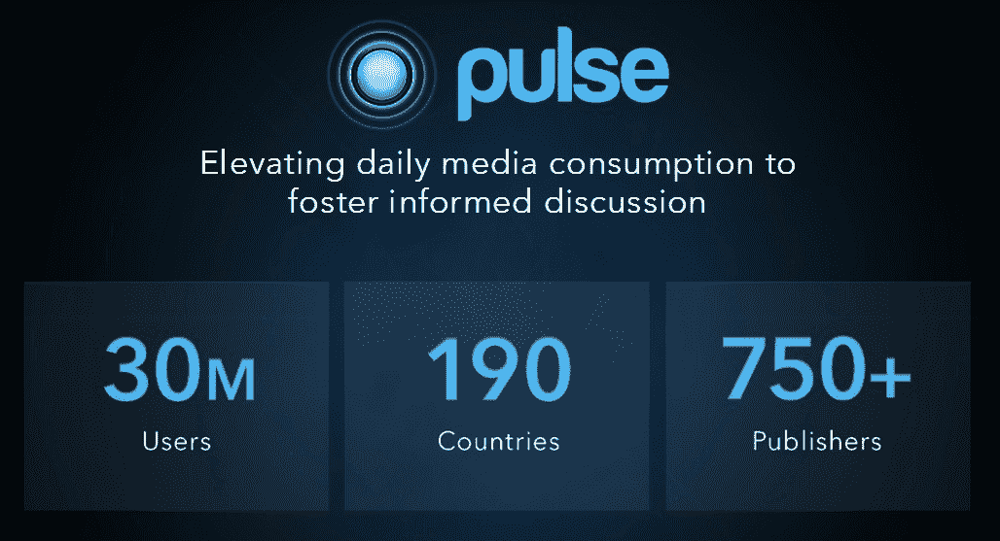

# LinkedIn 以 9000 万美元的股票和现金收购 Pulse 

> 原文：<https://web.archive.org/web/https://techcrunch.com/2013/04/11/linkedin-acquires-pulse-for-90m-in-stock-and-cash/>

LinkedIn 今天[宣布](https://web.archive.org/web/20221231003954/http://blog.linkedin.com/2013/04/11/welcome-pulse-to-linkedin-family/)已经收购了 [Pulse](https://web.archive.org/web/20221231003954/http://pulse.me/) ，这是一个网络和手机上流行的新闻阅读器。LinkedIn [称](https://web.archive.org/web/20221231003954/http://press.linkedin.com/News-Releases/295/LinkedIn-Acquires-Pulse)该交易价值约 9000 万美元，其中约 90%为股票，10%为现金。该收购预计将于 2013 年第二季度完成。

今天的声明并不完全出人意料，因为几周前就有关于两家公司谈判的传言。

LinkedIn 辩称，它收购 Pulse 是因为它希望该网站“成为权威的专业出版平台——所有专业人士都可以在这里消费内容，出版商也可以在这里分享他们的内容。数百万专业人士已经在 LinkedIn 上开始了他们的一天，收集他们需要的专业见解和知识，使他们在工作中表现出色。”

LinkedIn 的产品和用户体验 SVP 在今天的一份声明中表示:“我们很高兴能够将 Pulse 的大量人才、技术和产品添加到我们不断增长的内容生态系统中，我们相信它们将帮助我们加快我们的能力，为我们的成员提供他们需要的洞察力，以便在任何设备上做得更好。”。“为了继续向我们的成员提供这种价值，我们对内容的愿景是 LinkedIn 将成为权威的专业发布平台，而 Pulse 是这一愿景的完美补充。”

Pulse 于 2010 年由阿克谢·科塔里和安基特·古普塔创立，当时他们还是斯坦福大学的学生。这项服务最初是一个 iPad 应用程序，但很快扩展到其他平台，包括网络[。就在最近，Pulse 开始涉足社交](https://web.archive.org/web/20221231003954/https://techcrunch.com/2012/08/09/pulse-web-launch/)领域，为其应用添加了许多社交功能。鉴于今天的收购，Pulse 可能会在不久的将来更加关注这一点。

这项服务目前在 190 多个国家拥有约 3000 万用户。大约 40%的用户在美国以外

Kothari 在他今天的公告中写道“Pulse 应用程序将保持不变，我们的两个团队很高兴能合作开发出又酷又有用的新产品。”

2010 年 10 月，Pulse 筹集了 80 万美元的种子资金。Redpoint Ventures、Greycroft Partners、Mayfield Fund、e.ventures 和 Lightspeed Venture Partners 参与了此轮投资。2011 年 6 月，Pulse 从[New Enterprise Associates](https://web.archive.org/web/20221231003954/http://www.crunchbase.com/financial-organization/new-enterprise-associates)、 [Greycroft Partners](https://web.archive.org/web/20221231003954/http://www.crunchbase.com/financial-organization/greycroft-partners) 和 [Lerer Ventures](https://web.archive.org/web/20221231003954/http://www.crunchbase.com/financial-organization/lerer-ventures) 获得了[900 万美元的 A 轮融资。](https://web.archive.org/web/20221231003954/https://techcrunch.com/2011/06/16/4-million-users-strong-and-apple-design-award-in-hand-pulse-grabs-9-million-series-a/)