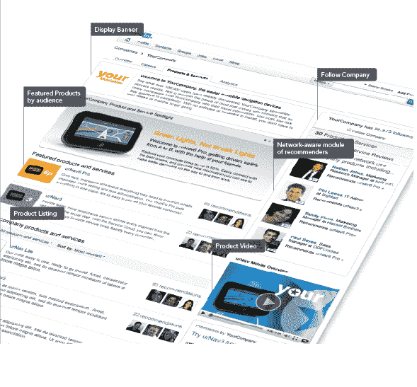

# LinkedIn 将产品、推荐等带到公司页面 TechCrunch

> 原文：<https://web.archive.org/web/https://techcrunch.com/2010/11/01/linkedin-brings-products-recommendations-and-more-to-company-pages/>

# LinkedIn 将产品、推荐等带到公司页面

除了给用户资料页面增加更多功能外，职业社交网络 LinkedIn 一直在[加强其在网络上的](https://web.archive.org/web/20221208180027/https://beta.techcrunch.com/2010/09/28/linkedin-beefs-up-company-profiles-with-news-feeds-career-data-and-more/)公司资料，允许企业[增加关注选项](https://web.archive.org/web/20221208180027/https://beta.techcrunch.com/2010/06/22/linkedin-takes-groups-to-the-next-level-with-likes-follows-and-more/)，并包括新闻提要和职业信息。这些功能背后的想法是鼓励公司在他们的档案中添加更多数据，这对寻找工作机会的专业人士和招聘人员都很有用。如今，LinkedIn 在公司页面、产品、服务以及推荐公司或产品的能力上增加了额外的精选信息。

在公司页面上，管理员可以添加产品和服务选项卡。因此，会计业务可以展示公司提供的各种金融服务。LinkedIn 更进一步，允许公司根据会员档案定制产品和服务清单。因此，企业主可以向航空业的会计师展示一套产品(或服务)，向航运业的工程师展示另一套产品(或服务)。

公司还可以在他们的网页上添加产品和服务的视频，并比其他产品更突出地展示特定的产品。

反过来，LinkedIn 会员可以在公司简介上推荐和评论产品或服务，他们的推荐也会出现在他们自己的简介上。公司页面也会列出推荐过某个特定产品的人。有趣的是，LinkedIn 似乎正在使用来自 [mSpoke 的推荐技术，LinkedIn 在今年早些时候收购了](https://web.archive.org/web/20221208180027/https://beta.techcrunch.com/2010/08/04/linkedin-mspoke/)。

LinkedIn 还透露，许多知名公司都在使用 Pages 模块，包括戴尔、惠普、捷蓝、微软和 E*Trade。