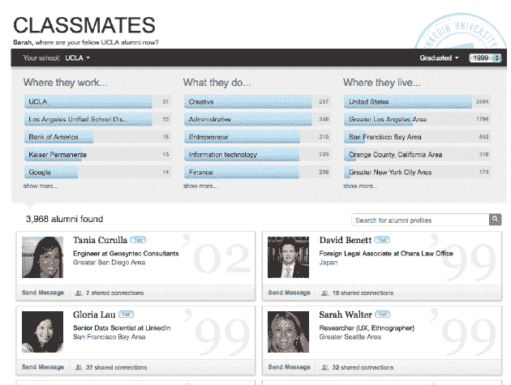
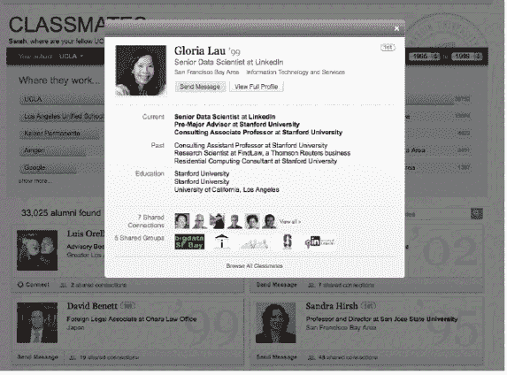

# LinkedIn 首次推出同学会，帮助你与校友保持联系 

> 原文：<https://web.archive.org/web/https://techcrunch.com/2011/10/19/linkedin-debuts-classmates-to-help-you-stay-connected-with-your-fellow-alumni/>

# LinkedIn 首次推出同学会，帮助你与你的校友保持联系

以前，你可以在 LinkedIn 上通过姓名或教育机构搜索来联系大学和研究生院的联系人，但 LinkedIn 现在让这一过程变得更加容易，提供了丰富的体验。LinkedIn 今天首次推出了一个新工具，名为“同窗”，它为职业社交网络的用户提供了新的见解和网络功能，以联系大学和学院的校友。

通过同学你可以按大学(即哥伦比亚大学，我的母校)选择一个网络，我可以通过图表看到我的大多数同学在哪里工作，他们做什么(按行业)，他们住在哪里。您还可以看到与您共享联系的校友列表，并通过该功能向他们发送消息。

目前，你在 LinkedIn 个人资料中列出的学校是自动可用的。LinkedIn 还会设置日期，显示你上学期间在校园里的人(从你的个人资料中)。如果您列出了多所学校，请从下拉窗口中选择不同的学校，以深入了解该机构的数据。

这个工具实际上让与老校友的联系变得更加容易。我可以想象这是会员使用 LinkedIn 的一种非常受欢迎的方式，让这种搜索更加丰富和有用是有意义的。这只是 LinkedIn 如何利用其 1.2 亿多名成员的海量数据来改善求职和职业联系体验的又一个例子。

尽管你想知道 Classmates.com 的[对这个新功能有什么想法。](https://web.archive.org/web/20230203152052/http://www.classmates.com/)

