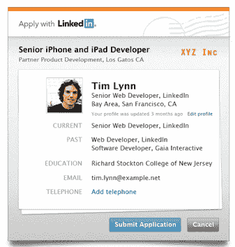
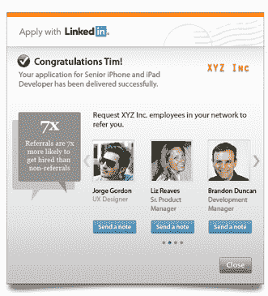

# LinkedIn 首次推出面向企业的嵌入式求职工具 

> 原文：<https://web.archive.org/web/https://techcrunch.com/2011/07/25/linkedin-debuts-embeddable-job-application-tool-for-companies/>

4 月，LinkedIn [推出了](https://web.archive.org/web/20221006173818/https://beta.techcrunch.com/2011/04/06/linkedin-unveils-a-more-open-developer-platform-with-lightweight-customizable-plugins/)新的可定制插件，这是来自专业社交网络的功能，可以轻松定制并嵌入网站。LinkedIn 插件能够向网站添加成员资料、公司信息和 [LinkedIn 共享按钮](https://web.archive.org/web/20221006173818/https://beta.techcrunch.com/2010/11/30/linkedin-thinks-publishers-need-yet-another-share-this-button/)。今天，LinkedIn 正在[推出](https://web.archive.org/web/20221006173818/http://blog.linkedin.com/2011/07/24/apply-with-linkedin/)公司的主要插件——向 LinkedIn 申请。

新的插件(关于该功能的最初细节最初是由 GigaOm 在 6 月初透露的)在任何公司网站上放置了一个“向 LinkedIn 申请”按钮。公司可以定制“向 LinkedIn 申请”模块的外观，让它看起来像是特定品牌的一部分。公司可以通过将申请发送到电子邮件地址或网络应用程序来管理求职申请。该插件还可以与申请人跟踪系统集成，并且只需要嵌入网站的一小段代码。

第一批在公司网站上推出“向 LinkedIn 申请”按钮的公司包括网飞、TripIt 和 Photobucket。LinkedIn 表示，另有 1000 家公司将推出 LinkedIn 申请按钮。

从求职者的角度来看，你会看到工作和公司的描述，一旦你点击“用 LinkedIn 申请”按钮，你就可以实时预览和更新你的个人资料。一旦你提出申请，LinkedIn 还会向你展示你在该公司工作的职业关系，以防你想就这份工作联系这些人。您将能够从该模块向这些连接发送一个通知。

如果你不认识公司里的任何人，LinkedIn 会向你展示可以把你介绍给那里的人的关系(LinkedIn 表示，在其网络上，推荐是公司外部招聘的最大来源)。



Finally，LinkedIn 将在“保存的职位”标签中记录所有“向 LinkedIn 申请”的提交，这样你就有了你申请的所有职位的记录，即使是在 LinkedIn 网站之外。

考虑到 LinkedIn 在工作申请、[研究和社交](https://web.archive.org/web/20221006173818/https://beta.techcrunch.com/2011/06/22/linkedin-men-are-more-savvy-networkers-than-women/)中的使用频率，这个插件为公司和求职者都提供了真正的价值。将个人数据添加到求职申请中的能力(例如，在你感兴趣的公司工作的人脉)也很有吸引力。

LinkedIn 的 Share 插件看到了[令人印象深刻的结果](https://web.archive.org/web/20221006173818/https://beta.techcrunch.com/2011/06/30/linkedin-traffic-twitter/)，而继 5 月份的 [IPO 之后，](https://web.archive.org/web/20221006173818/https://beta.techcrunch.com/2011/05/19/linkedin-ipo-shares-pop-84-percent-on-first-trade/)[的流量在网络上爆发](https://web.archive.org/web/20221006173818/https://beta.techcrunch.com/2011/07/08/linkedin-surpasses-myspace-for-u-s-visitors-to-become-no-2-social-network-twitter-not-far-behind/)。

该公司也在加大广告投放力度，推出新的社交广告形式，利用会员在网站上的行为提供更有针对性的广告。考虑到脸书是如何从社交广告中赚钱的，LinkedIn 从这一渠道获得最大收入是有道理的。

不清楚的是“向 LinkedIn 申请”工具是否会给社交网络带来任何经济利益。

【YouTube http://www.youtube.com/watch?v=icche0kMP00&w=560&h=349]

