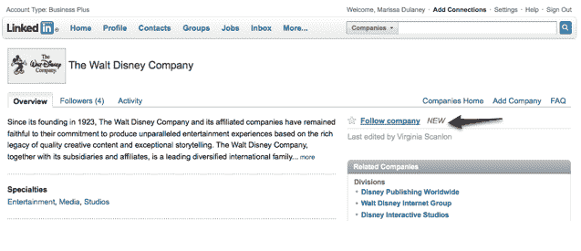

# LinkedIn 跟随脸书和 Twitter 进入“跟随”模式

> 原文：<https://web.archive.org/web/https://techcrunch.com/2010/04/29/linkedin-follows-facebook-and-twitter-into-follow-model/>

# LinkedIn 跟随脸书和 Twitter 进入“跟随”模式

[LinkedIn](https://web.archive.org/web/20230406081143/http://www.linkedin.com/) 一直致力于使其职业社交网络更加社会化。随着脸书和 Twitter 的大规模流行，LinkedIn 使用这些网络的一些功能来使其平台更加社会化是有意义的。去年秋天，Linked 与 [Twitter 整合后，](https://web.archive.org/web/20230406081143/https://techcrunch.com/2009/11/09/social-networks-continue-to-rally-around-twitter-as-linkedin-goes-tweet-crazy-too/)允许用户从其平台上发推文，并将外部客户的推文发送到带有标签的 LinkedIn。今天，LinkedIn[推出了](https://web.archive.org/web/20230406081143/http://blog.linkedin.com/2010/04/29/linkedin-company-follow/)一个小但非常熟悉的功能:能够“关注”一家公司的简介。

所以现在，任何 LinkedIn 用户都可以在网络上关注一家公司，并将在他们的新闻和活动流中收到来自个人资料的实时提醒。这在理论上非常类似于在 Twitter 上“关注”某人成为脸书某人的粉丝。

这个想法是帮助用户实时跟踪公司的更新，比如职位空缺，新的发展等等。现在，您可以点击某家公司个人资料上的“关注”按钮，他们的更新将自动添加到您的信息流中。您还可以选择从这些公司接收更新的数量和类型。

LinkedIn 正在推动更多的社交功能，这并不奇怪，因为这似乎是一个更大战略的一部分。LinkedIn 拥有 6500 万会员，用户数量稳步增长，但它希望将 LinkedIn 带到人们在职业生活中可能使用的任何网站或平台。在过去的几个月里，该公司[推出了](https://web.archive.org/web/20230406081143/https://techcrunch.com/2010/04/21/linkedin-launches-url-shortener-enhances-sharing-options/)一个新的网址缩写器，并增强了分享功能，与[微软 Outlook](https://web.archive.org/web/20230406081143/https://techcrunch.com/2009/11/09/social-networks-continue-to-rally-around-twitter-as-linkedin-goes-tweet-crazy-too/) 集成，并开放了[平台的 API。](https://web.archive.org/web/20230406081143/https://techcrunch.com/2009/11/23/five-ways-startups-are-tapping-into-linkedins-api/)

然而，如果 LinkedIn 以某种方式与脸书整合，就像它与 Twitter 的整合一样，应该会很有趣。韦纳最近告诉我，Twitter 推出后，社交网络上的状态更新显著增加。凭借脸书超过 4 亿的会员，LinkedIn 利用脸书社交网络的巨大力量是有意义的。