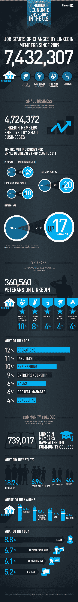

# 自 2009 年以来，LinkedIn 经历了 740 万次工作变动，470 万会员受雇于小企业 

> 原文：<https://web.archive.org/web/http://techcrunch.com/2011/09/26/linkedin-has-seen-7-4m-job-changes-since-2009-4-7m-members-are-employed-by-small-businesses/>

# 自 2009 年以来，LinkedIn 经历了 740 万次工作变动，470 万会员受雇于小企业

美国总统巴拉克·奥巴马定于今天在山景城的计算机历史博物馆与职业社交网络 LinkedIn 进行短暂停留，与 LinkedIn 成员谈论就业创造和经济。该会议将由现场观众提问，以及 LinkedIn 会员在过去一周提出的数千个问题。在过去一年左右的时间里，LinkedIn 对其 1.2 亿会员的个人资料信息进行了多次深度数据挖掘，以突出趋势。今天，该网络[开发了一个信息图表](https://web.archive.org/web/20230205041637/http://blog.linkedin.com/2011/09/26/startup-america/)，调查了 LinkedIn 成员在过去两年中的经济机会和行业增长。

例如，LinkedIn 表示，自 2009 年以来，其会员已经有 740 万人跳槽或开始工作。这些变化的主要行业是高等教育、医疗保健、信息技术以及营销和广告。

470 万 LinkedIn 会员受雇于小企业。网络中小企业增长最快的行业是可再生能源和环境(自 2009 年以来增长了 29%)；石油和能源(自 2009 年以来上涨了 20%)、食品和饮料(自 2009 年以来上涨了 18%)以及医疗保健(自 2009 年以来上涨了 18%)。

LinkedIn 上有超过 36 万名退伍军人，退伍军人工作的最受欢迎的行业是信息技术、国防和航天、医疗保健、高等教育和政府管理。LinkedIn 上有近 74 万名会员上过社区大学，大多数人学习商业、计算机科学、会计和护理。

作为奥巴马总统活动的一部分，LinkedIn 将向 Startup America Partnership entrepreneurs 捐赠高达 10 万份免费订阅(价值 500 万美元)。

往期资料潜比较[男女网商、](https://web.archive.org/web/20230205041637/https://techcrunch.com/2011/06/22/linkedin-men-are-more-savvy-networkers-than-women/) [职业名称](https://web.archive.org/web/20230205041637/https://techcrunch.com/2011/04/27/linkedin-takes-a-data-dive-to-examine-whats-in-a-professional-name/)、[创业创始人简介](https://web.archive.org/web/20230205041637/https://techcrunch.com/2011/09/01/linkedin-takes-a-deep-data-dive-on-startup-founder-profiles/)信息。

