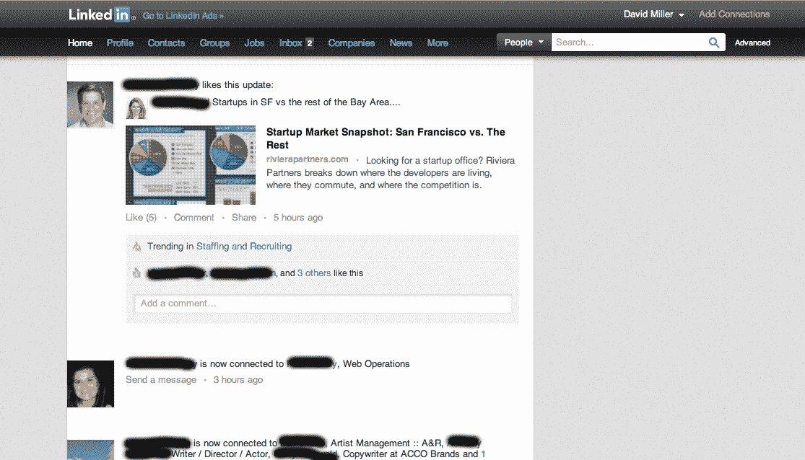
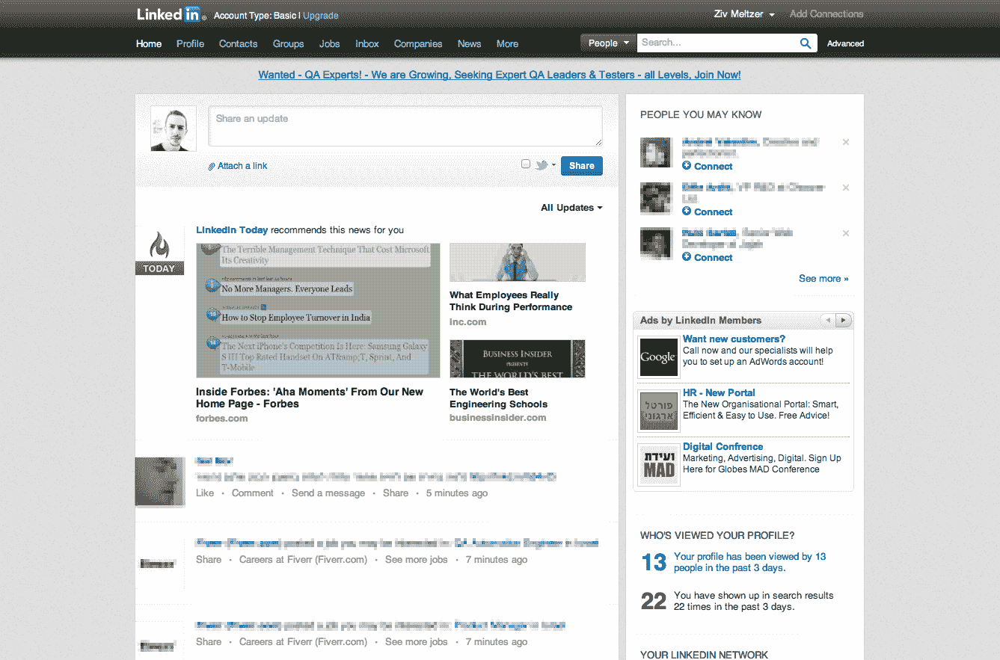

# LinkedIn 正在为重新设计做准备:更大的图片、锚定菜单(以及更少发推文的生活)

> 原文：<https://web.archive.org/web/https://techcrunch.com/2012/07/10/linkedin-is-gearing-up-for-a-redesign-bigger-pictures-anchored-menu-and-a-life-less-tweeted/>

[LinkedIn](https://web.archive.org/web/20221207001040/http://linkedin.com/) 如今可能是那些寻找新工作的人[使用最多](https://web.archive.org/web/20221207001040/http://www.forbes.com/sites/susanadams/2012/06/05/new-survey-linkedin-still-the-top-social-networking-site-for-job-seekers-and-recruiters/)的社交网络(而 *[不是](https://web.archive.org/web/20221207001040/http://blog.linkedin.com/2012/06/29/sharing-on-linkedin-twitter/)* 阅读推文的地方)，但该公司长期以来一直希望被视为一个有更多用途的地方，我们现在可以一窥它计划如何将其付诸行动。LinkedIn 已经悄悄地向其 1.6 亿多用户推出了新版本的主页——这是多年来的第一次重大更新——其布局将更加强调建立关系，更好地利用社交策划的新闻内容——如果事情按计划进行，应该会使网站更有粘性。

我们已经有三个不同的人就新版 LinkedIn 联系了我们，该公司的一位发言人也证实了这一点:

“我们一直在寻找方法，通过创造更简单、更相关的体验，让 LinkedIn 成员更容易从我们的服务中获得更多价值，所以我们目前正在与少数成员测试 LinkedIn 主页的新设计，”他告诉 TechCrunch。

从我们已经收到的关于新外观的建议数量来看(以及那些我们已经发现在网上讨论它的建议)，它可能会在几周内从测试阶段进入更广泛的推广。

那么新网站上有什么？许多相同的元素和以前一样存在，但是以更动态的方式存在。

例如，现在在深色背景上的新菜单栏，具有与现有菜单栏相同的选项卡，但是当你向下和四处滚动时，它将保持在页面的顶部。这使得用户能够在页面上的任何地方创建消息或查看新闻。

同样，LinkedIn 今天仍然出现在页面顶部附近，但现在提要中的图像要大得多。虽然这与脸书时间表完全不同(首先，LinkedIn 上没有发布照片，除了你的个人资料照片)，但你可以看到视觉导向的重新设计的影响，这种设计被用来吸引用户。

与此同时，“查看过你个人资料的人”区域似乎也有更多的功能，每个人旁边都有条件的“消息/连接”按钮，这意味着:如果有人查看过你的个人资料，并且你与他们有联系，你可以向他们发送消息，否则，你可以连接。

LinkedIn 更大的战略举措是更加简化。这是我们在该公司最新版本的移动应用中看到的东西，也是首席执行官杰夫·韦纳[强调的](https://web.archive.org/web/20221207001040/http://investors.linkedin.com/common/download/download.cfm?companyid=ABEA-69T44N&fileid=571941&filekey=3fc7d0f0-b2ef-4daa-992a-fb14a375c381&filename=lnkd%20transcript.pdf)公司更广泛的目标。这似乎也是 LinkedIn 的目标。

但几乎可以肯定的是，这些美学上的改进也将伴随着算法上的变化，即易用性将与 LinkedIn 成员实际上想要使用的内容相结合:这是否是通过“你可能认识的人”对潜在联系人进行更相关的选择，LinkedIn 上更个性化的故事列表，或者与你的联系人创建和分享内容的更简单方式。

关于人们使用 LinkedIn 作为他们自己的想法和信息分享的地方的最后一点是很重要的。虽然具有增强内容功能的新主页的开发早在几个月前就已经开始，但它的出现恰逢 Twitter 与 LinkedIn 半分离之后，这是及时的，Twitter 已经[将其 API](https://web.archive.org/web/20221207001040/https://dev.twitter.com/blog/delivering-consistent-twitter-experience) 限制为[阻止推文](https://web.archive.org/web/20221207001040/http://blog.linkedin.com/2012/06/29/sharing-on-linkedin-twitter/)自动发布到 LinkedIn 的社交网络。

我们听说，这些推文在 LinkedIn 上产生了大量内容，但不一定是与专业网络相关的内容。这说明了两件事:有一个洞需要填补，有一个机会用比以前更好的方式来填补这个洞。

我的一位同事对我说:“随着 Twitter 被从 LinkedIn 上撤下，我意识到自己更有动力(在 Linkedin 上)发布状态更新。”嗯，可能是这样，也可能是因为需要额外的时间和精力，人们不再使用这个网站。这也是 LinkedIn 需要快速更新的原因。

