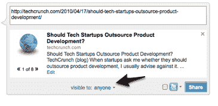

# LinkedIn 推出 URL Shortener，增强内容共享选项 

> 原文：<https://web.archive.org/web/https://techcrunch.com/2010/04/21/linkedin-launches-url-shortener-enhances-sharing-options/>

# LinkedIn 推出 URL Shortener，增强内容共享选项

职业社交网络 [LinkedIn](https://web.archive.org/web/20230127021504/http://www.linkedin.com/) 通过与 [Twitter、](https://web.archive.org/web/20230127021504/https://techcrunch.com/2009/11/09/social-networks-continue-to-rally-around-twitter-as-linkedin-goes-tweet-crazy-too/)和 [Microsoft Outlook](https://web.archive.org/web/20230127021504/https://techcrunch.com/2009/11/09/social-networks-continue-to-rally-around-twitter-as-linkedin-goes-tweet-crazy-too/) 的整合以及开放[平台的 API，一直在稳步扩展其平台外的业务。](https://web.archive.org/web/20230127021504/https://techcrunch.com/2009/11/23/five-ways-startups-are-tapping-into-linkedins-api/)由于 LinkedIn 从网络外的用户那里获取数据和状态更新，该公司已经为用户增强了共享和隐私选项。LinkedIn 推出了一个官方网址缩写器 Lnkd.in，用于任何从其网站分享的链接。

通过新的公共与私人控制，您可以完全控制谁可以看到您在网络或 Twitter 上共享的内容，无论是每个人、您的联系人、群组还是特定个人。当你在网站或 Twitter 上分享一个链接或网址时，你可以用配套的网址缩短器 Lnkd.in 缩短链接。

LinkedIn 没有用 Bit.ly 创建一个品牌化的 URL shortener，而是决定开发自己的应用程序，以便可以直接将其绑定到 LinkedIn 自己的后端，具有高 SLA 和数据保真度。

LinkedIn 对其分享功能进行了重大改进。当你分享一篇新闻文章时，LinkedIn 现在允许你定制你链接的新闻文章的摘录。因此，用户可能更有动力点击包含图片或链接所带内容的前几行的链接。LinkedIn 在分享方面也加强了其归因，将你重新分享的东西归因于与你分享的人。

LinkedIn 拥有 6500 万会员，用户数量稳步增长。首席执行官杰夫·韦纳表示，该公司正在实施一项产品战略，将 LinkedIn 引入人们在职业生活中可能使用的任何网站或平台。随着平台在网络上的扩张，它不可避免地需要加强和限制分享。此外，它还需要跟踪从其网站传播的内容，URL shortener 将会做到这一点。

【YouTube = http://www . YouTube . com/watch？v = er3 wevf-Zps & HL = en _ US & fs = 1 & HD = 1]