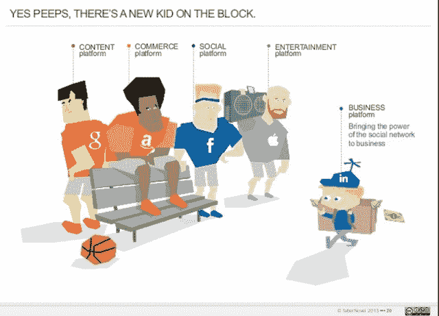
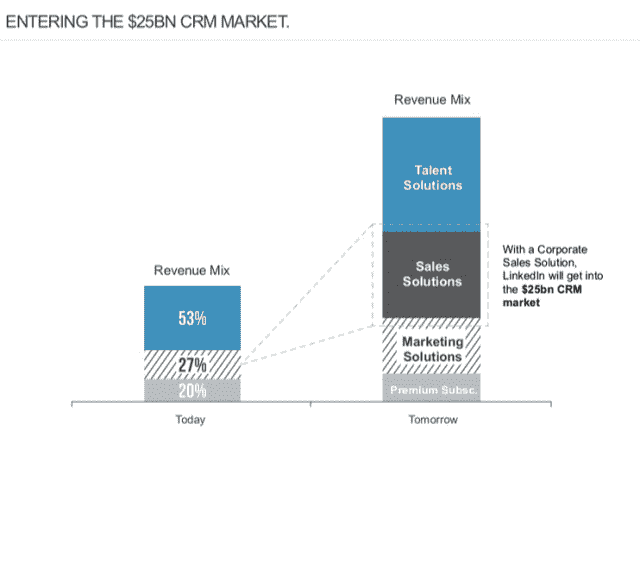

# LinkedIn 的市值超过 Salesforce，sales force 一直是云服务的风向标 

> 原文：<https://web.archive.org/web/https://techcrunch.com/2013/09/15/linkedin-market-cap-surpasses-salesforce-long-the-bellwether-symbol-of-cloud-services/>

# LinkedIn 的市值超过了长期以来作为云服务风向标的 Salesforce

LinkedIn 的市值连续第二周高于 Salesforce.com。Linkedin 周五收盘时市值为 325.6 亿美元，而 Salesforce 市值为 295.9 亿美元。Salesforce 是华尔街的宠儿，长期以来一直是 SaaS 和企业新世界的象征，第一个年收入超过 10 亿美元的公司。但随着 LinkedIn 的崛起，金融市场又有了一家可以作为 SaaS 世界领导者的公司。

Linkedin 主要是一个商务专业社交网络，但其越来越多的收入来自 SaaS，该公司正在深入推进 CRM 市场。该公司通过发展网络效应，使公司进入企业市场，从而与 SaaS 平台和企业提供商形成差异化竞争。

Salesforce 的核心并不像 LinkedIn 那样是一个网络。该公司最初建立在其 CRM 平台上，但近年来它变得更像一个平台提供商，希望从其应用程序平台和收购 [ExactTarget 等业务中获得增长。](https://web.archive.org/web/20221207010413/https://beta.techcrunch.com/2013/06/04/with-exacttarget-acquisition-salesforce-com-has-spent-close-to-3-5-billion-to-get-into-the-chief-marketing-officers-suite/ "With ExactTarget Acquisition, Salesforce.com Has Spent Close To $3.5 Billion To Get Into The Chief Marketing Officer’s Suite")在其发展过程中，Salesforce 证明了有订阅收入的云服务能够取得成功。许多 SaaS 供应商已经跟随它的道路，其中一些成为上市公司。

LinkedIn 建立了一个专注于数据分析和算法的经济图表，这使其成为一个大型商业平台。根据 [FaberNovel](https://web.archive.org/web/20221207010413/https://beta.techcrunch.com/2013/07/03/study-linkedin-positioned-to-become-first-global-economic-graph-business-platform-on-par-with-google-and-facebook/) 今年夏天的一项研究，LinkedIn 的成功和向新市场的扩张依赖于挖掘数据交易，它通过汇集数据来寻找联系，并建立新的服务，使用 SaaS 模式销售这些服务。该公司是如何建立基于开源数据技术的核心实践的典范，如 Hadoop 和 [Lucene/Solr](https://web.archive.org/web/20221207010413/https://beta.techcrunch.com/2012/10/12/open-source-search-engine-apache-lucenesolr-gets-big-update/) for search，它正利用这些技术成为企业服务提供商和 CRM 市场的参与者。

该公司将社交网络的概念与 SaaS 技术的传统产品相结合，创建了一种跨越不同市场的新型商业平台。

根据 Faber-Novel 的研究，LinkedIn 近 50%的收入来自其人才解决方案。该公司每天更新代码三次，这有助于推动快速开发周期，不断提供优质服务，看看什么最有共鸣。

它通过其[销售导航器](https://web.archive.org/web/20221207010413/http://www.linkedin.com/company/linkedin/linkedin-sales-navigator-899344/product)工具扩展到销售管理领域，为销售人员提供社交销售能力。这项服务是 LinkedIn 如何与 Salesforce 竞争的一个明显例子。

Bessemer Venture Partners 是 LinkedIn 的投资者，自 2012 年 1 月以来，一直通过其[云指数](https://web.archive.org/web/20221207010413/http://www.bvp.com/cloud)跟踪其市值和其他 SaaS 提供商。LinkedIn 的市值在不到一年的时间里增长了 5 倍多，而 Salesforce.com 的市值增长了一倍多。上周末，当 LinkedIn 刚刚开始超越 Salesforce 时，venture group 更新了其指数。

应该指出的是，Salesforce 今年表现出色。其股价周五收于 49 美元，该公司即将迎来第一个 10 亿美元的季度。上个季度，它公布了 9.57 亿美元的收入，与去年相比增长了 31%。该公司预计 2014 财年的收入将超过 40 亿美元。2013 年，它公布了 30 亿美元的收入。2012 年，收入为 22 亿美元。该公司在 2010 财年公布了第一个 10 亿美元的财年，收入为 13 亿美元。今年早些时候，Gartner Research 报告称，Salesforce 已经超过 SAP 成为 CRM 销售领导者。

目前，与销售人员的关系是友好的。在上周与 TechCrunch Disrupt 的共同编辑 Eric Eldon 的[讨论中，首席执行官 Jeff Weiner 表示，Salesforce 是 LinkedIn 的合作伙伴，并将在未来继续发展。](https://web.archive.org/web/20221207010413/https://beta.techcrunch.com/2013/09/09/linkedin-ceo-talks-evolution-salesforce-is-a-partner-today-google-could-be-a-competitor-tomorrow/)

LinkedIn 主要是一个人才网络，对 CRM 和企业市场更感兴趣。但它也是一种新的 SaaS 供应商，其市值使其成为 SaaS 市场的新象征。