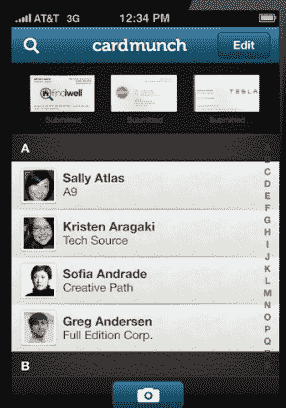
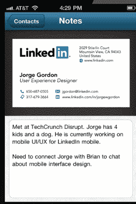
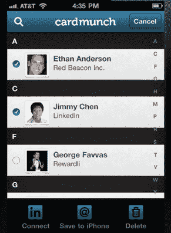

# LinkedIn 在新版 iOS 应用 card munch TechCrunch 中将名片与个人资料数据进行匹配

> 原文：<https://web.archive.org/web/http://techcrunch.com/2011/11/15/linkedin-matches-business-cards-with-profile-data-in-new-version-of-ios-app-cardmunch/>

# LinkedIn 在新版 iOS 应用 CardMunch 中将名片与个人资料数据进行匹配

今年早些时候，LinkedIn [收购了 CardMunch](https://web.archive.org/web/20230203070202/https://techcrunch.com/2011/01/26/linkedin-buys-business-card-converter-cardmunch-will-offer-its-services-for-free/) ，这是一款 iPhone 应用，可以让你拍摄名片的快照，并将其添加到你的 iPhone 联系人中。今天，LinkedIn 在[重新推出](https://web.archive.org/web/20230203070202/http://blog.linkedin.com/2011/11/15/new-cardmunch-app/?utm_medium=twitter&utm_source=twitterfeed)card munch iPhone 应用程序，为社交网络上的专业人士提供全新的移动体验。

作为背景，CardMunch [使用机械土耳其人](https://web.archive.org/web/20230203070202/https://techcrunch.com/2010/08/04/cardmunch-for-iphone-converts-your-business-cards-into-contacts-%E2%80%94%C2%A0by-hand/)将名片转换成电话联系。事实上，迄今为止，已经有数百万张名片在 CardMunch 上被数字化了。

通过新版应用程序，LinkedIn 整合了其丰富的数据，并彻底改革了整个体验，以向用户提供更多价值。除了更时尚的界面，LinkedIn 还重新设计了应用程序中的相机体验，让用户可以轻松地给卡片拍照。该应用程序有三个简单的屏幕可供选择——名片捕捉、联系人列表、联系人详细信息和 LinkedIn 个人资料。

过去版本的应用程序只向你展示从你扫描的名片中提取的信息，但在这个版本中，Linkedin 已经将个人资料数据与名片整合在一起。一旦应用程序扫描了名片，CardMunch 就会将这些信息与联系人的 LinkedIn 个人资料、联系人照片、共同关系、过去的工作经验、教育背景进行映射。

您仍然可以将联系人添加到您的 iPhone 地址簿中，在
LinkedIn 上与联系人联系，查看您的移动名片夹，等等。您还可以在应用程序中为卡片和联系人添加注释。

虽然 CardMunch 过去是一款付费应用，但 iOS 应用现在对用户免费。

LinkedIn 一直在稳步推进其移动产品，移动页面浏览量同比增长了 400%。公司[刚刚发布了](https://web.archive.org/web/20230203070202/https://techcrunch.com/2011/08/16/linkedin-redesigns-android-iphone-apps-with-groups-and-more-debuts-html5-mobile-site/)新的 iPhone、Android 和移动(HTML5)网络应用。

