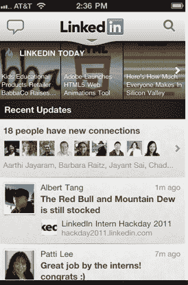

# LinkedIn 用群组等重新设计 Android、iPhone 应用；首次推出 HTML5 移动网站 

> 原文：<https://web.archive.org/web/http://techcrunch.com/2011/08/16/linkedin-redesigns-android-iphone-apps-with-groups-and-more-debuts-html5-mobile-site/>

# LinkedIn 用群组等重新设计 Android、iPhone 应用；首次推出 HTML5 移动网站

LinkedIn 首席执行官杰夫·韦纳(Jeff Weiner)在几周前该公司的第一次收益电话会议上解释说，该公司正计划对其移动战略进行大量投资。今天，这个职业社交网络[为其移动应用带来了重大更新](https://web.archive.org/web/20230205033334/http://blog.linkedin.com/2011/08/16/new-linkedin-mobile/)，包括新的 iPhone、Android 和移动网络应用。

LinkedIn 移动用户数量同比增长 400%，LinkedIn 表示，由于这种参与，该公司的移动应用程序需要调整，以反映更好的用户体验。该网络围绕 4 个领域重新组织了其 iPhone 和 Android 应用程序——更新、收件箱、个人资料和群组。你可以从 iPhone 和 Android 应用程序的[早期版本](https://web.archive.org/web/20230205033334/https://techcrunch.com/2010/12/16/linkedin-android/)中搜索和访问更新、收件箱、个人资料和联系，但通过 LinkedIn 的“你可能认识的人”功能浏览和与你的群互动以及添加联系的能力是新的。

因此，在应用程序中，有一个更干净和简单的界面，你会看到四个主要选项。今天，您可以查看来自您的网络的更新和来自社交聚合器 LinkedIn 的头条新闻；查看您的邀请和消息，访问您的个人资料、联系人并共享更新。浏览您的群组并与之互动，以及通过“您可能认识的人”功能建立您的关系网。

LinkedIn 表示，更新流是其移动应用程序中使用最多的领域，因此这一功能在应用程序中变得更加突出。群组是移动应用体验中最受欢迎的功能之一，用户现在可以访问他们所属的群组列表，浏览讨论，开始新的讨论或对现有的讨论进行评论。

LinkedIn 表示，新的移动应用在所有功能上都快了 2 到 10 倍，包括搜索和更新流。和许多其他公司一样，LinkedIn 也将赌注压在了 HTML5 的新移动网站上，该网站包括了许多与原生应用相同的功能。

LinkedIn 拥有超过 1 . 2 亿的会员，毫无疑问在上市后发展非常迅速。随着这种参与和新闻聚合器 LinkedIn 的推出，该网络的移动应用程序需要满足这种需求。

[YouTube http://www.youtube.com/watch?v=Q-VARh15ZJE&w=560&h=349]