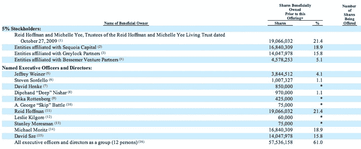

# LinkedIn 的最大股东及其持股数量 

> 原文：<https://web.archive.org/web/http://techcrunch.com/2011/01/27/linkedin-shareholders/>

# LinkedIn 的最大股东及其持股数量

LinkedIn 的 [S-1 文件](https://web.archive.org/web/20230203000215/http://www.sec.gov/Archives/edgar/data/1271024/000119312511016022/ds1.htm)于[今天](https://web.archive.org/web/20230203000215/https://techcrunch.com/2011/01/27/linkedin-files-for-ipo/)发布，文件中包含了大量我们从未见过的信息。这包括销售额、利润、收入明细等。文件中分享的一个有趣的数据点是 LinkedIn 的最大股东[和每个股东拥有多少股份。](https://web.archive.org/web/20230203000215/http://www.sec.gov/Archives/edgar/data/1271024/000119312511016022/ds1.htm#rom122081_14)

在 5%的股东中，该公司最大的股东是 LinkedIn 的创始人兼董事长雷德·霍夫曼和他的妻子 Michelle Yee，拥有 1900 万股或 21.4%的公司股份。紧随其后的是红杉资本(1680 万股，占 18.9%)、Greylock Partners(1400 万股，占 15.8%)和 Bessemer Venture Partners(460 万股，占 5.1%)。

Seqouia 在 2003 年是 LinkedIn 最早的投资者，2004 年是 Greylock。贝塞默在 2007 年和 2008 年参与了 LinkedIn 后来的三轮融资。

在高管和董事中，LinkedIn 首席执行官杰夫·韦纳持有 380 万股股票，占公司的 4.1%，首席财务官史蒂文·索尔代洛拥有 100 万股股票，占公司的 1.1%，产品副总裁迪普·尼沙尔拥有 97 万股股票，占公司的 1.1%。

在我们知道发行价之前，我们不会知道这些股票值多少钱。