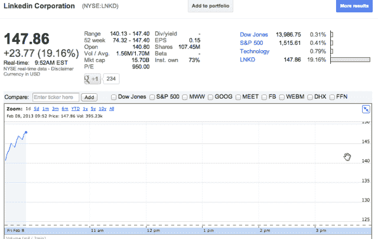

# 在令人印象深刻的收益之后，LinkedIn 股价飙升 19.2% TechCrunch

> 原文：<https://web.archive.org/web/https://techcrunch.com/2013/02/08/linkedin-shares-soar-19-2-in-the-wake-of-impressive-earnings/>

# 在令人印象深刻的收益之后，LinkedIn 的股价飙升了 19.2%

就在昨天的收益之后，LinkedIn 的股票([纽约证券交易所代码:LNKD](https://web.archive.org/web/20221204124716/http://www.google.com/finance?cid=13210501) )上涨了 19.16%，达到 147.86。显然是和公司收益挂钩的。收入增长了 81 %,达到 3 . 04 亿美元，净收入也呈同样趋势。

自上市以来，LinkedIn 的收入一直在稳步增长，净收入终于赶上了——与上一季度相比，净收入增长了五倍，从 230 万美元增加到 1150 万美元。

LinkedIn 首席执行官杰夫·韦纳甚至在一份声明中称 2012 年是该公司“变革的一年”。LinkedIn 通过 2 亿会员，国际增长良好。该产品得到了一些改进，如重新设计的个人资料页面，新的 API 实现和移动应用程序的升级。

总的来说，每一项指标都表明该公司状况良好。与其他在 2012 年 IPO 时备受关注的公司相反，LinkedIn 的表现相当不错。在过去的 12 个月里，股价从 74.32 美元上涨到 147.86 美元，涨幅约为 200%。脸书、Zynga 和 Groupon 在这方面遇到了更多麻烦。

该公司在纽交所的 IPO 可以追溯到 2011 年 5 月。该股定价为每股 45 美元，自那以来已经上涨了两倍多。LinkedIn 预计增长将继续。2013 年应该是社交网络的又一个好年景。

