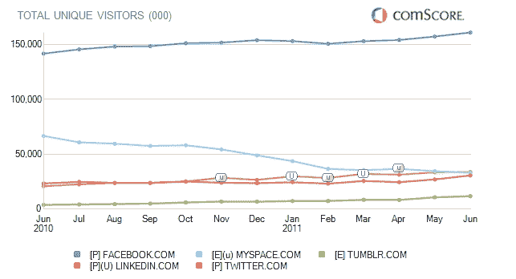

# LinkedIn 超越 Myspace 成为美国访客第二大社交网络；Twitter 紧随其后 

> 原文：<https://web.archive.org/web/http://techcrunch.com/2011/07/08/linkedin-surpasses-myspace-for-u-s-visitors-to-become-no-2-social-network-twitter-not-far-behind/>

# LinkedIn 超越 Myspace 成为美国访客第二大社交网络；Twitter 紧随其后

职业社交网站 Linkedin 的访问量超过了 Myspace，成为 6 月份美国访问量第二大的社交网站。LinkedIn 在[于 5 月](https://web.archive.org/web/20230204184058/https://techcrunch.com/2011/05/19/linkedin-ipo-shares-pop-84-percent-on-first-trade/)首次公开募股后[的流量出现了复苏](https://web.archive.org/web/20230204184058/http://allthingsd.com/20110614/linkedins-ipo-pops-traffic-too-your-turn-pandora/)，6 月份达到了 3390 万独立访客的历史新高，相比之下，Myspace 的独立访客为 3350 万(低于 5 月份的 3490 万)。希望 Myspace 的[新主人](https://web.archive.org/web/20230204184058/https://techcrunch.com/2011/06/29/myspace-goes-to-specific-media-for-35m-ceo-is-out-press-release/)能给陷入困境的社交网络[充电。](https://web.archive.org/web/20230204184058/https://techcrunch.com/2011/03/23/amazingly-myspaces-decline-is-accelerating/)

Twitter 发布了创纪录的美国流量，6 月份是该网站独立访客超过 3000 万的第一个月。Twitter.com 6 月份有 3060 万独立访客，而 5 月份有 2700 万独立访客。流量的增加实际上是 Twitter 的一大胜利，它在自己的移动客户端和用于访问网络的许多第三方客户端之间分配流量。

根据 comScore 最新发布的数据，脸书 6 月份的美国流量也创下了历史新高。6 月份，脸书在美国的独立访客人数为 1.608 亿，高于 5 月份的 1.572 亿。该公司还宣布，6 月份全球活跃用户也突破了 7.5 亿大关。

Tumblr 月份的独立访客数为 1，180 万，高于 5 月份的 1，070 万。6 月份，我们[报道称 Tumblr](https://web.archive.org/web/20230204184058/https://techcrunch.com/2011/06/27/tumblr-400-million/) 每天的浏览量约为 4 亿次，这在一定程度上要归功于国际化增长和更快的响应时间。