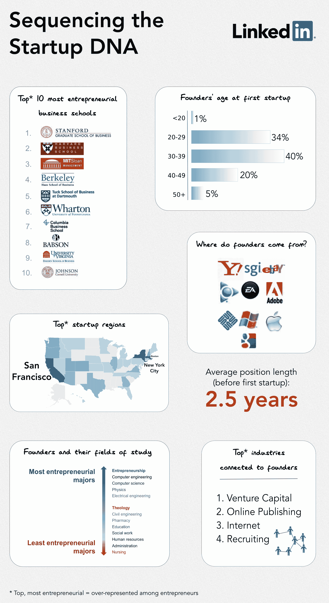

# LinkedIn 对初创公司创始人档案进行了深度数据挖掘 

> 原文：<https://web.archive.org/web/https://techcrunch.com/2011/09/01/linkedin-takes-a-deep-data-dive-on-startup-founder-profiles/>

# LinkedIn 对初创公司创始人的个人资料进行了深度数据挖掘

LinkedIn 对其 1.2 亿会员的个人资料信息进行了多次深度数据挖掘，以突出趋势。公司对比了[男女网友、](https://web.archive.org/web/20230204230423/https://techcrunch.com/2011/06/22/linkedin-men-are-more-savvy-networkers-than-women/) [职业名](https://web.archive.org/web/20230204230423/https://techcrunch.com/2011/04/27/linkedin-takes-a-data-dive-to-examine-whats-in-a-professional-name/)等等。如今，该公司已经[专注于](https://web.archive.org/web/20230204230423/http://blog.linkedin.com/2011/09/01/entrepreneur-data/?utm_medium=twitter&utm_source=twitterfeed)检查创业者的个人资料，并筛选其数百万份公开资料，分析网站上数万份初创公司创始人的个人资料。

以下是 LinkedIn 如何评估和分离数据的。Linkedin 认为，如果专业人士认为自己是 2000 年后创建的美国公司的创始人(或联合创始人)，拥有 LinkedIn 公司档案，并且目前拥有 2-200 名员工，那么他们就是初创公司的创始人。LinkedIn 排除了小型法律、咨询和房地产公司，以及有限责任公司(最终超过 13000 名企业家)。LinkedIn 随后将创始人与 LinkedIn 会员的平均水平进行了比较，并强调了初创公司创始人中不成比例出现的特征。

正如你从信息图中看到的，数据显示，创始人中最具代表性的商学院是斯坦福大学、哈佛大学和麻省理工学院斯隆管理学院。特别是，企业家在大学选择学习的最受欢迎的科目是技术专业(土木工程除外)，护理和管理是最不受欢迎的学习领域。

根据 LinkedIn 的数据，半导体和制药创业公司的创始人通常都有以前的行业经验，而零售、消费品、休闲&旅游和专业培训公司的创始人则没有。大多数有学术工作经历的创始人在纳米技术、生物技术和医疗设备行业创办了初创公司。

在创始人首次创业时的年龄分布方面，LinkedIn 的数据显示，65%的创业者年龄在 30 岁及以上，只有 2%的人是连续创业者。初创公司创始人的首选地区是纽约、加州、犹他州和科罗拉多州。

最有可能出现在创始人档案中的公司并不令人惊讶，包括 Adobe、苹果、易贝(包括 PayPal)、艺电、谷歌、微软、SGI 和
雅虎。就 LinkedIn 的人脉关系而言，创始人与风险资本家、博客作者和招聘人员的联系也不成比例。