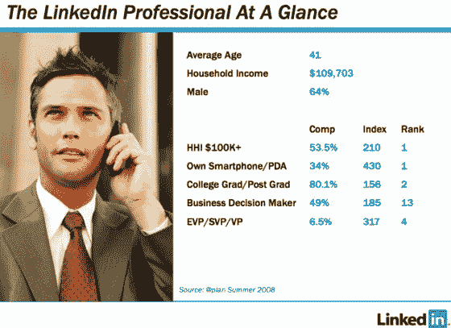
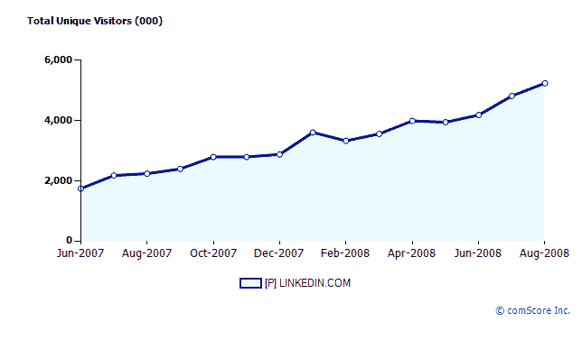
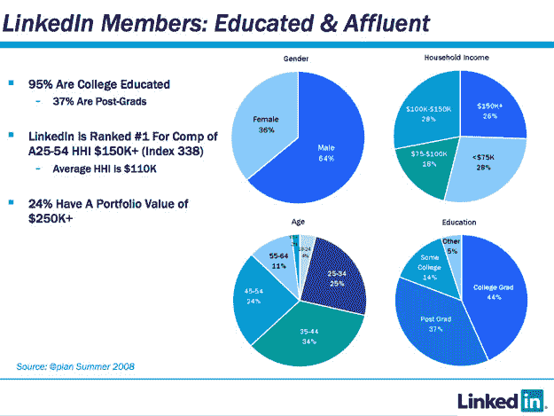
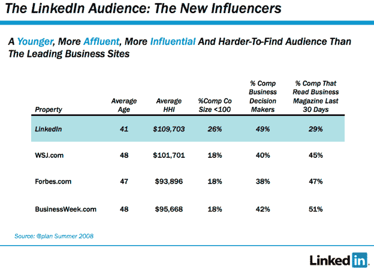

# LinkedIn 将推出自己的广告网络 

> 原文：<https://web.archive.org/web/https://techcrunch.com/2008/09/14/linkedin-to-launch-its-own-ad-network/>

当大多数社交网络仍在试图找出如何从广告中赚钱的时候，一个社交网络却逆势而上。商务专业人士的社交网络 LinkedIn 有如此多的广告客户需求，以至于它将在周一推出自己的广告网络。通过与广告网络 [Collective Media](https://web.archive.org/web/20230209180558/http://www.collective-media.com/) (定位于高端媒体网站)合作，LinkedIn 将让其他精选网站在用户访问这些合作网站时锁定其用户。

大多数社交网络很难以超过 1 美元/次(每千次展示的成本)的价格出售广告，但 LinkedIn 的费率卡显示显示广告从 30 美元/次开始，一直到 76.5 美元。文字广告每分钟从 12 美元到 20 美元不等。即使许多广告商可能会收到费率卡的定期折扣，LinkedIn 仍然比大多数社交网络做得好得多。这是因为它拥有广告商想要触及的更有吸引力的受众。

LinkedIn 声称拥有 2700 万注册用户。根据 comScore 的数据，7 月份美国有 520 万人访问了该网站(全球有 870 万人)。LinkedIn 声称其成员的平均家庭收入为 11 万美元，64%是男性，平均年龄为 41 岁，49%是决策者。(相比之下，根据 LinkedIn 的数据，《华尔街日报》的普通读者平均每户收入为 10.2 万美元，年龄为 48 岁，其中只有 40%是商业决策者)。

LinkedIn 已经在自己的网站上销售针对这些受众的广告[，根据行业、资历、公司规模、地理位置、性别和联系数量进行定位。现在，它将把目标扩大到其他合作伙伴网站。出版商将不得不申请成为广告网络的一部分，但 LinkedIn 可能会尝试与一些现有的内容合作伙伴签约，如商业周刊、美国消费者新闻与商业频道和纽约时报。](https://web.archive.org/web/20230209180558/http://www.linkedin.com/static?key=advertising_targeting)

每当有人访问 LinkedIn 时，他们的浏览器上会被放置一个 cookie，当他们访问合作伙伴网站时，cookie 会将他们识别为 LinkedIn 成员。个人身份信息将被删除，但成员将被分为不同的目标类别。就像雅虎和谷歌类似的广告网络定位一样，任何人都可以选择退出这个项目。

越来越明显的是，社交网络游戏不仅关乎谁拥有最多的观众，还关乎谁拥有最有价值的观众。像 MySpace 这样的主流社交网络试图通过关注 T2 最有利可图的地理市场来最大化广告收入。

LinkedIn 知道自己拥有有价值的受众，现在想把这些受众卖给其他人。尽管 LinkedIn 总是会从它在自己网站上展示的广告中赚更多的钱(因为它不必与集体媒体和合作伙伴网站将这些广告分成三份)。或许 LinkedIn 意识到它自己永远不会成为一个足够大的网站来证明其最近的[10 亿美元的估值](https://web.archive.org/web/20230209180558/https://techcrunch.com/2008/05/05/allen-co-pitching-linkedin-at-1-billion/)。(尽管员工只能以 5 亿美元的估值出售股份)。这将为 LinkedIn 创造增量收入。对于发布网站的合作伙伴来说，它提供了一套潜在更有利可图的剩余库存，可以用来投放广告。

这是所有目的地网站的未来吗——成为广告网络，将他们的受众卖给出价最高的人？

