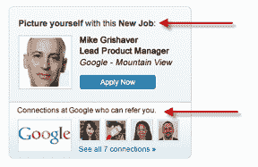
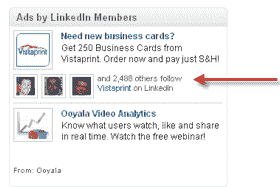

# LinkedIn 在新的社交广告形式中利用用户关注和推荐 

> 原文：<https://web.archive.org/web/https://techcrunch.com/2011/06/23/linkedin-to-leverage-user-follows-and-recommendations-in-new-social-ad-formats/>

# LinkedIn 在新的社交广告形式中利用用户关注和推荐

借鉴脸书的广告模式，职业社交网络 LinkedIn 今天[推出](https://web.archive.org/web/20230203052723/http://blog.linkedin.com/2011/06/23/social-ads/?utm_medium=twitter&utm_source=twitterfeed)新的社交广告模式，将利用会员在网站上的行为提供更有针对性的广告。

所以如果你关注一家公司，或者推荐一个产品或公司，LinkedIn 会在展示广告中使用这些数据，给你一个更有针对性的广告。例如，LinkedIn 可以发布一个谷歌招聘广告(由谷歌赞助),展示你网络中在谷歌工作的人，并推荐你。

另一种形式可以是公司的展示广告，LinkedIn 将显示有多少网络用户关注或推荐了该公司和/或其产品。

LinkedIn 也将跟踪通过其插件获得的任何信息和采取的任何行动。从 8 月份开始，LinkedIn 表示，你可以选择退出任何可能通过这些插件发送到 LinkedIn 的信息(如印象数据)。

 LinkedIn 表示，个性化的 LinkedIn 广告将于今天开始向一小部分会员推出，作为有限发布的一部分。当然，在网络上利用社交数据时，隐私总是一个问题。LinkedIn 表示，y 的名字和图像绝不会与任何广告商共享，你可以选择退出这些个性化广告。

LinkedIn [最近改变了其隐私设置，这暗示该公司可能会在不久的将来推出更多类似脸书的广告。虽然有些人可能会觉得广告具有侵犯性，但投放高针对性、互动性更强的广告对网络广告来说更划算。LinkedIn 在广告方面开始像脸书那样思考可能是明智的。](https://web.archive.org/web/20230203052723/http://blog.linkedin.com/2011/06/10/privacy-policy-changes/)