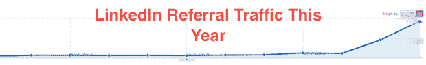
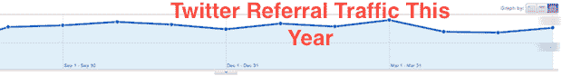

# LinkedIn 给我们带来的推荐流量远远超过 Twitter.com 现在 TechCrunch

> 原文：<https://web.archive.org/web/https://techcrunch.com/2011/06/30/linkedin-traffic-twitter/>

如果我问你，你认为哪个主要的社交网站给我们带来了最多的流量，你可能会认为是 Twitter。毕竟，[TechCrunch 推特账户](https://web.archive.org/web/20230204093951/https://twitter.com/#!/techcrunch)拥有超过 170 万粉丝。当你把这个和我们的[脸书 TechCrunch 页面](https://web.archive.org/web/20230204093951/http://www.facebook.com/techcrunch)的(不到)250，000 名粉丝相比，这应该没什么争议，对吧？不对。

事实是，如果这是去年 10 月，你会正确地认为 Twitter 是我们社交网站的首选。但从那时起，脸书每月的访问量已经远远超过了 Twitter。事实上，Facebook.com 现在发送的流量几乎是 Twitter.com 的两倍。这可能是因为去年 11 月份，[我们增加了 Elin](https://web.archive.org/web/20230204093951/https://techcrunch.com/2010/11/29/welcome-elin-our-new-community-manager/) ，她是我们优秀的社区经理，负责策划并与我们脸书 feed 上的人互动。我还怀疑这与喜欢按钮的兴起有关。自去年发行以来，脸书一直在稳步向我们推荐更多的读者。

但是这些信息虽然有趣，却并不令人惊讶。毕竟，脸书是世界上最大的社交网络。它拥有超过 7 . 5 亿活跃用户，仍然让 Twitter 相形见绌。真正令人惊讶的是，Twitter 甚至不再是我们网站中排名第二的社交推荐者。截至本月，这一殊荣属于 LinkedIn。而且差远了。

是的，刚刚上市的职业社交网络 LinkedIn 现在是我们社交流量的第二大推荐者。想想就在上个月，它的规模只有 Twitter 的一半左右(就推荐量而言)，落后于 Hacker News 等网站，你会觉得这很疯狂。两个月前，它的规模大约是 Twitter 的八分之一，在 TechCrunch 的推荐流量方面落后于 Digg、StumbleUpon、Reddit 和其他公司。但最大的统计数据是，一年前，LinkedIn 每月的流量是今天的 1/50。

那么是什么改变了呢？据我们所知，这一切都是关于今天的 LinkedIn，这个社交新闻产品是 T2 在三月份推出的。大约就在那个时候，LinkedIn 的访问量出现了第一次大幅增长。三月份，这个数字比二月份翻了一番。然后 4 月份相当平稳——仍然比以前高得多，但没有增长。然后在 5 月，流量增加了 5 倍。今年 6 月，这一数字翻了一倍多。这种增长令人震惊。

当然，或许最有趣的是，如今的 LinkedIn 是由 Twitter 驱动的*。Twitter 的共享链接决定了 LinkedIn 今天显示的内容，但流量不会通过 Twitter 返回。*

同样，这只是 LinkedIn 到 TechCrunch 的流量。事实是，对于 TechCrunch 的普通读者来说，LinkedIn 是技术和商业的交叉，可能是最完美的社交网络。但是在和其他一些博客作者交谈时，他们也注意到了同样的事情。所有这些无疑都受到了 LinkedIn 社交按钮[的推动，这些按钮也已经出现在网络的各个角落。最近(以及最近在 TechCrunch 上)。](https://web.archive.org/web/20230204093951/https://techcrunch.com/2010/11/30/linkedin-thinks-publishers-need-yet-another-share-this-button/)

在我看来，更大的问题是，这对 Twitter 网站作为新闻传播者的未来意味着什么？虽然 Twitter 试图通过最近推出的 [Twitter for Newsrooms](https://web.archive.org/web/20230204093951/http://media.twitter.com/newsrooms/) 教程来帮助记者和博客作者，但他们没有太多的新功能来改善表面信息。这些年来，Twitter 的推荐流量一直在稳步上升，但这只是因为我们获得了越来越多的 Twitter 追随者。而在去年，这种流量完全变平了。现在仅仅几个月的时间里，LinkedIn 的一款热门新产品就被它超越了。

Twitter 方面的部分解释可能是[增加了 HTTPS](https://web.archive.org/web/20230204093951/http://blog.twitter.com/2011/03/making-twitter-more-secure-https.html) 的使用，这可能会删除发送流量中的推荐信息。但是脸书和 LinkedIn 都有 HTTPS 选项，同样，这些数字正在快速上升，Twitter 没有。其中一部分是 Twitter 移动客户端的使用。但是，脸书也有非常受欢迎的移动客户端(虽然，不可否认，LinkedIn 的移动客户端似乎没有那么受欢迎，所以它们的大部分流量可能来自 linkedin.com)。

如果这种趋势在更大范围内是真的，那对 Twitter 来说不是好消息。显然，这是不容忽视的巨大流量，但数字表明，随着其他流量的出现，流量会逐渐减少。在 Twitter 推荐流量持平的同一年，脸书推荐流量增长了 6 倍。再说一次，这对 Twitter 来说并不乐观。Digg 也曾经是无可争议的推荐之王。上个月，他们在 TechCrunch 上的排名是第 17 位。

**更新** : Twitter 称 twitter.com 增长乏力是由于 Twitter 移动用户激增，并表示他们将很快分享一些统计数据，我会在这里发布。尽管这也表明人们为了使用手机而远离网站，这很有意思。无论如何，我修改了标题，以更好地反映 Twitter.com 是这里讨论的主要内容。

**更新 2** : Twitter 已经指向[这些](https://web.archive.org/web/20230204093951/https://twitter.com/#!/twitterglobalpr/status/55779286761750529) [之前](https://web.archive.org/web/20230204093951/https://twitter.com/#!/twitterglobalpr/status/55779152678223872) [陈述的](https://web.archive.org/web/20230204093951/http://blog.twitter.com/2011/03/numbers.html)数字分享了移动增长。

