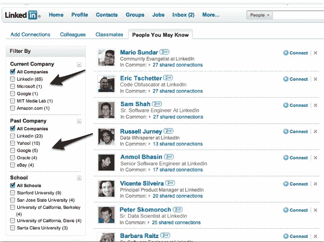

# LinkedIn 通过搜索过滤器升级“你可能认识的人”功能 TechCrunch

> 原文：<https://web.archive.org/web/https://techcrunch.com/2010/05/12/linkedin-upgrades-people-you-may-know-feature-with-search-filters/>

# LinkedIn 通过搜索过滤器升级了“你可能认识的人”功能

LinkedIn 最近一直在使其平台变得更加社交化，增加了[关注功能、](https://web.archive.org/web/20230127034820/https://techcrunch.com/2010/04/29/linkedin-follows-facebook-and-twitter-into-follow-model/)与[推特整合、](https://web.archive.org/web/20230127034820/https://techcrunch.com/2009/11/09/social-networks-continue-to-rally-around-twitter-as-linkedin-goes-tweet-crazy-too/)推出[网址缩短器](https://web.archive.org/web/20230127034820/https://techcrunch.com/2010/04/21/linkedin-launches-url-shortener-enhances-sharing-options/)并增加了额外的分享功能。如今，LinkedIn 正在使其“你可能认识的人”功能更加社会化。算是吧。

LinkedIn 本质上融合了过滤搜索和你现在可能认识的人功能。这使得通过公司和学校筛选你可能认识的人的列表变得容易得多。最终结果是，它让你更容易快速确定你想和谁联系，以及他们是如何和你联系的。

虽然这个功能很简单，但其背后的意图更为重要。LinkedIn 让你更容易找到人脉，而不必真的去做艰苦的工作。LinkedIn 拥有 6500 万会员，用户数量稳步增长，但显然想让这个平台更像一个社交目的地。这一战略的一部分意味着为用户提供一些功能，让他们更容易与朋友和同事联系。