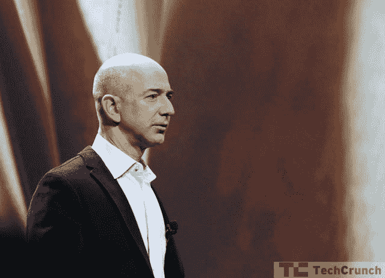
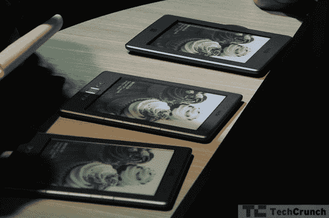

# 在纽约市的亚马逊活动现场直播 TechCrunch

> 原文：<https://web.archive.org/web/http://techcrunch.com/2011/09/28/live-at-the-amazon-event-in-new-york-city/>

请关注这里，因为从东部时间上午 10 点/太平洋时间上午 7 点开始，我们将直播纽约市的亚马逊活动。我们在期待什么？ [The Fire](https://web.archive.org/web/20230204181233/https://techcrunch.com/2011/09/26/amazon-kindle-fire/) ，当然是亚马逊最新的 Kindle，它将配备全彩色触摸感应屏幕，或许还有一些其他功能，包括 Prime 电子书订阅和更强大、更吸引人的亚马逊应用商店。我们将在活动期间更新此帖子，因此请尽早并经常更新。

* * *

9:57–好吧，看起来这个[今天可能有点没用](https://web.archive.org/web/20230204181233/https://techcrunch.com/2011/09/28/amazon-kindle-fir/)，但是我们会尽快抓取一些该设备的照片。

9:59–我们开始了。人们都在读彭博，所以很安静。
10:04–纽约人谈论原版 Kindle 的视频。“我不是一个非常懂技术的人，对我来说，有效地使用它非常棒。”圣徒传记。
10:06–贝佐斯上台。"四年前，我们着手重塑这本书。"

10:08——实体书销量远超 Kindle 图书。

10:09——开始有 90 万本书，现在有一百万本。
谈论更多关于 E-Ink 的事情。
很多人都在谈论云。重新概括 Kindle。

10:11——仍在重述。谈论 WhisperSync。谈论文字分享。

10:13——最畅销的电子阅读器。
10:14—**推出 Kindle Touch**—带红外触摸屏的触摸屏 Kindle。

10:17——谈论触觉。它实际上是一个带触摸屏的 Kindle。新功能包括 X 射线。x 光可以让你在书里面做研究。例如，关于“凡尔赛条约”的段落可以去维基百科。有趣的信息包含在书籍中，因此您不必使用 Wi-Fi。

10:22–Kindle Touch 3G–可在 100 个国家使用。免费 3G 连接。$149.从今天开始预购。11 月 21 日发货。

不带触控的 Kindle 是 79 美元。有来自亚马逊和亚马逊本地的特别优惠。
今日船只。

【T7

10:27–谈论电影和歌曲。1700 万首歌，10 万部电影。亚马逊云播放器。
10 点 29 分——亚马逊黄金时段。"把偶尔购物的人变成瘾君子。"
10:31–现在我们来谈谈亚马逊网络服务。基础设施服务。看起来这是一个综合版本。
10:32–快速回顾:
[The Fire](https://web.archive.org/web/20230204181233/https://techcrunch.com/2011/09/28/amazon-kindle-fir/)
[Kindle Touch–99 美元](https://web.archive.org/web/20230204181233/https://techcrunch.com/2011/09/28/amazon-unveils-new-99-e-ink-kindle-touch/)

10:35–刚刚推出 Kindle Fire 平板电脑。双处理器。无线同步到亚马逊云。

看电影的 WhispeSync 看一部火的电影，然后在家里亚马逊支持的电视上观看。

胡乱流畅的接口。杂志、游戏、书籍都以“最近接触”的顺序出现。新书？显示在顶部。只是读点东西？显示在顶部。在“旋转器”下方，你可以锁定游戏和应用程序等收藏夹。
这是一款全口径媒体设备。
1600 万色。大猩猩玻璃。海量像素密度。

10:41–贝佐斯展示他的水果忍者技能。
10:42–谈论亚马逊旧页面与新页面。10K 对 63 万。他现在会谈论浏览器。谈论 Flash。
打算用亚马逊 EC2 在后端渲染网页。亚马逊丝绸。拆分浏览器。部分生活在 EC2，部分生活在 Kindle fire。
T14
T16

“我们的网络更好。后端的所有繁重工作。您可以在设备上获得优化的内容。”他们称之为分离浏览器架构。它更像客户端服务器，但不要告诉他们。

确认 Kindle Fire 售价 199 美元。"适用于电影、网络、游戏和阅读的 Kindle . "

10:53–11 月 15 日发货，今天预购。

10:54——都搞定了。感谢观看。

