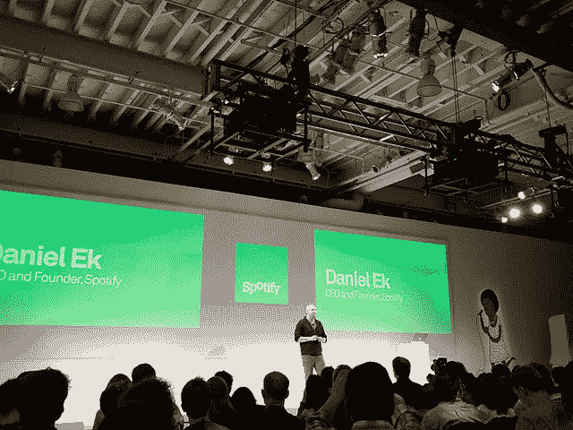
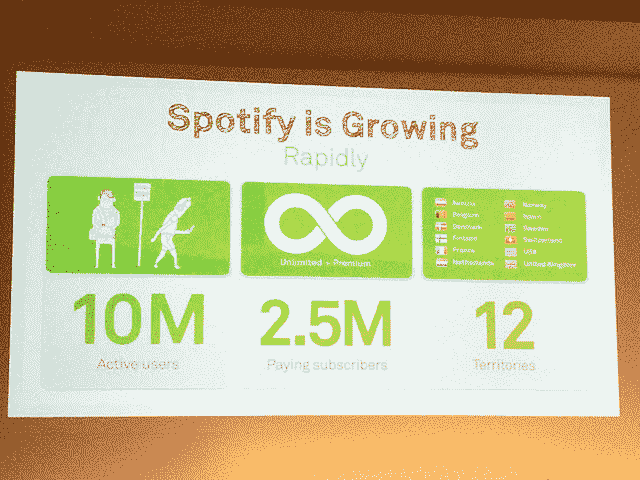
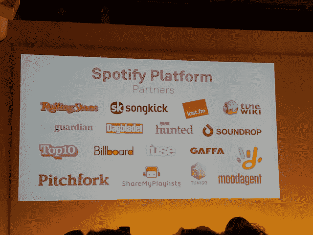
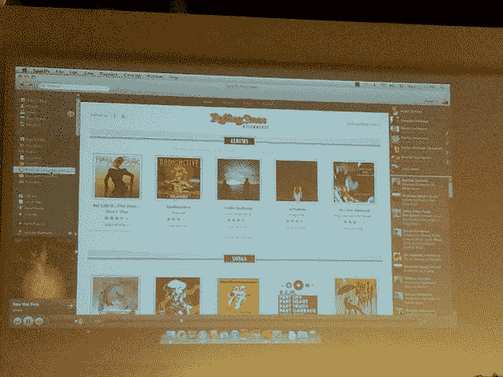

# 博客直播:Spotify 特别活动

> 原文：<https://web.archive.org/web/https://techcrunch.com/2011/11/30/live-blog-the-spotify-special-event/>

热门音乐初创公司 Spotify 今天上午在纽约市举办了一场特别活动，将公布这项服务的“新方向”。Spotify 没有透露任何细节，但它显然认为这是一件非常重要的事情，以至于邀请了数十名记者参加。

几篇[报道](https://web.archive.org/web/20230404080359/http://www.techmeme.com/111129/p90#a111129p90)表明 Spotify 将为第三方开发者推出一个新平台，他们可以将 Spotify 的大量音乐整合到新的应用程序中。**更新**:是的，请看下文。

这似乎是 Spotify 的风格，该活动具有异常高的生产价值:服务员正在分发我从未听说过的浓缩咖啡和一口大小的早餐食品(但相当美味)。该公司为舞台定制了背景，以音乐为主题的插图为特色。墙壁上排列着十几台平板电视，我怀疑它们将在活动后期用来展示第三方应用程序。

该活动定于美国东部时间中午开始——一旦事情开始，我将发布进一步的更新。

下午 12:11—活动将在五分钟后开始。与此同时，我得到了一个一口大小的肉桂面包。它是片状的，非常好吃。

12:15 —好了，事情开始了。Spotify 首席执行官丹尼尔·埃克已经登台。"这是我们第一次举办这样的活动。"。我将谈谈公司的背景和使命，进军社交领域，最后是今天的发布会。

埃克正在浏览数字音乐的简史。ABBA 的《来访者》是第一张 CD。Napster 在 2000 年向 Ek 介绍了新的乐队(他当时没有很多钱..).但这是违法的。今天，有很好的法律服务。但是在 5 亿在线听音乐的用户中，大多数都不是合法的。“你需要一个比盗版更好的产品”。所有的音乐。完全可靠。快速且易于分享。

Spotify 有两个付费选项:免费，带一些广告；高级，没有 as，允许你从移动设备访问 Spotify。Spotify 有 1500 万首歌曲，每天增加 2 万首歌曲。

Spotify 是仅次于 iTunes 的欧洲唱片公司第二大数字收入来源。到目前为止，他们已经向唱片公司支付了 1.5 亿美元。超过三分之一的瑞典人使用 Spotify，盗版率下降了 25%。

自 9 月份(脸书整合启动之时)以来增加了 700 万用户。

**今日公告:**

我们认为数字音乐正开始发光。是时候迈出下一大步了。

人们要求各种功能——DJ 模式、歌词、评论等等。Spotify 不会自己构建的东西。“如今，Spotify 成为了一个音乐平台。”

如今 Spotify 推出了 HTML5 Javascript API。应用程序将在 Spotify 桌面应用程序中使用。看起来开发者使用这些 Javascript API 构建网络应用，然后从 Spotify 的桌面应用中访问这些应用。任何时候你点击这些应用程序中的一首歌曲，它就会立即开始播放。

接下来，介绍一位伟大的新伙伴——滚石的联合创始人扬·温纳上台了。《滚石》将有助于策展/发现。滚石每天都会创建新的播放列表。“你需要那种帮助来发现事物…”。也会有有趣的播放列表，比如米克·贾格尔最喜欢的十首雷鬼歌曲。

Spotify 的新版本在应用程序的左侧有一个名为应用程序查找器的部分。“你可以找到所有 Spotify 应用的地方”。

现在看滚石 app。拥有播放列表、专辑、评论和其他由《滚石》杂志策划的内容。这很聪明——这些无限制的音乐流媒体服务的目录可能会让人不知所措，许多用户会喜欢有知名品牌的音乐专家为他们指明正确的方向。

Last.fm 应用程序会显示您最近的 Scrobbles、推荐的艺术家以及您通常会在 Last.fm 网站上找到的其他内容。点击歌曲将立即开始播放。

Spotify 也在利用这个平台开发自己的新功能。现在，您可以在右侧边栏的顶部锁定您最喜爱的朋友，并查看他们最近听了什么。

“这只是一个开始，这里将会建起我们今天甚至无法想象的东西”。

**更新:**就时间而言，听起来用户今天就可以下载带有测试版应用平台的 Spotify 版本；它将在未来几周内广泛推广。

**Q & A**
大卫·古德曼(CBS 互动音乐集团总裁)<拉里·戈德堡(TuneWiki 首席执行官)、伊恩·霍加斯(SOngkick 创始人兼首席执行官)、比尔·克兰德尔(RollingStone 数字内容负责人)。

问:网站/应用程序将能够在自己的网站上集成 Spotify 功能，还是只能通过应用程序获得？答:会通过应用程序。“我们觉得这是最美好的体验”。

问:任何人都可以使用它还是只有这些合作伙伴可以使用它？
答:这将对所有人开放，但我们会批准应用程序。

问:你能在移动应用程序中使用它吗？
答:首先是在桌面上，但如果它像我们希望的那样成功，我们会把它添加到其他地方(也就是说，如果它做得好，它会出现在手机上，可能还会出现在其他平台上)。

问:合作伙伴赚钱了吗？
答:合作伙伴可以进行链接，目前还没有 rev share 协议。听起来这些合作伙伴受益于获得 Spotify 的用户群。

问:把商业模式作为你的尺度来谈。
答:每次有人放一首歌，我们就付钱。我们认为这是一个很好的模式。我们不认为我们有繁重的条款。

好吧，看来新闻到此为止了。有趣的乐队刚刚登台。他们很棒，看看他们。我首先推荐歌曲*冷静*和*赌徒*。