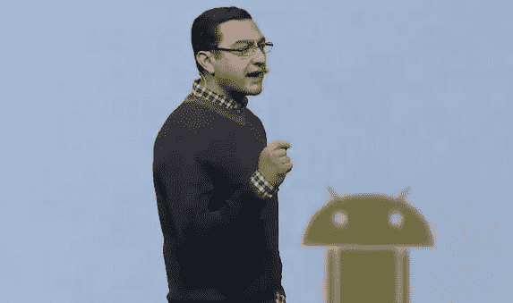

# 第二次 Google I/O 主题演讲:Android 和 Google TV 之日

> 原文：<https://web.archive.org/web/https://techcrunch.com/2010/05/20/live-blogging-the-second-google-io-keynote-the-day-of-android-and-google-tv/>

谷歌 I/O 大会的第二天开始了，我们[非常确定](https://web.archive.org/web/20230316224554/https://techcrunch.com/2010/05/19/proof-that-google-tv-will-make-its-debut-tomorrow/)将会有一些关于 Android 和谷歌电视的重大新闻。与[昨天的主题演讲](https://web.archive.org/web/20230316224554/https://techcrunch.com/2010/05/19/live-from-the-google-io-keynote/)一样，该活动将在 YouTube 上直播——我们不能嵌入视频流，但你可以在这里[观看](https://web.archive.org/web/20230316224554/http://www.youtube.com/googledevelopers)。我会在博客上直播主题演讲。我的笔记在下面。请注意，大多数报价将被转述。

维克·冈多特拉登上了舞台。

谈到他第一次见到安迪·鲁宾的时候和他的怀疑态度。安迪说我们需要一个开放的移动操作系统。他说有一个我们不想要的未来，一个人控制手机。展示了 1984 年的专辑封面。

目前已有超过 60 款安卓设备。去年，我们报告说每天有 3 万台手机被激活。在 2 月份，我们今天宣布了 60K 台。我们每天的激活量现在已经超过了 10 万次。我们现在在美国的手机销售排名第二，仅次于 RIM。根据 AdMob 的数据，我们在网络和应用程序总使用量上是第一名。

当我们 6 个月前推出谷歌导航时，我们用谷歌导航树立了 10 亿英里导航的里程碑。我们已经超越了。

有人说人们不会在智能手机上使用谷歌搜索。在过去的两年里，所有智能手机类别的搜索量都增长了 5 倍。“人们喜欢谷歌搜索”。他直接抨击史蒂夫·乔布斯之前说过的话。

我们已经通过了 5 万份申请。

今天我们宣布发布 Android 2.2，Froyo。

弗罗约有什么？

a)速度
达尔维克 VM 一直快速、高效、自动化。但是我们可以做得更好。在 Fryo 中，我们在现有硬件上增加了即时编译 2-5 倍的应用速度提升。

b)新的企业功能。现在 Microsoft Exchange 友好—自动发现，与全球通讯簿集成。安全策略。GAL 查找。还有用于设备管理的新 API。

c)面向开发者的新服务。应用程序数据备份 API。过去，Android 会备份应用程序。但是你的个人数据没有。从 Froyo 开始，我们将提供一个 n API 来移动应用程序中的数据。

新的 API 云/设备消息 API。“这不是一个旨在弥补操作系统中多任务等功能不足的推送通知 API”(Zing！).作为一名开发人员，你可以向服务器发送消息，并做类似折叠相似消息，处理延迟等事情。可以做一些事情，这样一条消息就可以触发 Android 意图。

例如，如果你在网上浏览地图。点击“发送到手机”——它实际上不是发送短信，而是让你进入 Android 设备上的地图应用。从手机向设备发送链接。它打开浏览器，直接打开文章。不用打开别的。这看起来真的很强大。

宣布:网络共享和便携式热点(上周我们[发布了](https://web.archive.org/web/20230316224554/https://techcrunch.com/2010/05/13/exclusive-google-to-add-tethering-wifi-hotspot-to-android-2-2-froyo/)这条新闻)。演示热点。启用热点，给它一个名字。网络共享热点激活..现在说“让我们去一个没有连接的设备。iPad 怎么样”。

浏览器:2-3 倍的 Javascript 性能提升。Android 版 V8(Chrome 的 JS 引擎现在在 Android 上)。

展示了一个 JS 速度演示，其中 Nexus One 绕着 iPad 浏览器跑了几圈。“我真的很想知道我们是否能在应用商店里买到它。哦，这是一个网络应用程序。这有多棒？”

HTML5 及更高版本。方位，摄像机，演讲。如果你能从浏览器访问它，那不是很好吗？我们将展示弗罗约之外的东西。展示了一个基于浏览器的地图应用程序，你可以旋转手机和地图旋转(浏览器可以访问数字指南针)。还有一个 Buzz 演示，可以从浏览器访问相机。

显示语音命令(Android 已经有一段时间了)。接下来是分析人类意图的能力。“给五楼餐厅打电话”。会有更多的意图。

网络应用-翻译。web 应用程序中的麦克风。语音命令在里面工作。

宣布 Flash Player 10.1 公开测试版。AIR Developer 预发行版。“原来在互联网上，人们用的是 Flash。开放意味着你是包容性的，而不是排他性的。”我女儿拿起她的 iPad，这是她在 Nickelodeon 网站上看到的——看到一个空白的橙色网站。在安卓设备上工作。

安卓市场。我们仔细听了。平均来说，我们看到用户在他们的设备上安装了超过 40 个应用程序。第一个新功能。搜索应用程序。可以快速搜索手机上的应用程序。也改进了搜索，所以开发者可以插入搜索框架。可以搜索一个应用程序的数据(显示使用 Mint 的应用程序演示)。

另一个问题是——人们不仅想把应用程序转移到内存中，还想转移到 SD 卡中。我们以一种安全的方式实现了这一点。我们以安全的方式实现了这一点。用户永远不必担心这一点——这是自动完成的(尽管他们可以将应用程序移动到 SD 卡，如果他们愿意的话)。

全部更新——今天你必须单独更新每一个。现在你可以点击“全部更新”。我们已经更进一步了。现在有了用户许可，允许自动更新。

发布–应用程序错误报告。更快地找到并修复错误。现在用户可以提交错误报告了。开发人员可以看到发生了什么的整个堆栈的痕迹(热烈的掌声——开发人员真的很喜欢这样)。

先睹为快:市场的下一步是什么？一个新的 Android Marketplace，可通过 PC 浏览器访问。可以浏览应用程序看评论。可以登录，可以直接从浏览器查看您的每台 Android 设备。可以浏览到某个应用程序。现在在其他系统上，你可以浏览它，连接它，下载到电脑，然后同步它。点击确认，应用程序将通过无线方式发送到 Android 设备。([听着耳熟？](https://web.archive.org/web/20230316224554/https://techcrunch.com/2009/11/15/android-market-app-store/)

还有音乐。来点音乐怎么样？可以通过互联网、OTA 发送音乐。看起来像一个安卓音乐商店。与空中音乐同步。非常酷。

我们最近收购了一家名为简化媒体的公司。让你在家里运行一个简单的软件，让家里所有的非 drm 软件都可以在 Android 设备上使用。假设你在你的安卓设备上。让 Android 设备能够以流的形式访问家庭图书馆。将 iTunes 曲库中的音乐流式传输到 Android。这是巨大的。

**广告**
这是我们做广告的第十年，我们很了解它。我们知道，如果你想要一个健康的广告生态系统，你需要广告商，而我们有成千上万的广告商。我们在这个游戏中并不陌生，“我们不会与少数合作伙伴合作，并向他们收取 100 万美元的费用，让他们成为一个项目的一部分”(另一个苹果杂志)。灵活的格式。广告是需要衡量的。有用的工具(分析、adwords、adsense、doubleclick)。展示格式。宣布新的可扩展广告形式。如果可能的话，用户喜欢呆在应用程序中。广告直接展开，再滑回来。目前提供可扩展格式。又一个。不仅可以显示，还可以是富媒体(嵌入了电影)。又一个可扩展广告。非常流行的添加格式–点击呼叫。利用用户允许使用位置这一事实。直播电视想为旧金山的顾客提供特别优惠。点击呼叫。另一种广告形式——可扩展形式。包括地图和方向，点击呼叫。

再比如。点击广告，全屏沉浸式广告。预告片，多媒体。点击底部可以购买。广告由 medialets 通过 doubleclick 提供。这就是开放。

每个与会者都可以在 Google.com/mobileads 注册

现在显示的是 Sprint HTC Evo 4G。谷歌让这里的每个人都可以使用它。响亮的掌声。

“感谢您支持 Android。感谢你支持开放和选择”。

**现在进行下一节**
Rishi Chandra 已经上台。我将向你介绍谷歌电视。“我们认为将改变电视未来的新平台”。

仅在美国，每年电视广告支出就达 700 亿美元。全球 40 亿电视用户。

许多人试图再次带来网络/电视世界。但是认养率仍然非常有限。

三个原因/限制
——他们试图简化/重建网络。又是 WAP 了。
-他们都关门了。
-多种解决方案让你在电视/网络之间转换。人们会选择电视，这是他们知道的经验。

我们相信《答案》集电视和网络之长，将两者融为一体。

谷歌电视:“电视与网络相遇的地方。网络与电视相遇”。

花更少的时间寻找，花更多的时间观看内容。控制和个性化您观看的内容。让您的电视内容更有趣。不仅仅是一台电视。

演示。

-打开电视。我们正在看电视。可以改变频道，访问 DVR，使用现有的遥控器来实现这一点。文森特(demoer)正在使用新的遥控器。合作伙伴专门为谷歌电视创建优化的控件。

你要做的第一件事就是想找些东西看。通常你用“指南”。对搜索不好，浏览很多频道。如果我们重新思考电视导航。带你去你想去的地方的搜索框。

和..在一次尴尬的演示故障后..

搜索框带你去你想去的地方。键入 MSNBC。从电视和网络上看到不同的结果。将您直接调到该频道。现在可以即时访问所有喜爱的频道。一场演出怎么样——30 块。你会看到一个未来的结果。如果您集成了 DVR，您可以从搜索框中直接录制。现在可以即时访问所有喜爱的节目。你可以做得更多。搜索整个网络。

搜索一下豪斯。查看电视和网络上的所有内容。豪斯在美国街和福克斯街交界处。情节内容。现在，我们可以让用户在两者之间获得单一体验。将来可以在电视上录制。或者可以在网站上做。点击了 Amazon.com。直接转到亚马逊的页面。从电视到网络的过渡是完全无缝的。去亚马逊。可以购买剧集或者播放预告片。主屏是所有内容和应用程序的快速启动器(看起来类似于 Boxee)。可以显示网飞的即时队列。你的建议。

网络上的内容不仅仅是喜爱的电视和节目。网络电视出现了爆炸式增长。YouTube.com——可以直接去 YouTube。我们可以比 YouTube 走得更远。我们可以让它更加个性化。举例。我儿子喜欢芝麻街里的 Elmo。Sesamestreet 的网站上有所有这些内容。我可以根据自己的兴趣过滤内容。可以只搜索 Elmo 视频。

可以输入“2010 年国情咨文”。可以走向网络。收到短信。可以点击直接去 Whitehouse.gov 播放视频。这很重要，因为我可以随时访问这些内容。我不拘泥于渠道和节目方面的思考。

可以接收电视信号，在图像模式下放入图像。当您观看比赛时，可以在您观看比赛的同时提高比分。可以在浏览网页的同时跟踪游戏中发生的事情。

到目前为止，我们只讨论了视频。但是还有很多其他的娱乐体验。音乐，游戏，社交。可以看看 flickr。观看 Flickr 幻灯片。“我的电视成了家里最好的照片浏览器”。

通过发挥电视所能提供的最佳功能，我们可以创造出最全面/最容易获得的娱乐体验。

规格-四个组件。内置 wifi/以太网。使用常规 HDMI 电缆将现有电缆/卫星电视盒连接到谷歌电视盒。谷歌电视配有 IR blaster。此外，我们还在机顶盒和碟形机顶盒之间实施了特殊的 IP 协议，实现了紧密集成。这就是我如何一键录音的。强大的处理能力。将成为 2d/3d 图形的 GPU。高清。和环绕声。谷歌电视输入设备——将全部包括键盘和指点设备。可以用安卓手机。通过 Wifi 与谷歌电视设备配对。可以对着电视说话。“说早上好，美国”。它在谷歌电视上搜索。可以配对多个遥控器。可以在手机上看一些东西，把它发送到电视上。

这只是开始。我们将发布 IP 远程控制协议，以便开发人员可以在您选择的设备上构建自己的应用程序，无论是 PC、智能手机还是平板电脑，以增强体验。

谷歌电视有三个组件要堆叠。首先是安卓。我们构建于 2.1 之上，并将进行升级。我们可以做 OTA 更新。其次是浏览器。我们是谷歌浏览器。我们需要完全网络兼容的浏览器。和 Flash 10.1。

Android 部分——如果我可以使用最喜欢的移动应用程序并在电视上运行，岂不是很酷？很快你就可以了。

手机版安卓市场。寻找潘多拉。Pandora 没有做任何超出他们正常应用的事情，但是 tiw roks 在 Google TV 上。我的电视不仅仅是一台电视。另一个很酷的功能。拿手机版安卓市场来说。

Brittany Bohnet 上台来帮助演示。

现在从电脑上，浏览来自市场的应用。可以直接从 Android Market 网站安装应用程序到 Google TV。

Ambarish Kenghe-谷歌电视下午。
谈论如何让开发者参与进来。

YouTube 的《猎人漫步》现在在舞台上。YouTube lean back——把整个 YouTube 语料库转化成你可以向后靠着享受的体验。可以看到频道，租金。

Bohnet 回来了——Google Listen 登陆电视。
可以访问队列、搜索等。探索—让您发现新的视频播客。

可以给你正在看的电视添加任何语言的字幕(非常酷)。

我们需要整个电视生态系统的帮助来推动平台向前发展。谷歌电视开源将开源到 Android 和 Chrome 源代码树中。

这是如何进入市场的？

与索尼合作。将推出全系列集成电视和蓝光播放器。
第二家罗技公司——将推出配套盒子。
英特尔将为芯片组提供支持。
**全部于 2010 年秋季上市**
与 Dish network 合作增强体验。
与百思买合作分销。

2011 年初——Android Market，Google TV SDK。2011 年夏天，它将被开源。

谷歌首席执行官埃里克·施密特站在舞台上—
20 年前，人们坐在这个房间里谈论将电视指南与电视整合在一起> 10 年前，网络电视，其他公司说，也许我们应该找到一种方法，在电视上整合你使用电视/网络的方式。我们等今天已经等了很久了。

推出合作伙伴首席执行官—
英特尔首席执行官保罗·欧德宁

索尼首席执行官霍华德·斯金格。

Gerald Quindlen–罗技

查尔斯·厄根——Dish Network 首席执行官

百思买首席执行官布莱恩·邓恩

尚塔努·纳拉延 Adobe 首席执行官

施密特——凌动处理器有什么特别之处？
欧德宁——它是凌动的一个版本，带来英特尔的全部处理能力。上网本的性能，但把一堆专门为高清视频设计的电路，其他事情的消费者预计会做。这是我们开发 Atom 处理器时预见到的事情之一。

Schmidt–Flash/这个平台的特别之处是什么让它更具交互性？
纳拉延—我们正在开发 Flash 10.1。考虑到性能，一定要优化。

施密特——人们会出去买新电视吗？
Stringer——当你将所有这些放入世界上第一台互联网电视时，它就变得天衣无缝了。这些机会简直令人难以置信。当我们在秋季发布这款产品时…

quindlen–我们一直在和谐偏远地区进行创新。我们认为客厅中最大的机会是电视内容和网络的结合，并在开放平台中将它们结合在一起。

ergen——Dish 的无缝体验将比任何其他视频提供商都更加无缝。人们还是会看超级碗等。

施密特-布莱恩，就我对这个行业的理解，利润来自圣诞节。你如何看待这件事的发展？你认为这会带来新的流量和新的价格吗？
邓恩——我们和你一样对我们是幸存者充满热情。我们有一句话，这是公司历史上最重要的节日，每年都是如此。你说得对，这不仅仅是一条新过道。这是一个新的类别——智能电视。我有幸得到了一个深入的演示。当你看到你能做什么，经历了它…“我需要一个”。现在我需要一个。我确实认为它会被广泛接受。因为它确实说明了人们如何在特定的时间享受消费媒体。

斯特林格——你说到点子上了。这是进化。它是可升级的。是主动电视。它是主动的。这是件大事。

邓恩——你可以个性化它，这是你的经历。

施密特——我们想在这里宣布这个消息的原因是，我们需要你，开发人员，利用这个平台，做我们还没有想到的事情。我们有工具，数量，经济，规模。我认为不仅要以新的方式定义电视，而且最终要定义人们如何娱乐自己。