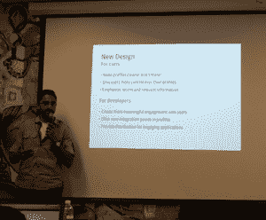
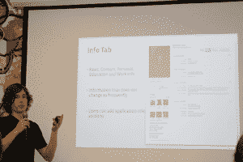

# 现场直播:脸书讨论新的外形设计 TechCrunch

> 原文：<https://web.archive.org/web/https://techcrunch.com/2008/05/21/live-facebook-discusses-new-profile-design/>

[脸书](https://web.archive.org/web/20230212094222/http://www.facebook.com/)今天邀请了一群博客作者和记者到其位于帕洛阿尔托 Hamilton 街的办公室，讨论即将到来的个人资料重新设计的细节，我们被告知将在几周后推出。

请继续关注此处，我将分享我的活动笔记。

埃利奥特·施拉格(Elliot Schrage)首先表示，今天将更关注 Q & A，而不是上次关于脸书聊天的[活动](https://web.archive.org/web/20230212094222/https://techcrunch.com/2008/03/18/facebook-to-launch-new-privacy-controls-confirms-chat-is-coming/)。

产品营销副总裁 Chamath Palihapitiya 正在讨论个人资料重新设计背后的愿景，尤其是迷你订阅/新闻订阅。

新设计的目标:

*   **对于用户:**使个人资料更简洁，让用户对自己的个人资料有更多的控制权，并强调最近的和相关的信息
*   **对于开发者:**与用户建立更有意义的互动，在概要文件中提供新的集成点，并为互动应用提供分发

我们会给开发者一个测试期，让他们进入沙盒，玩新的设计，这样他们就可以在未来几周推出 profile 时做好准备。

新设计利用了标签；目标将不同类型的信息分开，使导航更简单。

基本功能:feed、info、photos、box 和自定义应用标签。

**进料标签**

新轮廓的核心。各种不同类型的信息流。包括墙柱。使用 publisher 工具，所有者和查看者都可以在个人资料上创建内容。通过故事大小调整功能，用户可以从 3 个不同大小的故事中进行选择。'

**信息页签**

包含原始核心脸书配置文件的内容。分开 feed 和 info 标签的原因:feed 内容经常变化，info 内容更趋向于静态。

想使第三方开发者的信息标签可扩展(还没有什么需要的细节)。

**照片选项卡**

每天上传 1400 万张照片，总计 60 亿张——这是一个在脸书非常受欢迎的应用程序，因此有自己的标签。

照片只是许多应用程序中的一个例子，这些应用程序可以爆炸并获得自己的标签。

**箱子标签**

放置应用程序框，如您所见，与当前配置文件中的信息和提要混在一起。配置文件中的所有当前框将被完全保留。用户仍然可以控制移动盒子，调整大小等等。把盒子放在自己的页面上“很有价值”。

**自定义应用选项卡**

用户可以为每个应用程序创建单独的选项卡，以展示他们的收藏夹。您可以控制选项卡的显示位置。

* * *

【T2

现在转到应用程序如何插入新配置文件…

新的设计将允许更吸引人的应用程序，开发者以更有意义的方式接触用户。

主要集成点:

**进给选项卡**

应用程序可以直接发布到用户的提要中。使用 publisher，应用程序可以直接集成到配置文件中。通过调整故事大小，开发者可以提供 3 种不同大小的故事供用户选择:完整、中等和单线。

**信息页签**

应用程序可以在信息选项卡页面上添加文本和图像，以提供关于用户的更多信息。列出最好的朋友，最好的音乐选择，等等。“用户表达自己的新方式”。旅游、运动、娱乐都是可以做到这一点的领域。

**箱子标签**

如前所述，所有的箱子都搬到了这里。两种类型的箱子:宽箱子和窄箱子

**自定义应用选项卡**

类似于应用程序画布页面，提升应用程序的可见性。“应该增加应用流量”

* * *

现在把它交给问答…

脸书还没有决定这堵墙是否会完全整合到 Feed 标签中。他们可能会把它作为自己的标签，或者他们可能会完全整合它，然后允许用户只通过墙上的帖子而不是其他类似迷你订阅的更新进行过滤。仍在与用户一起解决这个问题。

计划于 6 月发布，“几周内”

在过去的 7-8 个月里，我们在网站上放了更多的 Ajax，这应该表明脸书关注的是参与度，而不是页面浏览量。说个人资料设计是为了更多的参与，而不是增加页面浏览量。

预计静态应用不会像过去那样成功——新设计最有利于动态应用。虽然框存储在单独的选项卡上，但它们也可以有自己的选项卡，并集成到 publisher 工具中，该工具显示在 feeds 选项卡上。

脸书计划引导用户切换到新的配置文件。

新的配置文件将保留从其他站点导入数据的能力。publisher 工具也有这种能力。

“我们试图建造这些传输信息的管道”(在我听来像是互联网)。

脸书仍然计划有一个显示应用程序框的栏目，不管它们是在信息还是订阅标签上。然而，这些盒子将有高度限制。

关于新的设计，一切都还在不断变化，所以这个列的布局及其模板区域可能会改变。

新的轮廓会大一点，宽 760 像素。它还将首次推出一个新的通用网站设计，缺少左侧栏，并将大多数选项放在带有下拉菜单的顶部栏中。在脸书内部看截图和设计细节[。](https://web.archive.org/web/20230212094222/http://www.insidefacebook.com/2008/05/20/first-screenshot-of-new-facebook-design/)