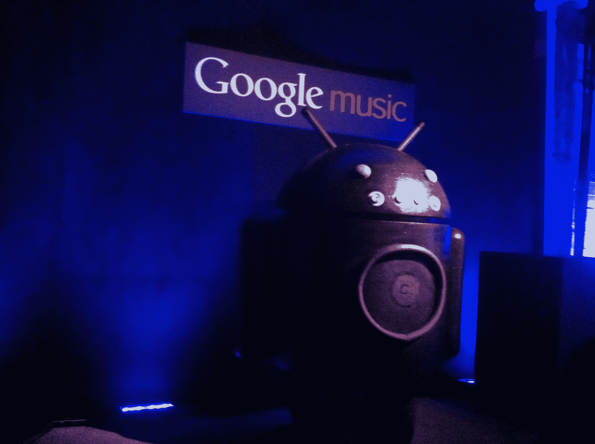

# 来自谷歌特别“这些去 11”音乐活动 TechCrunch 的现场直播

> 原文：<https://web.archive.org/web/http://techcrunch.com/2011/11/16/live-from-googles-music-related-special-la-event/>

[YouTube = http://www . YouTube . com/v/DLP fi 5 ys]

我们在洗脑先生位于洛杉矶的工作室，等待一场谷歌于太平洋标准时间下午 2 点开始的“特别活动”，该公司很可能会在那里宣布谷歌音乐商店，因为这是[每个人和他们的母亲](https://web.archive.org/web/20230204195851/http://www.techmeme.com/111115/p88#a111115p88)所说的。

我们将在下午 2 点在博客上直播这一消息，但你也可以在上面的 UStream 上观看。

**2:01 —** 这个活动绝对与音乐有关。我们收到的笔记本上写着“谷歌音乐”，而这里的音乐真的真的很吵。墙上也挂满了鲍勃·迪伦和吉米·亨德里克斯等艺术家的画。

我们被告知要就座。看起来没有那么多人在这里。而且活动还没开始。我非常喜欢丹尼·沙利文关于它是如何因 SOPA 而延迟的笑话。

**2:11 —** 好了，开始了，他们播放了一段转盘换盘的视频来介绍谷歌的杰米·罗森伯格。罗森博格开始谈论谷歌音乐测试版，以及其百万用户的体验。谷歌在测试版中分发了超过 1 亿首歌曲。

罗森伯格表示，谷歌已经激活了 2 亿部安卓设备，谷歌音乐现在对美国所有人开放。

**2:15 —** 谷歌音乐现已在 music.google.com 正式推出。它将是免费的，允许你播放超过 20，000 首歌曲。标语是“把音乐爱好者变成音乐推广者”

**2:17 —** 一旦一首歌出现在谷歌音乐上，它就可以通过网络和你所有的移动设备播放。

**2:18 —** 该应用程序与 Android Market 集成，就像我们报道的那样，您可以直接在新的音乐部分购买歌曲。音乐主页将会有“员工照片”和“促销活动”每个艺术家的页面都将提供推荐，该应用程序与 Google+进行了社交整合。Google+的分享将包括一个用户朋友的免费游戏。

**2:23 —** 每天谷歌都会在 Android Market 上发布一首免费的当日歌曲。我们正在观看一段酷玩视频，作为安卓市场独家内容的例子。

**2:25 —** 音乐商店按艺术家、歌曲和专辑分类，每页都有艺术家的简历和图片。

因此，谷歌刚刚发布了 aGoogle 音乐商店，一个新版本的音乐市场，一个网络播放器的更新版本，以及新的 Android 和 iOS 应用程序。

**2:33 —** 谷歌宣布与滚石乐队建立独家合作关系，滚石乐队将在网上举办六场音乐会，酷玩乐队和布斯塔·莱姆斯也将亲临现场。

**2:28 —** 环球、索尼百代、梅林唱片、独立唱片厂牌已经公布；今天有一千多家唱片公司参与，八百万首歌曲现场直播。

**2:31 —** 来自环球、索尼百代和梅林的高管站在台上，“我们对通过 Android 设备在全球推出该平台感到非常兴奋。”

**2:31** 谷歌音乐也将推出艺术家、滚石、布斯塔·莱姆斯和酷玩乐队的独家内容。

谷歌现在正在描述 music.google.com/artists,的艺术家页面(称为 hub ),艺术家们只需花 25 美元就可以建立这些页面。艺术家将可以在 YouTube 上销售歌曲，而不是他们的音乐视频。谷歌谈到像 DJ Tiesto 这样的艺术家已经在使用艺术家中心。

T-Mobile 的到来是因为 T-Mobile 的客户将能够直接通过他们的电话账单来支付谷歌音乐。T-Mobile guy 正在谈论他们的 4G 网络，他说移动音频占他们网络数据的 15%。

**2:46 —** T-Mobile guy 正在谈论与布斯塔·莱姆斯和马龙五兄弟的独家内容交易。“独家”被一遍又一遍地提起。

**2:48 —** “你在其他地方找不到的音乐”似乎是谷歌的竞争优势。

**2:49:** 演讲以“谷歌音乐开始营业”结束