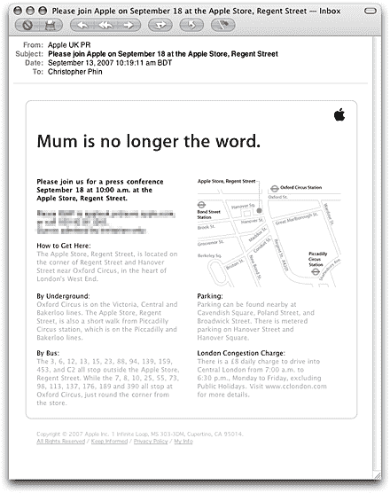

# 11 月 9 日发布的 8GB 英国 iPhone:没有 3G，免费 Wi-Fi，人人都有品脱，赢得一部 iPhone TechCrunch

> 原文：<https://web.archive.org/web/https://techcrunch.com/2007/09/18/live-from-london-the-apple-announcement-starts-at-5am-edt-2am-pdt/>

# 11 月 9 日发布的 8GB 英国 iPhone:无 3G，免费 Wi-Fi，品脱为所有，赢得一部 iPhone

点击此故事查看商品。史蒂夫显然是在地面上和 TC 作家迈克布彻准备好了。迈克排好队，准备出发。他们对苹果商店的 Wi-Fi 大惊小怪，所以看起来我们正在使用短信和 Twitter 来完成工作。

为了纪念我们在池塘那边的朋友，我想向这个帖子的随机评论者提供一部免费的 8GB iPhone——已经由我们在纽约的团队解锁了。只需在此帖子中输入评论并输入您的真实电子邮件地址(它不会出现在网站的任何地方)。告诉我们你有多沮丧，因为欧洲没有 16GB 的 3G iPhone，没有自动翻译和薯片包装。我们将在美国东部时间今晚午夜结束参赛，随机挑选一名获胜者——希望是英国或欧洲的人，他们可以利用弱势美元，给自己买一部漂亮的新解锁 iPhone。薯片麦片之类的。如果您的评论没有立即出现，请等待几分钟。我们的缓存系统有时会有点不正常。只要不要连续输入超过两次就可以了。

更新——如你所见，今晚我已经放弃了博客直播平台。看起来我们的更新有点慢了。只需阅读此线程的完整信息。

**上午 10:06**——刚刚与苹果公司就 wifi 问题掀起了一场大风暴。可能要为我的美国编辑生活在推特上。

**上午 10 点 14 分**——拥挤的人群。

**上午 10:23**——Mike 刚刚停止播音，但 Engadget 报道称，苹果在英国以 269 英镑(约合 542 美元)的价格在 O2 下销售 iPhone。[没有我们预测的 3G](https://web.archive.org/web/20221006052517/http://crunchgear.com/2007/09/16/cg-exclusive-iphone-in-france-november-29-no-3g/)和无限 EDGE 数据计划可用。 [Engadget](https://web.archive.org/web/20221006052517/http://www.engadget.com/2007/09/18/live-from-apples-mum-is-no-longer-the-word-event-in-london/) 。

**上午 10:27**——carphone 仓库销售点。已确认。Wifi 处理[云端](https://web.archive.org/web/20221006052517/http://www.thecloud.net/About-us/)免费 WiFi 漫游。8GB 版本售价 269 英镑。

**上午 10:34**–无线 ITMS 也将于下月在英国上市。