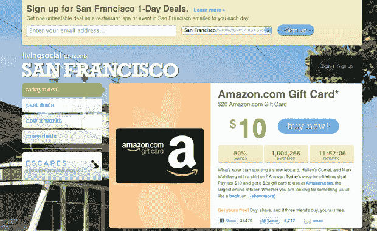

# LivingSocial 售出 100 万张亚马逊礼品卡，卡值 2000 万美元 TechCrunch

> 原文：<https://web.archive.org/web/https://techcrunch.com/2011/01/19/livingsocial-hits-a-million-amazon-gift-cards-sold-20-million-in-card-value/>

# LivingSocial 售出了 100 万张亚马逊礼品卡，价值 2000 万美元

[LivingSocial](https://web.archive.org/web/20230202232142/http://www.livingsocial.com/) 已经[从今天早上 5 点开始提供任何 20 美元](https://web.archive.org/web/20230202232142/https://techcrunch.com/2011/01/19/amazon-livingsocial-10-discount/)亚马逊购买的 10 美元，这对每日交易公司来说是一个巨大的福利，亚马逊已经精明地[投资了](https://web.archive.org/web/20230202232142/https://techcrunch.com/2010/12/02/livingsocial-confirms-175-million-amazon-investment/)1 . 75 亿美元。现在，这个非常受欢迎的交易刚刚突破 100 万大关，还有 12 个小时。LivingSocial 告诉我们，目前每小时售出 99.4K 张代金券，每分钟售出 2k 张代金券，每秒钟售出 85 张代金券。

这已经击败了 Groupon/Gap 的交易，该交易以价值 1100 万美元的 Groupons 出售而告终，而且它还剩下半天时间。

CenterNetworks 对这笔交易的里程碑时刻保持着令人印象深刻的警惕。