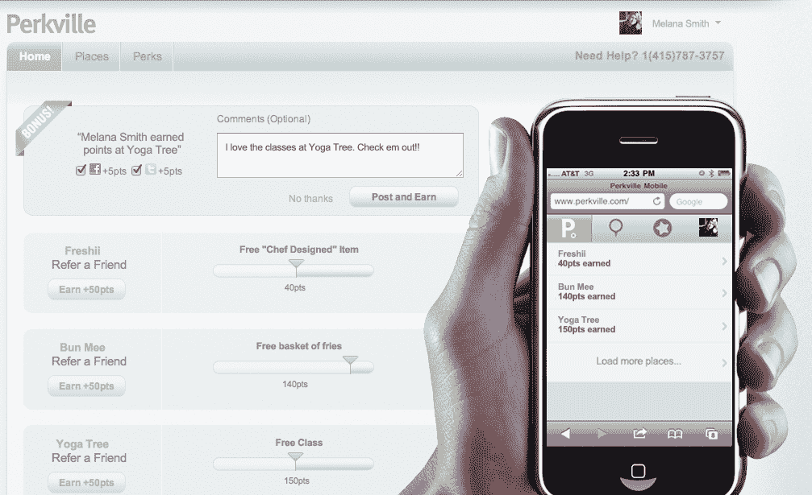

# 本地忠诚度:Perkville 想把你的电子邮件地址变成虚拟奖励卡 

> 原文：<https://web.archive.org/web/http://techcrunch.com/2011/10/05/local-loyalty-perkville-wants-to-turn-your-email-address-into-a-virtual-rewards-card/>

今天早些时候，[我写了一篇关于一家名为 Perka](https://web.archive.org/web/20230204121315/https://techcrunch.com/2011/10/05/bringing-punch-cards-online-perka-launches-a-nifty-loyalty-platform-for-small-businesses) 的新创公司的文章，该公司试图通过一项面向商家的出色服务来终结忠诚卡。好吧，今天似乎是启动忠诚度计划的日子-扰乱创业公司，因为一家名为[的公司 Perkville](https://web.archive.org/web/20230204121315/https://www.perkville.com/) 正在走出秘密模式，进入公共领域。

我们很多人的钱包都塞满了积分卡、买五送一的门票和随身携带的团购券。或者我们到了最喜欢的咖啡店才想起我们把打卡忘在家里了。与 Perka 相反，Perkville 采取了一种不同的方式，通过将客户的电子邮件地址转化为虚拟奖励卡，为当地商家提供忠诚度解决方案。这意味着不再需要携带和遗忘在家里的卡片，不再需要下载应用程序——只需要一个电子邮件地址，用户就可以参加 Perkville 上的任何商业计划。而且对于商家来说，Perkville 是免费使用的，分分钟就可以设置好。

那么它是如何工作的呢？商家决定他们想要为他们的顾客建立什么样的奖励计划，无论是每次访问还是购买，等等。当顾客购物时，商家通过店内的[平板电脑](https://web.archive.org/web/20230204121315/http://i.imgur.com/3Nre4.jpg)(即 iPad)或他们的[销售点](https://web.archive.org/web/20230204121315/http://www.perkville.com/partners/) (POS)系统奖励顾客积分。然后，顾客可以在网上追踪他们的积分，并把朋友推荐给商家，然后商家会收到一笔特殊的交易作为回报。然后，推荐客户会因成功推荐而获得积分。

由 LinkedIn 和雅虎的前高级产品经理于去年 1 月初创立。Sunil Saha 和雅虎 UX 前主管 Eric Bollman。，Perkville 一直在秘密努力与 POS 软件提供商合作，以扩大业务规模，并使其成为商家的一项有价值的服务。在推出时，这家初创公司已经在美国吸引了 200 多家活跃商家，并拥有 10 万多名消费者，其中 25%是注册用户。

无论商家是通过像 Mindbody 这样的 POS 视觉触摸解决方案[加入 Perkville，Mindbody【】为各种业务提供业务管理软件，包括沙龙、水疗中心、健身工作室、瑜伽、武术和零售，还是通过鼓励在 POS 采用 iPad(该团队表示，这对于咖啡店等场所以及不喜欢复杂方法的收银员来说很有效)，或者无论商家是手动输入客户的电子邮件地址，一旦他们有了电子邮件，Perkville 流程的其余部分都保持不变。然后，用户收到加入邀请，他们注册，剩下的就是历史了。](https://web.archive.org/web/20230204121315/http://www.mindbodyonline.com/Perkville)

Perkville 的联合创始人告诉我，他们发现使用移动解决方案、二维码解决方案、Shopkick 等的商家采用率很低。，因为它们都需要下载一个应用程序，扫描，在一些不可靠的设备旁边拿着一张卡——这种类型的摩擦会导致当地小商户的担忧、怀疑和犹豫。对于像 Groupon 这样拥有庞大销售队伍的公司，或者没有这种自动化流程的公司，这种类型的交易和忠诚度解决方案需要大量的营销支出和挨家挨户的宣传，并且很难扩展。帕克维尔不用担心这个。

关于帕克维尔的另一件很酷的事情是它如何赚钱。因为其核心平台对商家免费，Perkville 为商家提供了设置永久交易或“赢回”交易的能力，例如，让商家识别有一段时间没有回到商店的顾客，并向他们发送交易，以让他们回来购买。对于 Perkville 的高针对性交易，初创公司从商家赚取的利润中抽取 30%的分成。

但是，总的来说，商家保留完全的灵活性控制，其忠诚度计划在后台运行——一旦 Perkville 建立，商家可以做他们想做的或多或少。

为了测试其新的基于电子邮件的忠诚度假设，Perkville 建立了一个瑜伽馆的案例研究，他们看到的结果令人印象深刻。在使用魅力城市瑜伽的 9000 人中，21%的学生加入了忠诚度奖励计划。这些学生平均多上了 70%的课。自从 Perkville 让消费者选择将他们的课程连接到脸书和 Twitter，瑜伽馆已经收到了 500 个帖子和 100 条推文，以及 77 个推荐，增加了 340 门课程。他们的“赢回”计划重新激活了 150 名顾客。

在从朋友和家人那里筹集了 50 万美元和一年多的创业资金后，Perkville 目前正在积极寻求外部投资。可以肯定的是，这是一个有趣的想法，他们基于电子邮件的忠诚度计划似乎在案例研究中证明了自己。

[点击此处查看 Perkville，让我们知道你的想法。](https://web.archive.org/web/20230204121315/https://www.perkville.com/)