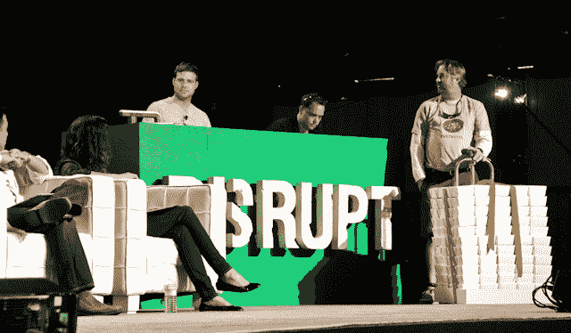

# Postmates 的目标是成为包裹的优步-以及更多 

> 原文：<https://web.archive.org/web/http://techcrunch.com/2011/09/13/local-messenger-postmates-aims-to-be-the-uber-of-packages-and-more/>

快递已经存在很久了。你可能见过他们骑着自行车，拖着邮差包。对于一个充满创新技术的世界来说，快递业仍然缺乏颠覆性似乎有些令人惊讶。尤其是考虑到美国的快递业代表着一个数十亿美元的市场。

在食物链的顶端，有像联邦快递(FedEx)和联合包裹(UPS)这样的大公司在某种技术进步的表象下运营，但也有成千上万的小公司拖着古董设备，通过双向无线电、短信和语音电话进行调度。达到预定的取货和送货时间(然后兑现)实际上是没有希望的——这几乎比与有线电视公司一起计划上门服务还要糟糕。

今天，在 TechCrunch Disrupt，一家新的创业公司正在启动，旨在彻底颠覆快递业。Postmates 希望以同样的方式改变这个利基行业，优步正在用按需送货服务颠覆精英豪华轿车服务和奖章出租车，这种服务将当地快递员和自行车信使与任何需要运送任何东西的人联系起来——从生日贺卡到大钢琴。

这家初创公司不仅打算扰乱人们在同一城市相互发送包裹的方式，Postmates 创始人 Bastian Lehmann(读者可能从他的上一家初创公司 Curated.by 中知道他)表示，这项服务还将为实体零售商提供当天送货 API。只要不到 20 美元，任何零售商都可以为当地顾客提供网上订购商品的能力——并在当天送货上门。(Lehmann 今天在台上说，这家初创公司已经促成了 300+次交付。)

因此，Postmates 希望为快递员和自行车信使提供机会，通过他们的移动设备利用只有联邦快递和 UPS 这样的巨头才能利用的技术。至于它是如何工作的？从 Postmates 的移动应用程序中，人们可以输入起始地址和目的地地址，这时应用程序将告诉消费者运送他们的商品需要多少钱，以及该地区目前可用的快递员(全部通过交互式地图)。然后，用户可以选择商品详情，输入商品描述，附上照片等。为了帮助快递员了解运送的货物，请输入收件人的姓名和联系电话，然后提交。

然后，该应用程序会 pings 靠近用户位置的可用快递员，并在快递员接受交付后通知他们，然后在整个交付过程中更新用户，甚至会向收件人发送一封包含跟踪链接的电子邮件。

总的来说，这种模式曾经尝试过[，并获得了成功](https://web.archive.org/web/20230204213126/https://techcrunch.com/2009/04/03/deliveryedge-tumbles-into-the-deadpool/)。但很高兴看到一家初创公司试图颠覆一个支离破碎的现实世界的业务，并将其上线。这款应用的用户界面很流畅，看起来很棒；然而，初创公司将不得不面对确保(或许是投保)用户免受商品被盗风险和其他风险的问题(尤其是考虑到进入该领域的门槛如此之低)。

在某种程度上，Postmates 就像移动世界的 Kosmo 2.0，但 Kosmo 也因拥有贩运非法物质的快递员而臭名昭著。相比之下，Posmates 有很多事情要做，这个想法肯定有根据。它还帮助这家初创公司从海军拉维坎特、杰夫克拉维尔、Matrix Partners、拉塞尔西蒙斯(Yelp)、吴大维、托马斯科特(Google 和 AngelPad)和拉塞尔库克等人那里筹集了 87.5 万美元。

Postmates 的价值主张显然是，它旨在打开一个城市内巨大的当地商业市场，该团队希望我们能够想象有一天数百家当地实体企业以目前只有花店似乎能够做到的方式经营。这项服务将首先在旧金山推出(更多城市将陆续推出)，创始人今天在台上表示，他们已经在旧金山注册了 50 多家零售店，将这款应用程序带给企业和个人。相当酷。我们期待看到它从这里走向何方。

**介绍:**