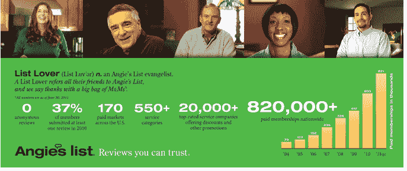

# 当地商业评论网站 Angie 的 7，500 万美元 IPO 上市文件 

> 原文：<https://web.archive.org/web/https://techcrunch.com/2011/08/25/local-reviews-site-angies-list-files-for-75-million-ipo/>

# 当地商业评论网站 Angie 的上市文件为 7500 万美元的首次公开募股

继 Jive 昨天提交 1 亿美元的 IPO 申请后，当地商业评论网站 [Angie's List](https://web.archive.org/web/20230203111256/http://www.crunchbase.com/company/angies-list) 今天下午提交了一份 [S-1](https://web.archive.org/web/20230203111256/http://www.sec.gov/Archives/edgar/data/1491778/000119312511232387/ds1.htm) 申请。根据备案文件，该公司将融资至多 7500 万美元。

正如我们过去所写的，Angie 的列表为消费者提供了一种在网上查看和评价医生、承包商和服务公司的方式。该公司成立于 1995 年，专注于本地家居、庭院和汽车服务，位于本地搜索、用户生成内容和订阅服务的交汇点。迄今为止，安吉的名单已经从 Battery Ventures，T. Rowe Price，City Investment Group，Cardinal Ventures 等公司筹集了近 1 亿美元。

截至 2011 年 6 月 30 日，该公司向美国 170 个地方市场的付费会员提供服务。安吉的付费会员已经增加到 820，000 人，这一增长主要是由其全国广告战略推动的。但该公司在营销和广告上花了大价钱，分别在 2010 年和 2011 年上半年花费了 3020 万美元和 2920 万美元来获得新会员。

在 2010 年和截至 2011 年 6 月 30 日的六个月中，安吉的收入分别为 5900 万美元和 3860 万美元。在同一时期，该公司分别净亏损 2720 万美元和 2580 万美元。

该公司表示，自 1995 年以来，该网站已经从会员那里收集了 220 万条对当地服务提供商的评论。

